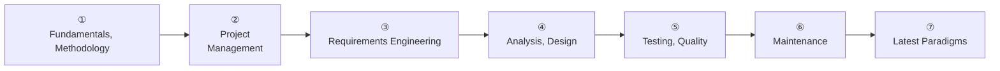
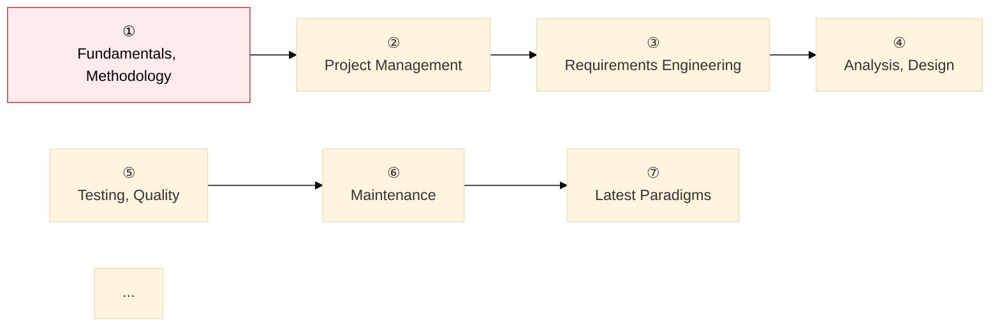
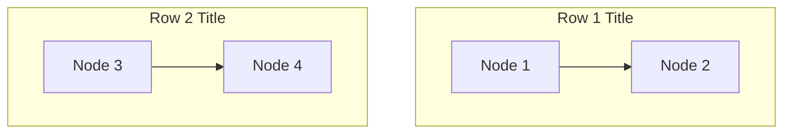

# Mermaid Two-Row Roadmap Rendering Bug Fix

**Date**: 2026-05-28  
**Commit**: `ddec7bd`  
**Files affected**: 1

---

## 1. Symptom

The software engineering study roadmap diagram fails to render, and the  
Mermaid code prints to the page as **raw text**.

```
%%{init: { 'theme': 'base', 'themeVariables': { 'edgeLabelBackground': '#fff' }}}%%
flowchart TD
    subgraph R1["Stage 1 — From Fundamentals to Design"]
    ...
```

Where it occurred:
- `content/docs/01-software-engineering/_index.md`
- Section: **Study Roadmap — 7-Stage Flow**

---

## 2. Attempt History and Issues at Each Stage

### Attempt 1 — Original Single Row (Baseline)



**Result**: Renders fine, but all 7 nodes line up in a single row, requiring **horizontal scrolling and hurting readability**.

---

### Attempt 2 — `flowchart TD` + Subgraph `direction LR` + Cross-Node Edge

```mermaid
flowchart TD
    subgraph R1["　"]
        direction LR
        A["①"] ... D["④"]
        A --> B --> C --> D
    end
    subgraph R2["　"]
        direction LR
        E["⑤"] ... G["⑦"]
        E --> F --> G
    end
    D --> E    ← cross connection
```

**Result**: The `D --> E` cross edge **overrides** the `direction LR` declaration inside the subgraphs.  
The Mermaid layout engine falls back to the overall `TD` direction and **stacks all 7 nodes vertically** — the scrolling problem returns.

**Root cause**:  
Even with `subgraph ... direction LR` declared inside `flowchart TD`, if a  
cross edge between nodes (`D --> E`) exists outside the subgraphs, the Dagre engine still applies the `TD` direction first.

---

### Attempt 3 — `flowchart TD` + Edge Between Subgraphs (`R1 --> R2`)

```mermaid
flowchart TD
    subgraph R1["Stage 1 — From Fundamentals to Design"]
        direction LR
        A["①"] ... D["④"]
        A --> B --> C --> D
    end
    subgraph R2["Stage 2 — From Quality to Latest Trends"]
        direction LR
        E["⑤"] ... G["⑦"]
        E --> F --> G
    end
    R1 --> R2    ← edge between subgraphs
```

**Result**: The diagram fails to render — **the entire Mermaid code prints as text**.

**Root cause**:  
In Mermaid **11.x**, using the following three elements together causes a parsing error.

| Element | Used |
|---|---|
| `flowchart TD` (outer direction) | ✅ |
| `subgraph ... direction LR` (inner direction override) | ✅ |
| `R1 --> R2` (edge between subgraphs) | ✅ |

This combination misfires the Mermaid 11.x parser, leaving the entire diagram **unable to render**.  
`el.innerHTML` keeps the original source code unchanged, so it displays as text.

---

## 3. Final Fix

**Remove the subgraphs entirely + `flowchart LR` + declare two separate chains**



**How it works**:  
In `flowchart LR`, the Dagre layout engine automatically arranges **two unconnected chains** one above the other. This achieves a two-row horizontal layout with no extra configuration.

```
① → ② → ③ → ④      ← Row 1 (Dagre auto-placement)
⑤ → ⑥ → ⑦          ← Row 2
```

---

## 4. Comparison Across Attempts

| Attempt | Approach | Renders | Layout | Adopted |
|:---:|---|:---:|---|:---:|
| 1 | `flowchart LR` single chain of 7 | ✅ | 1 row, horizontal — needs scrolling | ❌ |
| 2 | `flowchart TD` + subgraph + `D-->E` | ✅ | 7 nodes vertical — needs scrolling | ❌ |
| 3 | `flowchart TD` + subgraph + `R1-->R2` | ❌ raw text | — | ❌ |
| **Final** | `flowchart LR` + two separate chains | ✅ | **2 rows, horizontal — no scrolling** | ✅ |

---

## 5. Rules to Prevent Recurrence

### Forbidden Pattern — Never Combine All Three

```
# Forbidden — triggers a Mermaid 11.x parsing error
flowchart TD
    subgraph R1["..."]
        direction LR   ← inner direction override
        ...
    end
    subgraph R2["..."]
        direction LR
        ...
    end
    R1 --> R2          ← edge between subgraphs
```

| Forbidden combination | Reason |
|---|---|
| `flowchart TD` + `direction LR` + edge between subgraphs | Mermaid 11.x parsing error → renders as raw text |
| `flowchart TD` + `direction LR` + cross-node edge | `direction LR` overridden → renders vertically |

### Recommended Pattern for a Multi-Row Horizontal Layout

**Method 1 — Two Separate Chains (Recommended)**

```mermaid
flowchart LR
    A["Node 1"] B["Node 2"] C["Node 3"] D["Node 4"]
    E["Node 5"] F["Node 6"] G["Node 7"]
    A --> B --> C --> D
    E --> F --> G
```

The Dagre engine automatically arranges disconnected chains into two rows, stacked one above the other.

**Method 2 — Subgraphs as Pure Visual Groups (No Edges)**



Use the subgraphs only as visual groups, with no edge between them (`R1 --> R2`).  
→ The two subgraphs can be placed side by side (LR direction) or stacked (TD direction).  
**Adding a connecting edge triggers an error in Mermaid 11.x — never do it.**

---

## 6. Automated Detection Script

A scan command to check whether the error-triggering three-part combination has recurred.

```bash
# Detect the flowchart TD + direction LR + edge-between-subgraphs pattern
python3 - << 'EOF'
import os, re

danger = []
for root, dirs, files in os.walk("content"):
    for fn in files:
        if not fn.endswith(".md"):
            continue
        path = os.path.join(root, fn)
        with open(path, encoding="utf-8") as f:
            text = f.read()
        blocks = re.findall(r"```mermaid(.*?)```", text, re.DOTALL)
        for block in blocks:
            has_td = bool(re.search(r"flowchart\s+TD", block))
            has_dir_lr = bool(re.search(r"direction\s+LR", block))
            has_sg_edge = bool(re.search(r"\b[A-Z][A-Z0-9]*\s*--[->]", block) and
                               re.search(r"\bend\b", block))
            if has_td and has_dir_lr and has_sg_edge:
                danger.append(path)
                break

if danger:
    print("⚠️  Danger pattern found:")
    for p in danger:
        print(f"  {p}")
else:
    print("✅ No danger pattern found")
EOF
```

If the output is `✅ No danger pattern found`, the pattern has not recurred.
