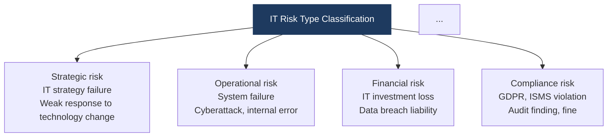
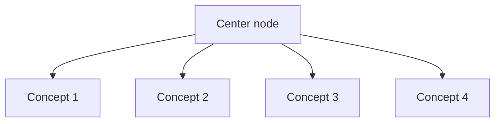
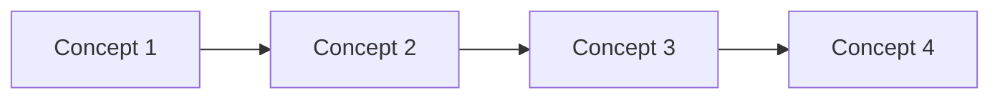
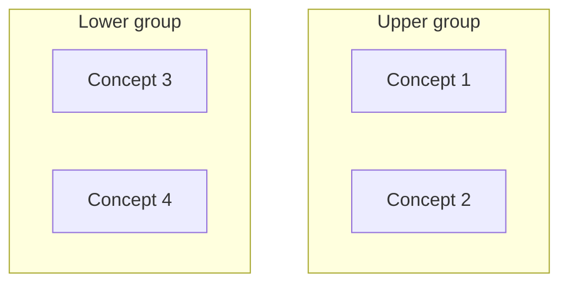

# Mermaid Syntax Error Fix

**Date**: 2026-05-25  
**Commit**: `adaca6a`  
**Files affected**: 9

---

## 1. Symptom

Mermaid diagrams fail to render on the following pages on the Hugo site.

```
Syntax error in text
mermaid version 11.15.0
```

First found at:
- `content/docs/06-it-management/04-business-continuity/erm.md`
- Section: **B. IT Risk Type Classification and Risk Response Strategy**

---

## 2. Root Cause

### Underlying cause

The cause is declaring two node definitions on the **same line** inside a `subgraph` block.  
Mermaid **11.x** treats this syntax as a parsing error.

### Error code pattern

```mermaid
flowchart TD
    subgraph R1["　"]
        direction LR
        A["Node 1 text"] B["Node 2 text"]   ← two nodes on the same line → error
    end
    subgraph R2["　"]
        direction LR
        C["Node 3 text"] D["Node 4 text"]   ← same problem
    end
```

### How it happened

This originates from the **2×2 grid diagram pattern** in the `it-professional-content` skill.  
That pattern used `subgraph` plus same-line node declarations to lay out 4 concepts in a 2-row, 2-column grid, but the Mermaid 11.x parser treats this as a syntax error.

```markdown
<!-- 2x2 grid example from the skill doc (causes the error) -->
flowchart TD
    subgraph R1["　"]
        direction LR
        A["Concept 1"] B["Concept 2"]   ← the same-line declaration is the problem
    end
```

---

## 3. Fix

### erm.md — full layout replacement

Replaced the `subgraph` 2×2 grid with a **hub-and-spoke TD layout**.

**Before**:
```mermaid
flowchart TD
    subgraph R1["　"]
        direction LR
        A["Strategic risk<br/>..."] B["Operational risk<br/>..."]
    end
    subgraph R2["　"]
        direction LR
        C["Financial risk<br/>..."] D["Compliance risk<br/>..."]
    end
    style R1 fill:none,stroke:none
    style R2 fill:none,stroke:none
    ...
```

**After**:


### The other 8 files — split nodes onto separate lines

Split the two nodes declared on the same line into **separate lines**.

**Before**:
```
        A["Node 1 text"] B["Node 2 text"]
```

**After**:
```
        A["Node 1 text"]
        B["Node 2 text"]
```

Applied as a batch automated fix using a Python script that scanned the whole document set.

---

## 4. Files Fixed

| File path | Error location | Fix applied |
|---|---|---|
| `content/docs/06-it-management/04-business-continuity/erm.md` | B. IT Risk Type Classification | subgraph → replaced with hub-and-spoke |
| `content/docs/03-network/05-wireless-mobile/5g-6g.md` | A. 5G's 3 major scenarios | same-line nodes → split onto separate lines |
| `content/docs/03-network/05-wireless-mobile/iot-wireless.md` | A. Short-range wireless communication classification | same-line nodes → split onto separate lines |
| `content/docs/04-security/01-cryptography/symmetric-crypto.md` | B. Major algorithm classification | same-line nodes → split onto separate lines |
| `content/docs/05-computer-architecture/04-process-thread/thread.md` | A. Process vs. thread | same-line nodes → split onto separate lines |
| `content/docs/05-computer-architecture/05-concurrency-deadlock/deadlock.md` | A. 4 conditions for deadlock | same-line nodes → split onto separate lines |
| `content/docs/05-computer-architecture/05-concurrency-deadlock/synchronization.md` | B. Synchronization mechanism classification | same-line nodes → split onto separate lines |
| `content/docs/07-emerging-tech/04-metaverse-iot/metaverse-digital-twin.md` | A. XR technology classification | same-line nodes → split onto separate lines |
| `content/docs/08-algorithms/01-data-structures/nonlinear-structures.md` | B. Heap, graph structures | same-line nodes → split onto separate lines |

---

## 5. Rules to Prevent Recurrence

Follow these additional rules going forward when writing Mermaid diagrams.

### Forbidden pattern

```
# Forbidden — two node definitions on the same line
A["Text 1"] B["Text 2"]
```

### Allowed pattern

```
# Allowed — each node defined on its own line
A["Text 1"]
B["Text 2"]
```

### Recommended alternatives for laying out 4 concepts in a 2x2 grid

**Method 1 — hub-and-spoke (recommended)**


**Method 2 — sequential LR list**


**Method 3 — split nodes inside a subgraph onto separate lines**


---

## 6. Automated Detection Script

A scan command to check whether the same pattern has recurred.

```bash
grep -rn '' content/docs/ | \
  python3 -c "
import sys, re
for line in sys.stdin:
    if re.search(r'\[\"[^\"]*\"\]\s+[A-Z][A-Z0-9]*\[\"', line):
        print(line.rstrip())
"
```

No output means the pattern has not recurred.
