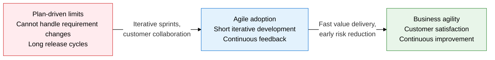
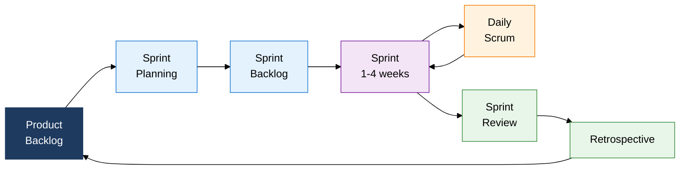
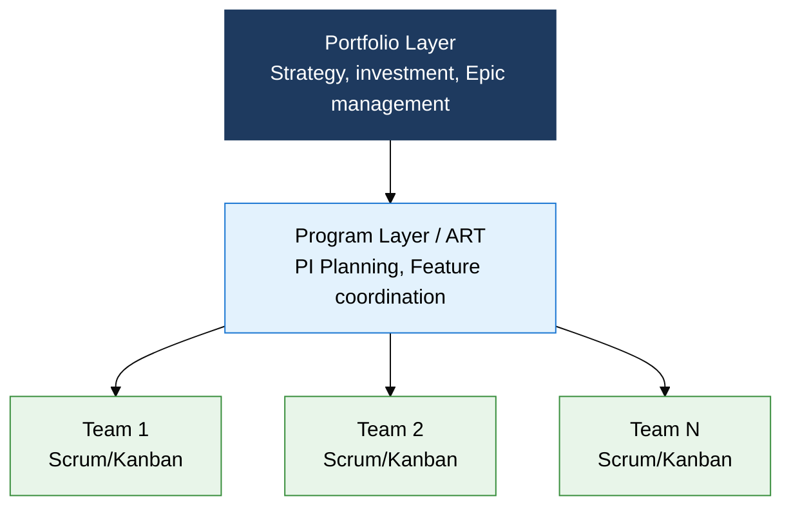

## I. Overview of Agile Methodology, Iterative and Collaborative Development That Adapts to Change

**Definition**:  
A development methodology that uses iterative development cycles and customer collaboration as its core mechanisms to adapt flexibly to change and deliver software value continuously  
- Based on the 4 values and 12 principles that 17 software professionals declared in the 2001 Agile Manifesto  
- Implemented through frameworks such as Scrum, XP, Kanban, and SAFe, applied at scales from a single team to an entire enterprise  
- Iteratively releases working software in Sprint (Iteration) units of 1 to 4 weeks, surfacing risk early  

**Characteristics**:  
( **Adaptive planning** ) A flexible planning structure that welcomes change instead of fixed requirements and re-prioritizes each Sprint  
( **Continuous feedback** ) Regular events such as Sprint Review and Daily Stand-up let the customer and team exchange feedback immediately  
( **Working software first** ) Delivers a working Increment periodically over comprehensive documentation, verifying value directly  

---

## II. Core Structure of Agile Methodology

### A. Agile Core Values and the Scrum Framework Structure

| Category | Item | Description |
|---|---|---|
| **Role** | Product Owner (PO) | Defines product vision, sets Product Backlog priority, owns maximizing business value |
| **Role** | Scrum Master (SM) | Upholds Agile principles, removes impediments, coaches the team toward self-organization |
| **Role** | Development Team | A self-organizing team of 3-9, executes the Sprint Backlog, owns completing the Increment |
| **Event** | Sprint Planning | Sets the Sprint goal and scope, selects Sprint Backlog items from the Product Backlog |
| **Event** | Daily Stand-up | A 15-minute daily sync, shares progress through three questions: yesterday, today, and blockers |
| **Event** | Sprint Review | Demonstrates the Increment at Sprint end, gathers stakeholder feedback |
| **Event** | Retrospective | Identifies team process improvements, finalizes Action Items for the next Sprint |
| **Artifact** | Product Backlog | The full list of requirements, in User Story form, prioritized by the PO |
| **Artifact** | Sprint Backlog | The list of tasks to complete in the current Sprint, managed autonomously by the team |
| **Artifact** | Increment | Completed working software at the end of each Sprint, must meet the DoD |
| **Artifact** | Burndown Chart | Visualizes remaining work over time, tracks Sprint progress |

---

### B. XP Practices and a Comparison of Large-Scale Agile Frameworks

| Category | Scrum | XP | Kanban | SAFe / LeSS |
|---|---|---|---|---|
| **Scale of use** | Small to mid-size single team | Small development team | Team to service level | Mid-to-large organization, enterprise |
| **Core mechanism** | Sprint iteration, separated roles | TDD, pair programming, CI | WIP limits, pull system | PI Planning, ART, portfolio layer |
| **Key artifacts** | Product Backlog, Increment, Burndown | Test code, integrated build, refactoring results | Kanban Board, cumulative flow diagram | PI Roadmap, Feature, Program Increment |
| **Characteristics** | Roles, events, and artifacts are clearly defined; low learning curve | Emphasizes technical practices; code quality, TDD, pair programming | Flexible flow management, responds to change immediately, visualizes bottlenecks | Provides large-scale alignment and governance; LeSS simplifies to a single Backlog |
| **XP's 5 values** | — | Communication, simplicity, feedback, courage, respect | — | — |
| **Scaling approach** | No structure for coordinating multiple teams | — | — | SAFe: 3 layers / LeSS: single PO, multiple teams |

---

## III. Expected Benefits and Practical Applications of Adopting Agile Methodology

| Category | Key Benefits | Practical Applications |
|---|---|---|
| **Process** | Sprint-based iteration accepts requirement changes early and steadily lowers delivery risk | Reprioritize the Product Backlog every Sprint and codify Definition of Done criteria to secure quality standards |
| **Technology** | Applying XP practices such as TDD, CI, and refactoring improves code quality and technical debt management | Embed a Jenkins/GitHub Actions-based CI/CD pipeline and SonarQube static analysis into the Sprint cycle |
| **Organization/Culture** | Self-organizing teams improve member autonomy, accountability, and psychological safety, and activate knowledge sharing | Track Retrospective outcomes as Action Items and realize collective code ownership through pair and mob programming |
| **Strategy/Scale** | Adopting SAFe/LeSS keeps strategic goals and team execution aligned even at scales of dozens to hundreds of people | Make the full ART roadmap visible through quarterly PI Planning and manage Epic flow at the strategic level with a Portfolio Kanban |
