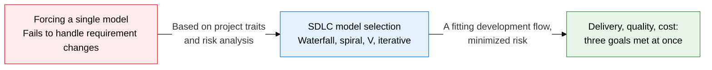
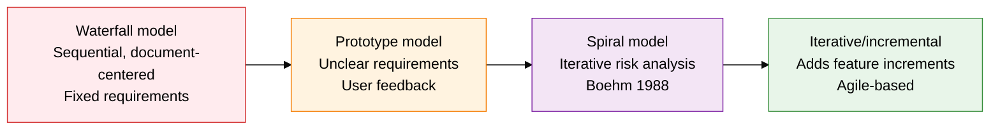
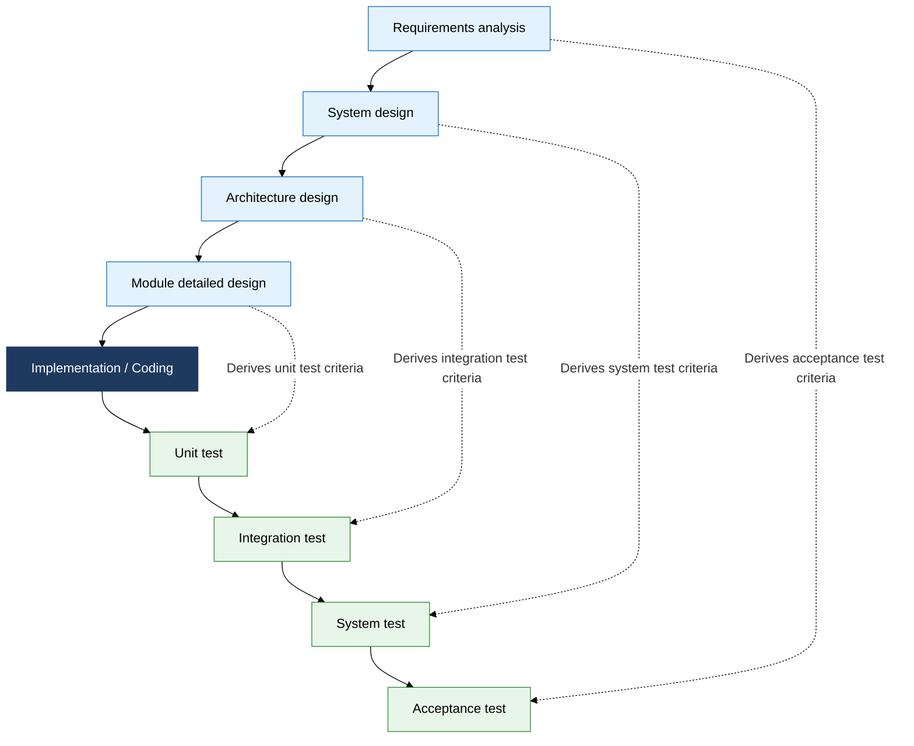

## I. Overview of SDLC Models, the Strategy for Choosing a Development Flow That Fits Project Characteristics

**Definition**:  
A **set of life cycle model types** that systematizes every stage of software development (requirements to design to implementation to testing to maintenance), a framework that secures quality and predictability by choosing the flow that fits a project's characteristics  
- The suitable model varies by requirements clarity, change frequency, and risk level  
- Represented by the waterfall, prototype, spiral, V-model, and iterative models, each with its own feedback structure  
- Choosing a model is not a simple technique adoption but a development strategy decision, directly affecting project success rate

**Characteristics**:  
( **Diversity** ) No single standard exists; the optimal model differs by requirements stability, team size, and risk tolerance  
( **Sequential vs. iterative** ) Waterfall-family models run a one-way sequential flow, while spiral and iterative models develop incrementally through feedback loops  
( **Built-in verification** ) The V-model explicitly defines a test stage that corresponds to each development stage, catching defects early

## II. Core Structure of SDLC Models

### A. Characteristics and Application Scenarios by Model Type

| Model | Core Characteristics | Suitable Application Scenario |
|:---:|:---|:---|
| **Waterfall** | A one-way sequential flow from requirements to design to implementation to testing; each stage completes before the next begins | Government/defense systems with clear requirements and low change likelihood |
| **Prototype** | Builds an early prototype quickly to incorporate user feedback before full development | New services with unclear requirements or that need UI/UX validation up front |
| **Spiral** | Iterates through the four quadrants of planning, risk analysis, development, and evaluation; suited to large, high-risk projects | Large-scale systems with high risk (aviation, healthcare, financial core infrastructure) |
| **Iterative/Incremental** | Splits the full feature set into small iterations, repeatedly delivering working increments | Web/mobile services with frequent requirement changes and a need for fast feedback |

### B. Comparing the Verification Structures of the V-Model and Iterative Model

| Verification Stage | Corresponding Development Stage | Verification Type | Key Check Items |
|:---:|:---|:---:|:---|
| **Unit test** | Module detailed design | Verification | Individual module logic correctness, boundary value and exception handling |
| **Integration test** | Architecture design | Verification | Interface and data flow consistency between modules |
| **System test** | System design | Validation | Whether the whole system meets functional, performance, and security requirements |
| **Acceptance test** | Requirements analysis | Validation | Whether user requirements and business goals are met |

## III. Expected Benefits and Practical Applications of Adopting SDLC Models

| Category | Key Benefits | Practical Applications |
|:---:|:---|:---|
| **Risk management** | The spiral model's iterative risk analysis identifies and mitigates high-risk factors early | Compile an initial risk list at project start and re-assess risk level every iteration |
| **Quality assurance** | The V-model's 1:1 mapping of development to test stages moves defect detection earlier | Practice TDD in parallel by writing test cases proactively when each design stage completes |
| **Requirements response** | The prototype and iterative models resolve requirement ambiguity through user feedback | Demonstrate a working increment every sprint to confirm requirements and reflect changes immediately |
| **Project predictability** | The waterfall model's stage-by-stage artifacts let progress and cost be tracked clearly | Combine WBS-based milestone management with EVM (earned value management) to detect deviations early |
