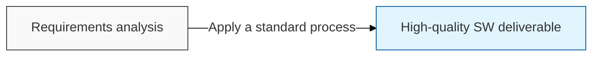
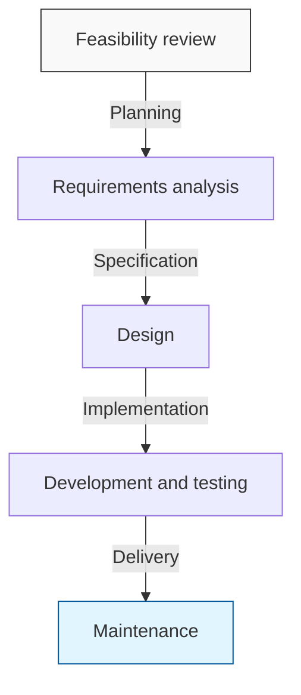

## I. Overview of SDLC, the Foundation of Software Quality Assurance

**Definition**:  
A standard system of **process models** for systematically managing the entire course of software, from planning to retirement  

**Characteristics**:  
( **Quality assurance** ) Standardized stages improve software reliability and readability  
( **Management efficiency** ) Stage-based deliverables support progress management and minimize risk  
( **Communication** ) Establishes a shared understanding among users, analysts, and developers  

## II. Detailed SDLC Mechanism and Key Stages

### A. Stage-by-Stage Process Mechanism of SDLC

### B. Key Activities and Deliverables by SDLC Stage
| Stage | Key Activities | Key Deliverables |
|:---:|:---|:---|
| **Planning** | Feasibility study, project schedule and budget planning | Project plan, feasibility report |
| **Analysis** | Gather and specify user requirements | Requirements specification, use-case model |
| **Design** | System architecture, UI/UX, DB schema design | System design document, detailed design document |
| **Implementation** | Coding and unit testing | Source code, executable file |
| **Testing** | Integration test, system test, acceptance test | Test result report, defect report |
| **Maintenance** | Defect fixes, performance improvements, updates | Maintenance log |

## III. Comparing SDLC Model Types: Waterfall vs Agile

| Comparison Item | Waterfall Model | Agile Model |
|:---:|:---|:---|
| **Management philosophy** | Plan-centered ( **Plan-Driven** ) | Value-centered ( **Value-Driven** ) |
| **Development style** | Linear sequential progress ( **Linear** ) | Iterative, incremental development ( **Iterative** ) |
| **Requirements** | Fixed early ( **Frozen** ) | Continuously changing ( **Flexible** ) |
| **Customer involvement** | Concentrated at the initial and final stages | Ongoing throughout the entire development process |
| **Advantages** | Simple structure, easy to manage | Fast response to changing market demands |
| **Disadvantages** | Requirement changes late in the project incur heavy cost | Increased risk of project management complexity |

## IV. SDLC Strategy from a Professional Engineer's Perspective
- As business environments grow more complex, adopting a **hybrid** approach is becoming more common than applying a single model.
- Selecting the optimal SDLC for an organization's capabilities and project characteristics through "Project Tailoring" is a **key success factor** for a successful software project.
