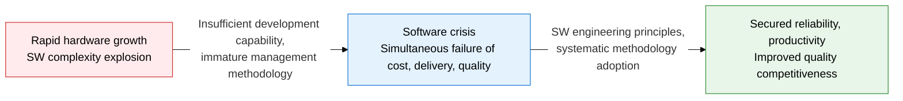
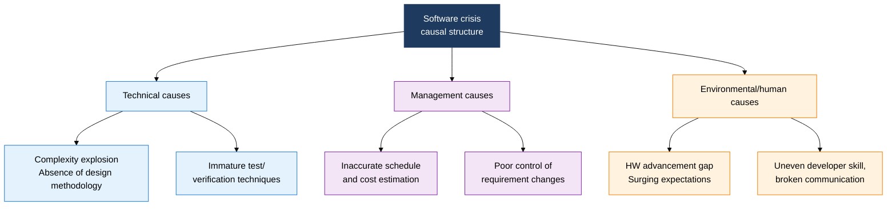
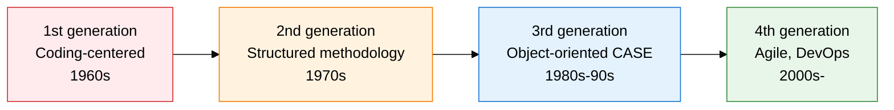

## I. Overview of the Software Crisis, the Limits of SW Development Capability Exposed by Triple Failure in Delivery, Cost, and Quality

**Definition**:  
A structural problem phenomenon of **cost overruns, delivery delays, and quality decline** that arose in the 1960s as software development capability fell behind the pace of hardware advancement  
- A concept formally raised at the 1968 NATO Conference on Software Engineering, the direct trigger for the birth of software engineering  
- Its core cause is the **complexity barrier**, where complexity grows exponentially as development scale increases  
- The historical phenomenon that gave rise to Brooks's Law ("adding manpower to a late software project makes it later")  

**Characteristics**:  
( **Lack of visibility** ) Software has no physical form, making it hard to measure progress and quality or to catch problems early  
( **Complexity explosion** ) Code complexity grows non-linearly as feature requirements increase, creating situations that are unpredictable and uncontrollable  
( **Recurring pattern** ) A structural, chronic phenomenon in which the same failure pattern repeats regardless of scale or domain  

## II. Causal Structure of the Software Crisis and the Engineering Response System

### A. Classification of Software Crisis Causes and Key Symptoms

| Cause Category | Core Cause | Key Symptom |
|:---:|:---|:---|
| **Technical** | Absence of design methodology, failed complexity management | Spaghetti code, unmaintainable state |
| **Management** | Unrealistic schedule/budget, uncontrolled requirements | Delivery delays, project cancellation/failure |
| **Environmental** | HW advancement gap, surging user expectations | Rapid SW scale growth, performance dissatisfaction |
| **Human** | Uneven developer skill, broken cross-team communication | Rising defect density, collaboration conflicts |

### B. Software Engineering Strategies and the Evolution of Methodology

| Response Strategy | Key Methodology and Standard | Expected Benefit |
|:---:|:---|:---|
| **Process standardization** | SDLC, CMMI, ISO/IEC 12207 | Better development predictability, unified quality criteria |
| **Adopting a design methodology** | Structured, object-oriented, component-based design | Complexity decomposition, better module reusability |
| **Iterative, incremental development** | Scrum, Kanban, XP, Lean development | Secures the ability to respond to requirement changes |
| **Automation, DevOps** | CI/CD, automated testing, code review | Early defect detection, shorter deployment cycles |

## III. Expected Benefits and Practical Applications of Addressing the Software Crisis

| Category | Key Benefits | Practical Applications |
|:---:|:---|:---|
| **Quality management** | Applying systematic methodology lowers defect density and secures reliability | Diagnose the CMMI level, then build a phased process improvement roadmap |
| **Project management** | WBS/EVM-based estimation improves schedule and cost accuracy | Estimate scale with Function Point and build a risk response plan |
| **Technical capability** | Accumulates reusable component and architecture assets | Standardize internal frameworks and build a design pattern library |
| **Organizational culture** | Establishing a learning organizational culture prevents repeated failure | Institutionalize periodic Retrospectives and adopt a knowledge management system |
