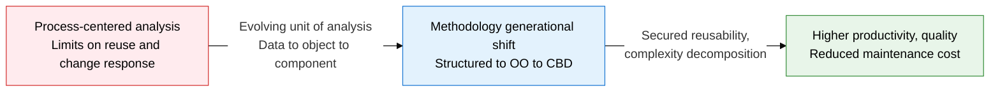
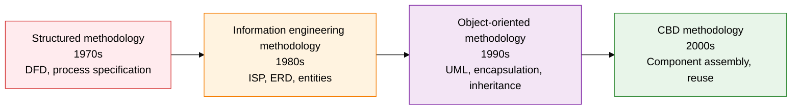
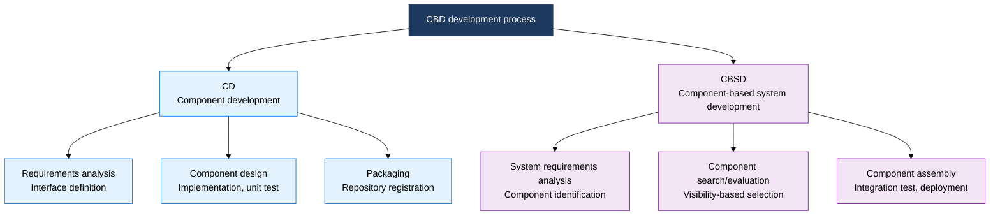

## I. Overview of Traditional Methodology, Which Maximized Reusability Through a Generational Shift in Analysis Paradigm

**Definition**:  
A methodology system in which the analysis and design paradigm of software development has evolved in the order **process-centered → data-centered → object-centered → component assembly**  
- Each generation advances to overcome the limits of the previous methodology (reusability, change response, complexity)  
- Structured, information engineering, object-oriented, and CBD methodologies are still selectively used today depending on domain characteristics  
- CBD systematizes assembly strategy by classifying reusable components into black-box, white-box, and gray-box types

**Characteristics**:  
( **Paradigm continuity** ) Each methodology is not independent; it inherits the core concepts of the prior generation while extending only the unit of analysis  
( **Tooling linkage** ) Each methodology's own modeling notation — DFD, ERD, UML — determines the precision of the design deliverables  
( **Maximized reuse** ) CBD standardizes assembly, replacement, and extension through component interface specification and visibility classification

## II. Core Structure of Traditional Methodology

### A. Paradigm Evolution of Traditional Methodology (Structured → Information Engineering → OO → CBD)

| Methodology | Core Analysis Target | Representative Technique/Deliverable | Characteristics |
|:---:|:---|:---|:---|
| **Structured** | Process (functional flow) | DFD, structure chart, process specification | Function-decomposition-centered; data and process are separated, weakening maintainability |
| **Information engineering** | Data and process analyzed together | ISP, ERD, CRUD matrix | Manages entities and processes together, grounded in an enterprise information architecture |
| **Object-oriented** | Object (data + behavior encapsulated) | UML class/sequence diagrams | Improves reusability through encapsulation, inheritance, and polymorphism; the direct basis for CBD |
| **CBD** | Component (unit of reuse) | Component specification, interface definition | Dual CD + CBSD structure, black/white/gray-box visibility classification |

### B. Core Concepts of CBD and Component Visibility Classification

| Visibility Type | Definition | Reuse Strategy | Advantages/Disadvantages |
|:---:|:---|:---|:---|
| **Black-box** | Internal implementation is fully hidden, only the interface is exposed | Assemble as-is without change (as-is reuse) | Easy to reuse; no alternative when requirements mismatch since internals can't be modified |
| **White-box** | Source code is fully exposed, internal modification is allowed | Modify the source, then reassemble (modified reuse) | Flexible customization; modification increases compatibility and maintenance burden |
| **Gray-box** | Limited internal access, modification allowed at the configuration/parameter level | Reuse after adjusting parameters/configuration | A middle ground between black and white; the form used most often in practice |

## III. Expected Benefits and Practical Applications of Adopting Traditional Methodology

| Category | Key Benefits | Practical Applications |
|:---:|:---|:---|
| **Analysis accuracy** | Methodology-specific modeling techniques structurally remove omissions and ambiguity from requirements | Perform data-centered requirement verification using information engineering's ERD and CRUD matrix |
| **Reusability** | Building a CBD component repository cuts development effort on similar projects by 30-50% | Establish a black-box-first selection principle, then allow customization in gray-to-white-box order |
| **Maintainability** | Object-oriented encapsulation and polymorphism minimize the scope of change impact, cutting maintenance cost | Pre-identify affected modules on change and scope regression testing through UML class diagram-based dependency analysis |
| **Enterprise standardization** | Adopting a methodology system unifies deliverable format and quality across development teams, building organizational capability | Establish an in-house standard methodology guideline and run a PMO-led quality gate for methodology compliance |
