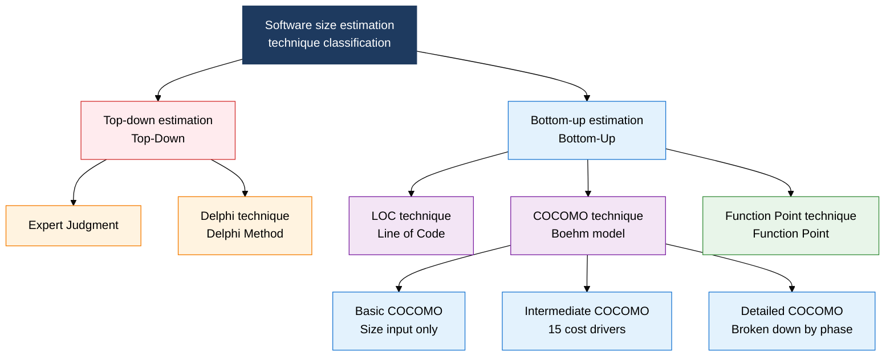
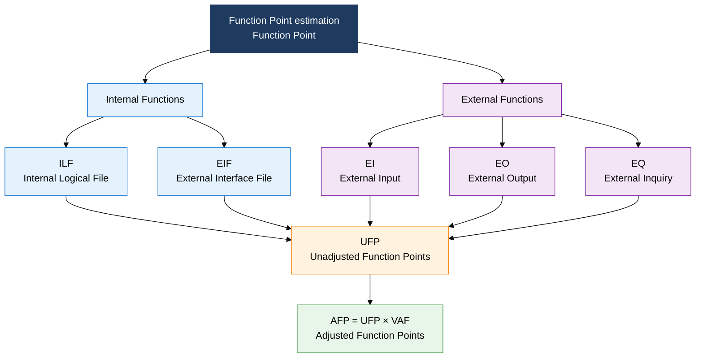

## I. Overview of Software Size Estimation, an Estimation System That Objectifies Development Scale Through Function-Based Quantification

**Definition**:  
An estimation system that quantifies software development scale through top-down/bottom-up approaches and the Function Point (FP) technique, securing reliability in budget and schedule planning  
- Improves estimation accuracy in stages, using expert judgment and Delphi (top-down) alongside LOC, COCOMO, and FP (bottom-up)  
- Function Point (FP) is an international standard estimation method that measures scale from a functional viewpoint, independent of the implementation language  
- A two-stage structure that applies VAF (Value Adjustment Factor) to UFP (Unadjusted Function Points) to produce AFP (Adjusted Function Points)  

**Characteristics**:  
( **Language independence** ) The Function Point technique measures scale from the user function viewpoint, independent of implementation technology or language  
( **Three-point estimation** ) A PERT-based estimation that statistically reflects uncertainty by weight-averaging optimistic, most-likely, and pessimistic estimates  
( **Complexity adjustment** ) Corrects for environmental differences using COCOMO project types (Organic, Semi-detached, Embedded) and FP complexity weights  

---

## II. Core Structure of Software Size Estimation

### A. Classification of Sizing Techniques (Top-Down vs. Bottom-Up)

| Technique | Type | Core Approach | Advantages | Disadvantages |
|---|---|---|---|---|
| **Expert judgment** | Top-down | Intuitive estimation based on expert experience | Fast, usable in early stages | Subjective, prone to bias |
| **Delphi technique** | Top-down | Reaches consensus through anonymous, repeated expert surveys | Reduces group bias, gathers independent opinions | Time-consuming, depends on facilitator skill |
| **LOC technique** | Bottom-up | Weight-averages optimistic, most-likely, and pessimistic three-point estimates | Concrete measurement, integrates easily with PERT | Varies widely by language and implementation style |
| **COCOMO** | Bottom-up | Formula-based estimation applying coefficients by project type | Objectivity grounded in historical data | Formula parameters need organization-specific calibration |
| **Function Point (FP)** | Bottom-up | Identifies the 5 function types and sums their weights | Language-independent, international standard (IFPUG) | Assumes clear requirements, has a learning cost |

### B. Detailed Structure of the Function Point (FP) Technique

| Function Type | Definition | Simple Weight | Average Weight | Complex Weight |
|---|---|---|---|---|
| **ILF (Internal Logical File)** | A user-identified logical data group maintained by the application | 7 | 10 | 15 |
| **EIF (External Interface File)** | A logical data group maintained by another application and referenced by this one | 5 | 7 | 10 |
| **EI (External Input)** | An elementary process that receives data from outside and changes an ILF | 3 | 4 | 6 |
| **EO (External Output)** | An elementary process that sends data or derived information outward (including calculation) | 4 | 5 | 7 |
| **EQ (External Inquiry)** | An elementary process that retrieves and returns data without changing an ILF | 3 | 4 | 6 |

> **AFP formula**: AFP = UFP × VAF (VAF = 0.65 + 0.01 × Σ of 14 general system characteristic scores)

---

## III. Expected Benefits and Practical Applications of Adopting Software Size Estimation

| Category | Key Benefits | Practical Applications |
|---|---|---|
| **Strategic** | Objective function-based sizing prevents contract disputes between client and vendor and builds trust | Apply FP-based unit-price contracts per the SW Business Cost Estimation Guide (Ministry of Science and ICT) |
| **Operational** | Three-point estimation and the COCOMO model secure a statistical confidence interval for budget and schedule planning | Run a dual estimation system: reach expert consensus via Delphi, then cross-verify with LOC/FP |
| **Technical** | COCOMO cost-driver analysis identifies project risk factors early and supports response planning | Refine estimates progressively from Basic to Intermediate to Detailed COCOMO as design advances |
| **Organizational** | Accumulating FP and actual-effort data from completed projects builds an organization-specific productivity metric (FP/MM) | Build a project history database and reference similar-project FP data when estimating new projects |
