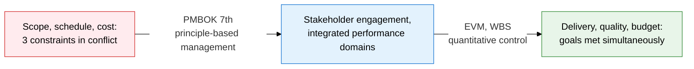
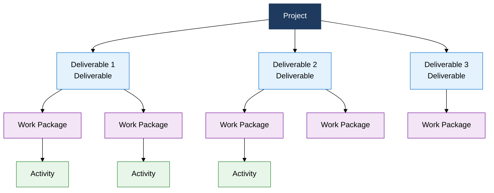
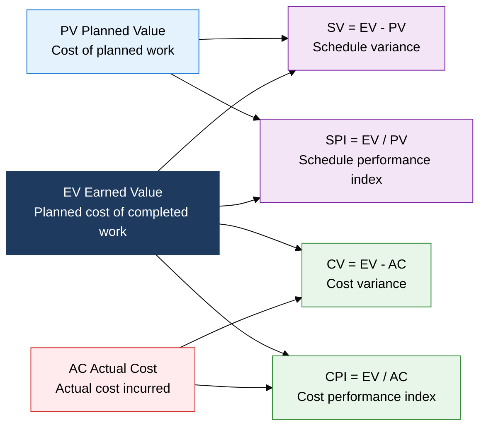

## I. Overview of Project Management, a Management System That Achieves a Time-Bound Goal by Balancing 3 Constraints

**Definition**:  
A project management system that applies PMBOK 7th's 12 principles and 8 performance domains to achieve a time-bound goal with a unique deliverable  
- A project is a time-bound effort with a clear end point, fundamentally distinct from ongoing Operations  
- The 3 constraints of Scope, Schedule, and Cost are interlinked, so a change to one affects the others  
- PMBOK 7th shifts from a process-centered focus to one centered on principles and performance domains, extending coverage to Agile environments  

**Characteristics**:  
( **Time-bound** ) A unique effort with a clear start and end point that, unlike operations, does not repeat  
( **Integrated constraint management** ) A triple-constraint principle that balances the trade-offs among scope, schedule, and cost  
( **Shift to performance focus** ) PMBOK 7th defines realized business value, rather than inputs or process, as the ultimate success criterion  

---

## II. Core Structure of Project Management

### A. PMBOK 7th Principles and Managing the 3 Constraints

| Constraint Area | Core Technique | Key Deliverable |
|---|---|---|
| **Scope** | WBS 100% rule, scope creep prevention, requirements traceability matrix | WBS dictionary, scope baseline, requirements document |
| **Schedule** | CPM (critical path method), PERT three-point estimation, CCM (critical chain method), resource leveling | Schedule baseline, network diagram, milestone list |
| **Cost** | EVM (earned value management), bottom-up estimation, reserve analysis (CV, SV, CPI, SPI) | Cost baseline, budget status report, EAC forecast |

### B. EVM (Earned Value Management) Metrics and Analysis System

| Metric | Formula | Meaning if Positive or 1 and Above | Meaning if Negative or Under 1 | Application |
|---|---|---|---|---|
| **CV (Cost Variance)** | EV - AC | Under budget (cost efficient) | Over budget (cost crisis) | Immediately analyze the cause of cost increase and take corrective action |
| **SV (Schedule Variance)** | EV - PV | Ahead of schedule (good progress) | Behind schedule (delivery risk) | Reallocate resources or apply schedule compression techniques |
| **CPI (Cost Performance Index)** | EV / AC | Getting more than 1 unit of value per 1 unit spent | Getting less than 1 unit of value per 1 unit spent | Basis for EAC forecasting and remaining budget control |
| **SPI (Schedule Performance Index)** | EV / PV | Ahead of schedule versus plan | Behind schedule versus plan | Focus management on critical-path activities and apply fast-tracking |
| **EAC (Estimate at Completion)** | BAC / CPI | Expected to finish within budget | Expected to finish over budget | Basis for upward reporting and requesting budget re-approval |

---

## III. Expected Benefits and Practical Applications of Adopting Project Management

| Category | Key Benefits | Practical Applications |
|---|---|---|
| **Strategic** | Aligning business goals with project deliverables maximizes realized return on investment | Build the project charter around PMBOK 7th performance domains, establish a stakeholder engagement strategy |
| **Operational** | Integrating WBS, CPM, and EVM makes the 3 constraints of scope, schedule, and cost visible and controllable in real time | Build a weekly EVM reporting system, run an early-warning system based on a CPI/SPI threshold (below 0.9) |
| **Technical** | Applying scope creep prevention and the WBS 100% rule reduces the risk of requirement omission and change | Maintain a requirements traceability matrix (RTM), protect the scope baseline through a change control board (CCB) |
| **Organizational** | Accumulating Lessons Learned after project closeout continuously grows organizational capability | Manage project execution data centrally through the PMO, track performance metric history via PMIS tools |
