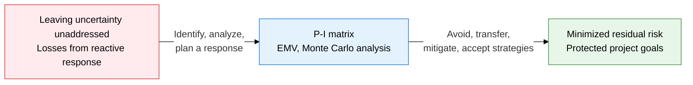
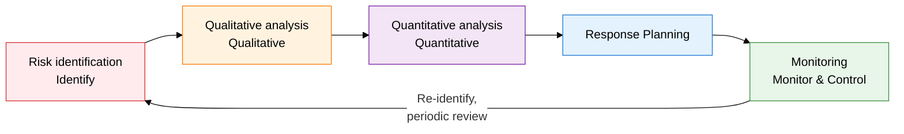
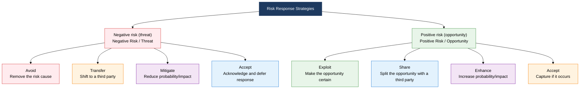

## I. Overview of Risk Management, a Management System That Proactively Controls Uncertainty Through Probability-Impact Analysis

**Definition**:  
A management system that systematically controls project uncertainty through the 5-stage process of risk identification, qualitative analysis, quantitative analysis, response planning, and monitoring  
- Qualitative analysis prioritizes risk using a probability-impact matrix, while quantitative analysis quantifies it using EMV and Monte Carlo simulation  
- Applies 4 distinct response strategies each for negative risk (threats) and positive risk (opportunities)  
- Separately manages Residual Risk left after a response and Secondary Risk newly created by the response  

**Characteristics**:  
( **Dual perspective** ) Treats risk as both threat (negative) and opportunity (positive), pursuing avoidance alongside opportunity-maximizing strategies  
( **Quantitative measurement** ) Expresses the financial impact of risk numerically through EMV and Monte Carlo simulation, grounding decisions in evidence  
( **Residual and secondary risk** ) Applies a completeness principle that tracks and manages both the residual risk that remains after a response and the secondary risk it creates  

---

## II. Core Structure of Risk Management

### A. Risk Management Process and Analysis System

| Analysis Type | Techniques Used | Output | Timing |
|---|---|---|---|
| **Qualitative analysis** | Probability-Impact Matrix (P-I Matrix), risk categorization, RBS (Risk Breakdown Structure) | Prioritized risk list, high-risk identification | Right after risk identification, before resource allocation |
| **Quantitative analysis** | EMV (expected monetary value), sensitivity analysis (tornado chart), Monte Carlo simulation | Quantified risk impact, probability distribution, P80 reserve estimate | For high-risk items, before finalizing budget and schedule |
| **Response planning** | Avoid, transfer, mitigate, accept (threat); exploit, share, enhance, accept (opportunity) | Risk response plan, risk owner assignment | After qualitative and quantitative analysis complete |
| **Monitoring** | Risk audits, variance and trend analysis, reserve analysis | Risk status report, residual risk list, secondary risk identification | Performed periodically throughout project execution |

### B. Classification System for Risk Response Strategies

| Strategy | Category | Definition | Practical Example | Cost Level |
|---|---|---|---|---|
| **Avoid** | Threat | Remove the risk cause itself or change the project plan | Replace an unproven new technology with a validated tech stack | High |
| **Transfer** | Threat | Shift the financial consequences of the risk to a third party | Purchase insurance, fixed-price contracts, subcontracting | Medium (insurance premium) |
| **Mitigate** | Threat | Reduce the probability or impact of the risk to an acceptable level | Build a prototype, strengthen testing, work in parallel | Medium |
| **Accept** | Threat | Acknowledge the risk and respond when it occurs, or set aside a reserve | Reserve schedule/budget, establish a contingency plan | Low |
| **Exploit** | Opportunity | Remove uncertainty so the opportunity is certain to happen | Assign top talent to guarantee an early-completion opportunity | High |
| **Share** | Opportunity | Pursue the opportunity jointly with a third party better positioned to capture it | Form a consortium with a specialized partner, joint venture | Medium |
| **Enhance** | Opportunity | Increase the probability or positive impact of the opportunity | Secure key resources early, expand the opportunity through strategic investment | Medium |
| **Accept** | Opportunity | Do not actively pursue the opportunity, but capture it if it occurs | Monitor for the opportunity, no dedicated resources committed | Low |

---

## III. Expected Benefits and Practical Applications of Adopting Risk Management

| Category | Key Benefits | Practical Applications |
|---|---|---|
| **Strategic** | Probability-impact-based prioritization focuses limited resources on high-risk areas | Update the P-I matrix quarterly, run a Top 5 risk dashboard for executive reporting |
| **Operational** | EMV and Monte Carlo simulation statistically size the Contingency Reserve | Set the reserve based on P80 simulation, phase out the reserve as risks retire |
| **Technical** | Tracking residual and secondary risk eliminates blind spots that appear after a response | Add residual-risk and secondary-risk fields to the Risk Register, assign risk owner accountability |
| **Organizational** | Accumulating risk identification and response history strengthens proactive risk management on similar future projects | Build a Lessons Learned database from completed projects, standardize a risk checklist (RBS) organization-wide |
