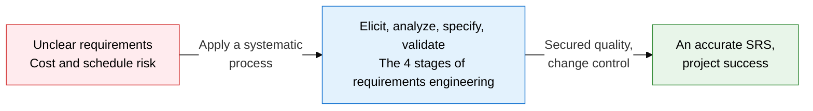
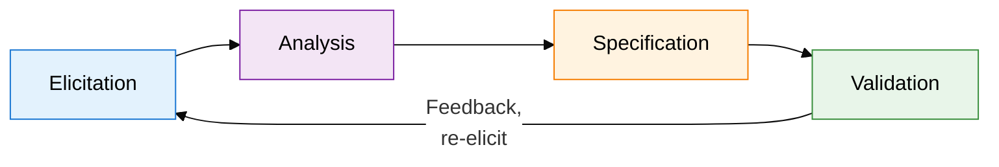
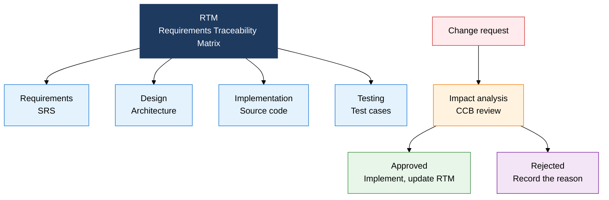

## I. Overview of Requirements Engineering, Which Completes Requirements Through Specification and Validation

**Definition**:  
A software engineering process that systematically elicits, analyzes, specifies, and validates stakeholder needs to produce an SRS  
- Covers both functional and non-functional requirements, forming the quality foundation for the entire SDLC  
- Links requirements to design, implementation, and testing through a traceability matrix (RTM)  
- Analyzes and controls the impact of requirement changes through a Change Control Board (CCB)  

**Characteristics**:  
( **Systematicity** ) The repeating cycle of elicit → analyze → specify → validate guarantees requirements completeness  
( **Traceability** ) The RTM enables bidirectional tracing between requirements and deliverables  
( **Verifiability** ) Inspection, walkthrough, and peer review confirm the SRS's accuracy and consistency  

---

## II. Core Structure of Requirements Engineering

### A. The 4-Stage Requirements Engineering Process and Elicitation Techniques

| Elicitation Technique | Characteristics | Suitable Situation | Key Deliverable |
|---|---|---|---|
| **Interview** | A 1:1 in-depth conversation with a stakeholder | Gathering input from key stakeholders | Interview record, requirements list |
| **Survey** | Quantitative collection of opinions from many users | A broad user distribution | Statistical analysis report |
| **Workshop** | Group discussion among stakeholders | When conflicting requirements need to be reconciled | Agreed-upon requirements list |
| **Brainstorming** | Free-form idea generation | Discovering creative features | Idea list |
| **Prototyping** | Confirmation through a UI/UX prototype | When requirements are unclear | Prototype, feedback |
| **Persona** | Defining fictional user types | User-centered design | Persona profile |
| **Ethnography** | On-site observation and work analysis | Understanding implicit business processes | Workflow description |

---

### B. Requirements Traceability and Change Management System

| Review Technique | Formality | Participants | Materials Needed | Cost |
|---|---|---|---|---|
| **Inspection** | Very high (formal procedure) | Author, moderator, reviewers, recorder | Checklist, the full SRS | High |
| **Walkthrough** | Medium (presentation format) | Author, peers, manager | SRS draft | Medium |
| **Peer review** | Low (informal) | Author, 1-2 peers | SRS draft | Low |

---

## III. Expected Benefits and Practical Applications of Adopting Requirements Engineering

| Category | Key Benefits | Practical Applications |
|---|---|---|
| **Quality** | Securing SRS completeness, consistency, and verifiability removes defects early | Verify the SRS against each quality item with an inspection checklist, then sign off |
| **Traceability** | The RTM links requirements to design, code, and testing end to end | Assign requirement IDs and manage them through JIRA/Confluence integration |
| **Change control** | The CCB approval process prevents unchecked scope creep | Standardize the change request form and mandate an impact analysis report |
| **Risk** | Catching requirement errors early reduces the cost of later fixes | Identify potential gaps early using prototyping and persona techniques |
