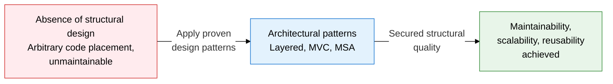
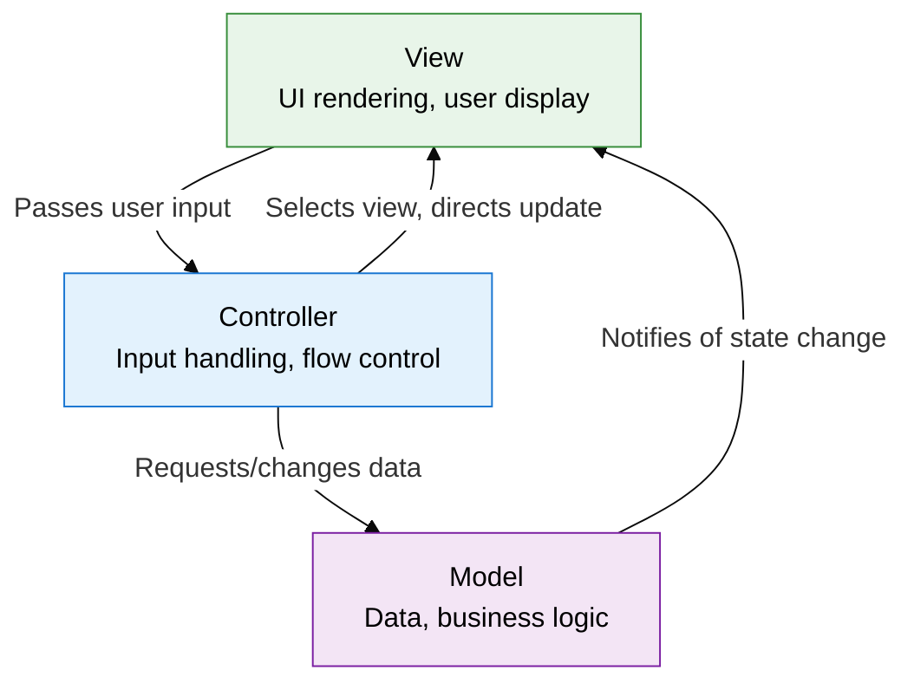
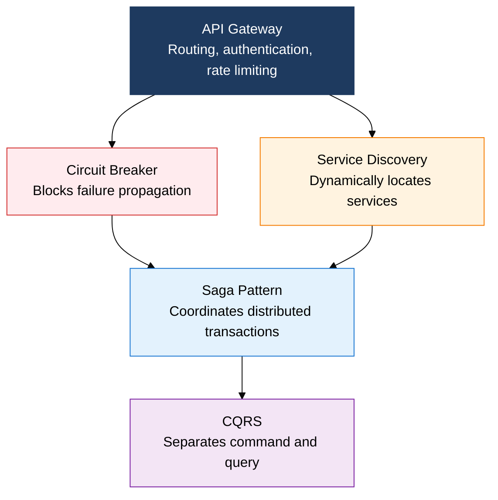

## I. Overview of Architectural Styles and Patterns, a Framework for Strategically Designing System Structure

**Definition**:  
A design strategy that systematizes repeatedly proven structural design solutions to achieve software quality attributes  
- A high-level design decision that governs the placement of components, separation of responsibilities, and communication style across the whole system  
- A key deliverable that directly affects quality attributes such as maintainability, scalability, and testability  
- Chosen after requirements analysis and before detailed design, since the cost of changing it later is very high  

**Characteristics**:  
( **Separation of concerns** ) Each layer/component holds a single responsibility, localizing the impact of change  
( **Reusability** ) Applying proven patterns repeatedly reduces design time and defects  
( **Quality trade-offs** ) Every pattern carries a trade-off among performance, complexity, and development speed  

---

## II. Core Structure of Architectural Styles and Patterns

### A. Traditional Architectural Patterns (Layered, MVC, MVVM)

| Pattern | Components | Core Principle | Frameworks | Advantages/Disadvantages |
|---|---|---|---|---|
| **Layered** | Presentation / Business Logic / Data Access / DB | One-way dependency between layers, separation of concerns | Spring MVC, .NET, Django | Pro: clear role separation / Con: call overhead between layers |
| **MVC** | Model / View / Controller | Model and View are separated, the Controller mediates | Spring MVC, Rails, ASP.NET | Pro: clear roles, easy to test / Con: risk of a bloated Controller |
| **MVVM** | Model / View / ViewModel | Two-way data binding, the ViewModel manages state | React (+Redux), Vue, Angular | Pro: declarative UI, easy to test / Con: complex binding debugging |
| **Pipe-Filter** | Source / Filter / Pipe / Sink | An independent filter chain, a data transformation stream | Unix pipes, ETL, compilers | Pro: filters recombine easily / Con: shared state is hard to handle |
| **Client-Server** | Client / Server / Network | Request-response, server-centralized | Web, REST API, gRPC | Pro: easy central management / Con: server is a single point of failure |

---

### B. Core MSA Concepts and a Comparison with Monolithic Architecture

| Comparison Item | Monolithic | MSA |
|---|---|---|
| **Deployment unit** | The whole application deployed as one unit | Independent deployment per service |
| **Technology stack** | A single language/framework enforced | Each service can pick the best-fit technology |
| **Scalability** | Scales the whole application horizontally (inefficient) | Scales only the bottleneck service selectively |
| **Data management** | A single shared DB | An independent DB per service (eventually consistent) |
| **Fault isolation** | One bug can risk bringing the whole system down | The Circuit Breaker blocks failure propagation |
| **Suitable scenario** | Small teams, early-stage startups, simple domains | Large teams, high-availability needs, fast release cycles |

---

## III. Expected Benefits and Practical Applications of Adopting Architectural Styles and Patterns

| Category | Key Benefits | Practical Applications |
|---|---|---|
| **Maintainability** | Separating layers and components minimizes the scope of change impact and improves code readability | Write per-layer unit tests after applying the Layered pattern, detect dependency violations with SonarQube |
| **Scalability** | Adopting MSA allows selective scale-out of only the services with surging traffic | Configure per-service autoscaling with Kubernetes HPA, control traffic by introducing an API Gateway |
| **Team productivity** | Clear service boundaries give teams independent development and deployment cycles | Structure teams around domains (leveraging Conway's Law), set up per-service CI/CD pipelines |
| **Fault resilience** | The Circuit Breaker and Saga patterns block failure propagation in a distributed environment | Adopt the Resilience4j/Hystrix libraries, verify failure scenarios with Chaos Engineering |
