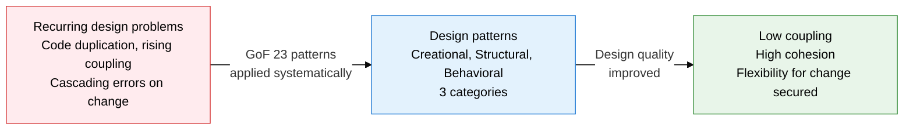
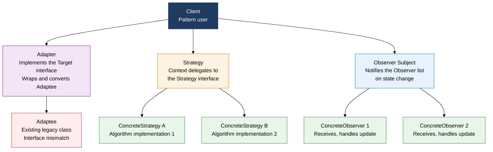

## I. Overview of Design Patterns, Proven Solutions to Recurring Design Problems

**Definition**:  
A design language codified by Erich Gamma and three co-authors (GoF) into 23 reusable solutions for recurring design problems  
- Classified into 5 Creational, 7 Structural, and 11 Behavioral patterns  
- An abstract design blueprint describing relationships, roles, and collaboration among classes and objects, not concrete code  
- Gives designers a shared vocabulary, cutting communication cost and improving code-review efficiency  

**Characteristics**:  
( **Reusability** ) Applying proven solutions repeatedly reduces design errors and development time  
( **Flexibility** ) Interface-based design lets behavior change without swapping implementations  
( **Communication** ) A pattern name like "apply the Observer pattern" shares a complex design instantly  

---

## II. Core Structure of Design Patterns

### A. The GoF 3-Category Classification

```mermaid
%%{init: { 'theme': 'base', 'themeVariables': { 'edgeLabelBackground': '#fff' }}}%%
flowchart TD
    ROOT["GoF 23 Design Patterns"]

    ROOT --> CR["Creational Patterns<br/>5 patterns"]
    ROOT --> ST["Structural Patterns<br/>7 patterns"]
    ROOT --> BH["Behavioral Patterns<br/>11 patterns"]

    CR --> C1["Singleton<br/>Single instance"]
    CR --> C2["Factory Method<br/>Delegated creation"]
    CR --> C3["Abstract Factory<br/>Related object family creation"]
    CR --> C4["Builder<br/>Staged complex objects"]
    CR --> C5["Prototype<br/>Cloning"]

    ST --> S1["Adapter<br/>Interface conversion"]
    ST --> S2["Proxy<br/>Surrogate"]
    ST --> S3["Decorator<br/>Dynamic feature addition"]
    ST --> S4["Facade<br/>Simplified interface"]

    BH --> B1["Observer<br/>Event notification"]
    BH --> B2["Strategy<br/>Algorithm swap"]
    BH --> B3["Template Method<br/>Algorithm skeleton"]
    BH --> B4["State<br/>State transition"]

    style ROOT fill:#1E3A5F,stroke:#1E3A5F,color:#fff
    style CR fill:#E3F2FD,stroke:#1976D2,color:#000
    style ST fill:#F3E5F5,stroke:#7B1FA2,color:#000
    style BH fill:#FFF3E0,stroke:#F57C00,color:#000
    style C1 fill:#E3F2FD,stroke:#1976D2,color:#000
    style C2 fill:#E3F2FD,stroke:#1976D2,color:#000
    style C3 fill:#E3F2FD,stroke:#1976D2,color:#000
    style C4 fill:#E3F2FD,stroke:#1976D2,color:#000
    style C5 fill:#E3F2FD,stroke:#1976D2,color:#000
    style S1 fill:#F3E5F5,stroke:#7B1FA2,color:#000
    style S2 fill:#F3E5F5,stroke:#7B1FA2,color:#000
    style S3 fill:#F3E5F5,stroke:#7B1FA2,color:#000
    style S4 fill:#F3E5F5,stroke:#7B1FA2,color:#000
    style B1 fill:#FFF3E0,stroke:#F57C00,color:#000
    style B2 fill:#FFF3E0,stroke:#F57C00,color:#000
    style B3 fill:#FFF3E0,stroke:#F57C00,color:#000
    style B4 fill:#FFF3E0,stroke:#F57C00,color:#000
```

| Pattern | Purpose | When to apply | Core structure |
|---|---|---|---|
| **Singleton** | Guarantees only one instance of a class | DB connection pool, log manager, config object | Private constructor + static instance-return method |
| **Factory Method** | Delegates object-creation responsibility to a subclass | When the product type is decided at run time | Creator abstract class + ConcreteCreator subclass |
| **Abstract Factory** | Creates a family of related objects consistently | UI theme sets, platform-specific widget creation | AbstractFactory interface + concrete factory implementations |
| **Builder** | Assembles a complex object step by step | Many constructor parameters, many optional fields | Director + Builder interface + ConcreteBuilder |
| **Prototype** | Creates a new object by cloning an existing one | High initialization cost, repeated creation of similar objects | clone() method, deep-copy implementation |

---

### B. Key Structural and Behavioral Patterns in Detail

| Pattern | Problem solved | Core structure | Use case | Exam point |
|---|---|---|---|---|
| **Adapter** | Interface mismatch blocks collaboration | Target interface ← Adapter (delegates to Adaptee) | Legacy library integration, JDBC drivers | Class adapter (inheritance) vs. object adapter (delegation) |
| **Proxy** | Access control or lazy loading needed for the real object | Client → Proxy (implements Subject) → RealSubject | Lazy-loaded images, access control, caching | Distinguishing Virtual, Remote, and Protection Proxy |
| **Decorator** | Adds behavior dynamically at run time, without inheritance | Component interface + chained Decorator wrapping | Java InputStream chains, decorating UI widgets | Extends behavior by composition, not inheritance; supports multiple nesting |
| **Observer** | 1:N state-change notification with loose coupling | Subject (attach/notify) + Observer (update) | Event listeners, MVC Model→View updates | Pull vs. push notification strategy |
| **Strategy** | Lets an algorithm be swapped at run time | Context + Strategy interface + concrete implementations | Swapping sort algorithms, changing payment methods | Replaces if-else branching with a pattern; realizes OCP |
| **Template Method** | Fixes the algorithm skeleton, delegates only the details | AbstractClass (final template) + hook methods | Framework hooks, JUnit's setUp/tearDown | Inheritance-based; often tested together with Factory Method |
| **State** | An object whose behavior varies by state | Context + State interface + ConcreteState | Order state machine, TCP connection state transitions | Encapsulates if-else state branching into State objects |

---

## III. Expected Benefits and Practical Applications of Adopting Design Patterns

| Category | Key benefits | Use and practical application |
|---|---|---|
| **Design quality** | Achieves low coupling and high cohesion; realizes OCP and DIP automatically | Share design intent by pattern name in code review; measure coupling metrics with SonarQube |
| **Maintainability** | Localizes change within a pattern's boundary; minimizes edits to existing code when adding new features | Design algorithm swaps with Strategy; preserve existing classes when extending features with Decorator |
| **Team productivity** | Cuts communication cost via a shared design vocabulary; shortens onboarding time | Document where patterns are applied in the codebase; discuss by pattern name in design reviews |
| **Exam prep** | The GoF 3 categories, and each pattern's purpose, structure, and use cases, are a recurring topic in ITPE Session 1 | Memorize the UML class diagrams for the 5 patterns Singleton, Observer, Strategy, Adapter, Decorator |
