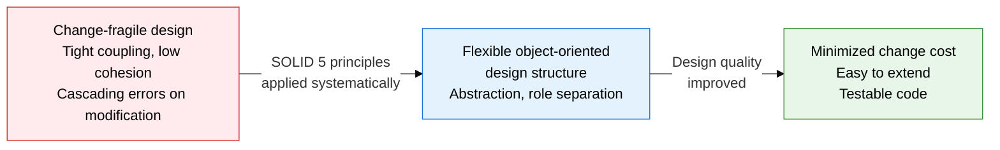
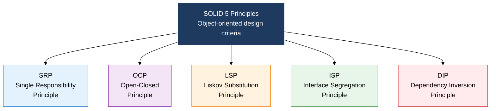
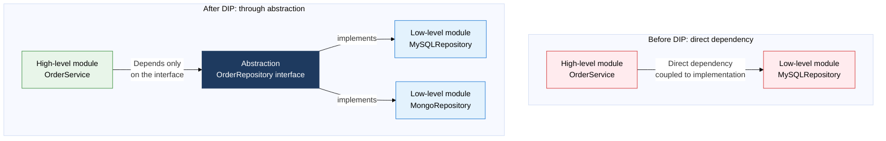

## I. Overview of SOLID, the 5 Principles for Object-Oriented Design That Withstands Change

**Definition**:  
Five core object-oriented design principles defined by Robert C. Martin as design guidance for achieving maintainability, extensibility, and testability  
- A design standard named from the first letters of SRP, OCP, LSP, ISP, and DIP  
- Applied to design decisions at the class, module, and component level; the theoretical foundation for applying GoF patterns  
- Compliance is measured with code review and static analysis tools, and used to steer refactoring direction  

**Characteristics**:  
( **Minimizes change** ) Each principle narrows the blast radius of change, cutting modification cost and regression defects  
( **Abstraction-based** ) Interface- and abstract-class-centered design lets implementations be swapped and extended freely  
( **Mutual reinforcement** ) The 5 principles are not independent — the other principles work together to realize OCP  

---

## II. Core Structure of the SOLID Principles

### A. Purpose of SOLID and S, O, L in Detail (SRP, OCP, LSP)

| Principle | Core definition | Violation example | How to apply |
|---|---|---|---|
| **SRP** | A class should have only one reason to change | A `User` class handles authentication, storage, and email sending all at once | Split by role: `UserAuth` / `UserRepository` / `EmailService` |
| **OCP** | New behavior should be addable without modifying existing code | Adding a shape type forces an if-else branch edit in `AreaCalculator` | A `Shape` interface plus polymorphism: new shapes leave existing code untouched |
| **LSP** | A subtype must be fully substitutable for its supertype | A `Square` that extends `Rectangle` also changes height on `setWidth`, breaking the contract | Prefer interface segregation and composition over inheritance; guarantee the supertype's contract (pre-/post-conditions) |

---

### B. I, D Principles in Detail and SOLID Applied Together (ISP, DIP)

| Principle | Core definition | Violation example | How to apply |
|---|---|---|---|
| **ISP** | Don't force clients to depend on interface methods they don't use | A `Printer` interface declares print/fax/scan together → a `SimplePrinter` that doesn't need fax is forced to implement fax anyway | Split into role interfaces: `Printable` / `Faxable` / `Scanable` |
| **DIP** | Both high-level and low-level modules should depend on abstractions, never directly on implementations | A `Service` class creates and references `new MySQLRepository()` directly | Inject dependencies via a DI container (Spring IoC), reference by interface |

**SOLID 5 principles, side by side**

| Principle | Core keyword | Violation symptom | Resolution pattern |
|---|---|---|---|
| **SRP** | Single reason to change | God Class, thousands of lines in one class | Role separation, Facade pattern |
| **OCP** | Open for extension, closed for modification | Every new feature edits an existing if-else | Strategy / Template Method pattern, polymorphism |
| **LSP** | Subtype substitutability | Supertype guarantees break when a subclass is used | Composition over inheritance, explicit interface contracts |
| **ISP** | Depend only on the interfaces you need | Empty method implementations, `UnsupportedOperationException` | Interface segregation, role interface separation |
| **DIP** | Depend on abstractions | Direct `new Implementation()` creation, hard to test | DI (dependency injection), IoC container, Factory pattern |

---

## III. Expected Benefits and Practical Applications of Adopting SOLID

| Category | Key benefits | Use and practical application |
|---|---|---|
| **Design flexibility** | Minimizes edits to existing code when accommodating change requests; adds new features purely by extension | Design to OCP, then implement new features only by adding new classes, reducing the regression-test burden on existing code |
| **Testability** | DIP enables mock injection, achieving unit-test isolation | Mock low-level modules with Spring `@MockBean`/Mockito; SRP compliance clarifies what each test targets |
| **Collaboration efficiency** | SRP and ISP compliance keep class responsibilities clear, improving teammates' comprehension and review speed | Include SOLID-violation items in the code-review checklist; auto-detect with static analysis tools (Checkstyle, PMD) |
| **Exam prep** | Definitions, violation examples, and resolutions for the 5 principles are a core topic in ITPE Sessions 1 and 2 | Memorize violation-code-to-fixed-code conversion examples for each principle; map the connections to GoF patterns |
