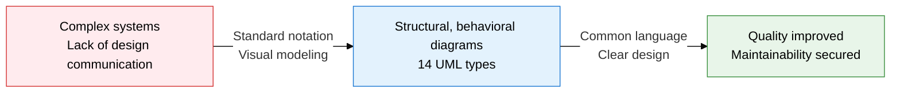
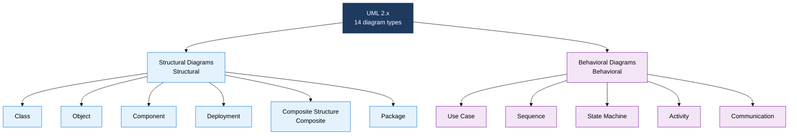
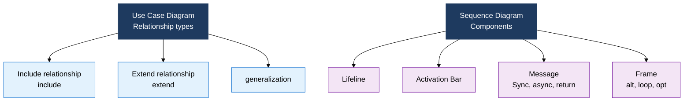

## I. Overview of UML, Standardizing Object-Oriented Design Visually

**Definition**:  
A visual modeling language for object-oriented analysis and design, standardized by the OMG (Object Management Group)  
- Represents the entire software system through 6 structural diagram types and 7 behavioral diagram types  
- Used as a deliverable across every SDLC phase, from requirements analysis to deployment configuration  
- Gives developers, designers, and customers a common notation, minimizing communication errors  

**Characteristics**:  
( **Standardization** ) An official OMG standard, providing tool- and language-independent general-purpose modeling notation  
( **Comprehensiveness** ) Covers static structure and dynamic behavior across 14 diagram types  
( **Traceability** ) Design can be traced through the chain from use case → class → sequence → deployment diagram  

---

## II. Core Structure of UML

### A. UML Diagram Classification (Structural vs. Behavioral)

| Diagram | Represents | Key elements | When to use |
|---|---|---|---|
| **Class** | Class attributes, methods, relationships | Association, aggregation, composition, inheritance, dependency, realization | Core deliverable of the analysis and design phase |
| **Object** | State of class instances | `objectName:ClassName`, attribute values | Depicting system state at a specific point in time |
| **Component** | Independently deployable software units | Component, interface, port | Component-based design and architecture |
| **Deployment** | Mapping of physical hardware to software | Node, artifact, communication path | Infrastructure and deployment environment design |
| **Package** | Namespace and module grouping | Package, dependency, merge, import | Modularizing large-scale systems |

---

### B. Key Behavioral Diagrams — Sequence and Use Case

| Diagram | Represents | Core elements | Exam point |
|---|---|---|---|
| **Use Case** | Relationships between actors and system functions | Actor, use case, include/extend/generalization | Difference between include and extend; system boundary |
| **Sequence** | Time-ordered messages between objects | Lifeline, activation bar, sync/async messages, frame | alt/loop/opt frames, lifeline destruction |
| **State** | An object's state-transition cycle | State, transition, event, guard, action | Entry/exit actions, composite states |
| **Activity** | Workflow and parallel processing | Start/end, fork/join, swimlane, decision | Fork/join parallelism, swimlane role separation |
| **Communication** | Collaboration and message order between objects | Object, link, numbered message | Difference from the sequence diagram |

---

## III. Expected Benefits and Practical Applications of Adopting UML

| Category | Key benefits | Use and practical application |
|---|---|---|
| **Communication** | A common language across developers, designers, and customers minimizes misunderstanding and omissions | Agree on functional scope with a use case diagram before requirements are finalized |
| **Design quality** | A class diagram visualizes relationships and dependencies, enabling coupling analysis | Review SOLID compliance against the class diagram during design review |
| **Traceability** | Chaining use case → class → sequence → deployment traces requirements to implementation | Link the RTM to UML diagrams to see change impact immediately |
| **Maintenance** | A deployment diagram documents infrastructure structure, improving operational efficiency | Analyze business-process automation using activity and state diagrams |
