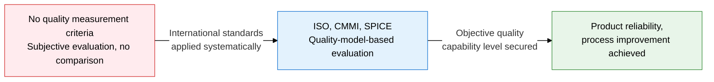
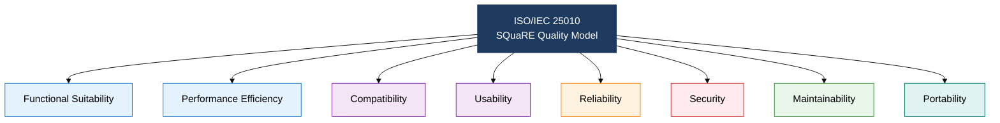
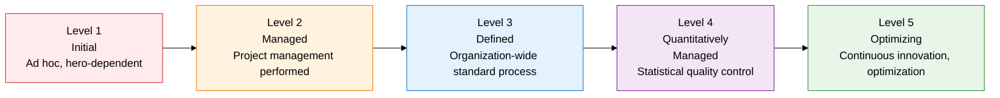

## I. Overview of Software Quality Standards, Measuring Product Quality and Process Capability Against International Standards

**Definition**:  
A system for objectively evaluating software product quality and process capability against international standards such as ISO/IEC, CMMI, and SPICE  
- Defines product quality (ISO/IEC 25010), life-cycle processes (ISO/IEC 12207), and process maturity (CMMI, SPICE) separately  
- Serves as the basis for diagnosing an organization's current level and building an improvement roadmap  
- Used as the compliance criteria required by procuring agencies, audit bodies, and certification bodies  

**Characteristics**:  
( **Multi-layered standard structure** ) Layers product, process, and organizational capability as separate standards, each independently measurable  
( **Maturity-based improvement** ) CMMI/SPICE staged maturity supports diagnosing the current level and setting target levels  
( **International mutual recognition** ) As ISO-based standards, recognized equally in global procurement, bidding, and certification processes  

---

## II. Core Structure of Software Quality Standards

### A. The ISO/IEC 25010 Quality Characteristics Model

| Characteristic | Definition | Sub-attributes | Example measures |
|---|---|---|---|
| **Functional Suitability** | Degree to which stated functional requirements are met | Functional completeness, functional correctness, functional appropriateness | Requirement coverage rate, number of functional defects |
| **Performance Efficiency** | Performance level relative to resources used | Time behavior, resource utilization, capacity | Response time (ms), CPU/memory utilization |
| **Compatibility** | Ability to coexist and interoperate with other systems and products | Co-existence, interoperability | API integration success rate, standard protocol compliance |
| **Usability** | Degree to which users can achieve their goals effectively | Appropriateness recognizability, learnability, operability, accessibility | Task completion rate, user error frequency |
| **Reliability** | Degree to which functions are maintained under stated conditions and duration | Maturity, availability, fault tolerance, recoverability | MTBF, availability rate (%), recovery time (RTO) |
| **Security** | Degree of protection against unauthorized access and tampering | Confidentiality, integrity, non-repudiation, accountability, authenticity | Number of vulnerabilities, penetration test pass rate |
| **Maintainability** | Ease of change, improvement, and correction | Modularity, reusability, analyzability, modifiability, testability | Time required for changes, code complexity (CC) |
| **Portability** | Ease of transfer to a different environment | Adaptability, installability, replaceability | Environment migration success rate, reinstallation time |

---

### B. CMMI Maturity Model vs. SPICE

| Comparison | CMMI | SPICE (ISO/IEC 15504) |
|---|---|---|
| **Developing body** | SEI (Carnegie Mellon University) / CMMI Institute | ISO/IEC JTC1/SC7 |
| **Purpose** | Evaluate and improve an organization's software development capability maturity | Evaluate and improve process performance capability |
| **Assessment structure** | Staged / Continuous representation | Two-dimensional: process dimension × capability level |
| **Number of maturity/capability levels** | 5 levels (Level 1-5) | 6 levels (Level 0-5) |
| **Scope** | Software, systems, hardware, services, IT (CMMI V2) | Software processes (referencing ISO/IEC 12207 processes) |
| **Adoption** | US DoD procurement requirements, domestic SW vendor capability ratings | European and domestic public SI projects, automotive (Automotive SPICE) |
| **Core components** | Process Area (PA), Goal, Practice | Process Attribute (PA), Base Practice (BP), Work Product (WP) |
| **Certification method** | Assessment team review, then maturity level certification | Independent assessor appraisal, then per-process capability level rating |

---

## III. Expected Benefits and Practical Applications of Adopting Software Quality Standards

| Category | Key benefits | Use and practical application |
|---|---|---|
| **Product quality** | Objectively measures and compares quality attributes against the ISO/IEC 25010 8 characteristics | Set quality-characteristic target values during requirements definition; reflect per-characteristic measures in the test plan |
| **Process improvement** | Identifies weak processes and sets improvement priority via CMMI/SPICE maturity diagnosis | Assess the current level (AS-IS), then build a target-level (TO-BE) roadmap and derive improvement tasks per PA |
| **Procurement and compliance** | Meets procuring-agency and audit-body requirements through ISO/IEC 12207 process compliance | Define the deliverable list per life-cycle process; reflect standard-conformance items in the audit checklist |
| **Competitiveness** | CMMI Level 3+ certification secures a bidding advantage in public, defense, and financial SW projects | Build a PAL (Process Asset Library) ahead of CMMI assessment; apply Automotive SPICE to support automotive SW exports |
