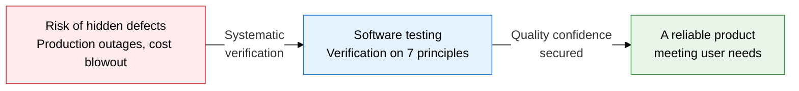
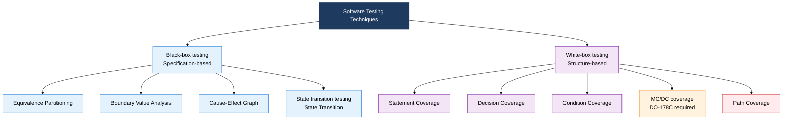
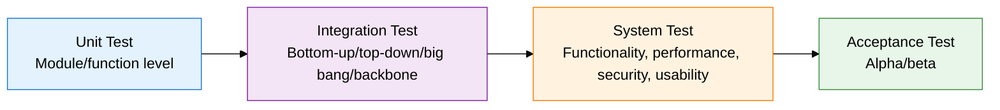

## I. Overview of Software Testing, Assuring Quality by Catching Defects Early

**Definition**:  
A verification activity using specification-based, structure-based, and experience-based techniques to catch defects early and assure software quality  
- Testing proves the presence of defects; it can never fully prove their absence  
- A comprehensive quality activity that covers both verification and validation  
- The V-model defines a corresponding test stage for each development stage  

**Characteristics**:  
( **Defect clustering** ) Applies the pesticide paradox: defects concentrate in a small number of modules  
( **Context dependency** ) Test technique and intensity vary by domain, risk level, and standard  
( **Absence-of-errors fallacy** ) Zero defects does not guarantee that user needs are met  

---

## II. Core Structure of Software Testing

### A. Black-Box vs. White-Box Testing Techniques

| Coverage type | Measurement basis | Intensity level | Applicable standard/context |
|---|---|---|---|
| Statement coverage | Statements executed / total statements | Level 1 (lowest) | General commercial software |
| Decision (Branch) coverage | Whether both true/false branches execute | Level 2 | DO-178C Level D, IEC 62304 |
| Condition coverage | Whether each condition executes true/false | Level 3 | Systems requiring security and reliability |
| MC/DC coverage | Each condition independently affects the decision | Level 4 (high) | DO-178C Level A/B, aviation, rail |
| Multiple condition coverage | Whether every condition combination executes | Level 5 | Nuclear, medical devices (extreme risk) |
| Path coverage | Every possible execution path | Level 6 (highest) | Theoretical completeness (impractical) |

---

### B. V-Model Test Stages and Static Testing

| Technique | Formality | How it proceeds | Key participants | Deliverables | Cost |
|---|---|---|---|---|---|
| **Inspection** | Very high | Formal review with role-based checklists | Author, reviewers (multiple), moderator, scribe | Defect list, inspection report | High |
| **Walkthrough** | Medium | Author directly explains and demonstrates | Author, peer reviewers (2-5) | Issue list, improvement notes | Medium |
| **Review** | Low | Informal exchange of opinions and feedback | Author, 1-2 peers | Review comments (unstructured) | Low |
| **Static analysis** | Automated | Tool-based automatic code analysis | Developer, QA engineer | Static analysis report | Very low |
| **Unit test** | High | Automatically run via an xUnit framework | Developer | Test result report | Medium |
| **Regression test** | High | Automated re-verification of existing functions after a change | QA, CI/CD pipeline | Regression test report | Medium |

---

## III. Expected Benefits and Practical Applications of Adopting Software Testing

| Category | Key benefits | Use and practical application |
|---|---|---|
| **Quality assurance** | Catches defects at an early stage, minimizing fix cost | Build a staged test plan based on the V-model; run unit, integration, and system tests in sequence |
| **Risk management** | MC/DC and boundary value analysis prevent defects in high-risk functions | Apply risk-based testing; concentrate coverage on core modules |
| **Automation efficiency** | Regression test automation cuts repeated-verification cost and integrates with CI/CD | Adopt automation tools such as xUnit, Selenium, and JMeter; insert test gates into the build pipeline |
| **Compliance** | Establishes evidence of compliance with safety standards such as DO-178C and IEC 62304 | Generate coverage measurement reports; keep formal review records based on the inspection checklist |
