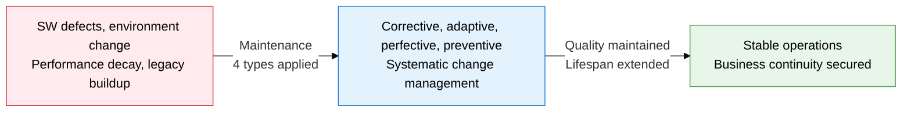
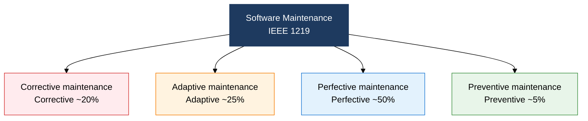
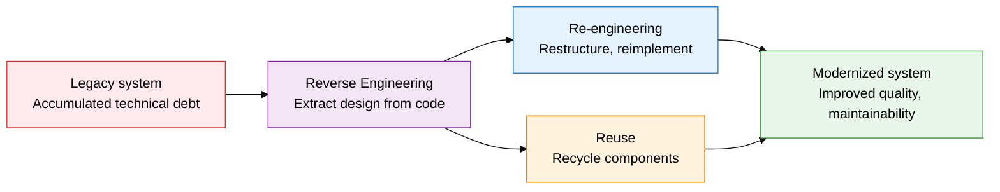

## I. Overview of Software Maintenance, Extending SW Lifespan Through Change Control

**Definition**:  
An engineering process that maintains SW quality and lifespan through post-delivery defect correction, environmental adaptation, functional improvement, and preventive activity  
- Classified under the IEEE 1219 standard into 4 types: corrective, adaptive, perfective, and preventive  
- The core phase accounting for 60-80% of the total SW life-cycle cost  
- Manages technical debt systematically through legacy modernization (3R) and refactoring  

**Characteristics**:  
( **Cost concentration** ) Maintenance cost exceeds development cost, with perfective maintenance making up about 50% of the total  
( **Change risk** ) Every change can introduce unforeseen defects (regression errors), requiring systematic control  
( **Quality continuity** ) Refactoring and preventive maintenance suppress SW aging and sustain quality  

---

## II. Core Structure of Software Maintenance

### A. Classifying Maintenance Types and Cost Structure

| Type | Definition | Cause | Share | Example |
|---|---|---|---|---|
| **Corrective** | Fixes errors and defects found during operation | Residual bugs, design flaws | About 20% | Fixing a NullPointerException, patching a logic error |
| **Adaptive** | Modifies SW in response to environmental change | OS upgrade, regulatory change, hardware replacement | About 25% | Java version migration, reflecting personal-data-protection law updates |
| **Perfective** | Improves performance and adds new features | Growing user demand, competitive pressure | About 50% | Adding search functionality, optimizing response time |
| **Preventive** | Proactive action to prevent future defects | SW aging, accumulated technical debt | About 5% | Code refactoring, updating documentation, test automation |

---

### B. Legacy Modernization (3R) Strategy and Refactoring

**The Legacy-Modernization 3R Strategy**

| Strategy | Definition | Input | Output | When to apply |
|---|---|---|---|---|
| **Reverse engineering** | Extracts design and requirements back out of existing SW | Source code, executable | Design documents, requirements specification | Analyzing undocumented legacy systems |
| **Re-engineering** | Restructures after reverse engineering to produce new SW | Existing design + reverse-engineering output | A modernized new system | When minimizing risk matters more than a full rebuild |
| **Reuse** | Carries existing components into the new system as-is | Proven modules and libraries | Reused components | When reliable existing assets are on hand |

**Key Refactoring Techniques**

| Code smell | Symptom | Refactoring technique |
|---|---|---|
| **Duplicate code** | The same logic repeated in multiple places | Extract Method, Pull Up Method |
| **Long method** | A single method handling too many roles | Extract Method, Decompose Conditional |
| **God class** | Excessive responsibility concentrated in one class | Extract Class, Extract Subclass |
| **Long parameter list** | 4 or more method parameters | Introduce Parameter Object, Preserve Whole Object |
| **Shotgun surgery** | One change ripples across multiple classes | Move Method, Move Field, Inline Class |

---

## III. Expected Benefits and Practical Applications of Adopting Software Maintenance

| Category | Key benefits | Use and practical application |
|---|---|---|
| **Quality stability** | Systematic defect correction minimizes downtime and heads off regressions | Standardize the corrective-maintenance process; build an automated regression-test pipeline |
| **Technical debt management** | Refactoring and preventive maintenance suppress code complexity and prevent SW aging | Maintain a technical-debt register; allocate refactoring time every sprint (the 20% rule) |
| **Legacy modernization** | Applying the 3R strategy protects existing assets while modernizing incrementally | Recover design documents via reverse engineering; apply re-engineering techniques during a microservices transition |
| **Cost optimization** | Concentrating investment in perfective maintenance maximizes business value and cuts unnecessary fix cost | Optimize budget allocation by maintenance type; measure maintenance effectiveness with KPIs |
