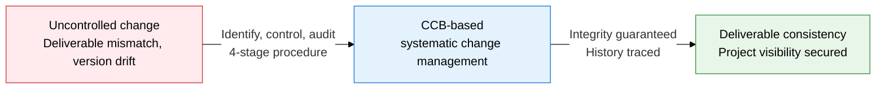
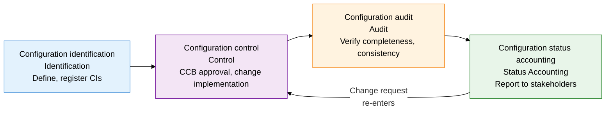
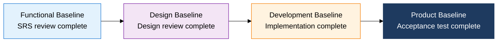

## I. Overview of Software Configuration Management, Guaranteeing Deliverable Integrity Through Change Control

**Definition**:  
A management system that identifies, controls, audits, and reports on configuration items across the SW life cycle to guarantee deliverable integrity and traceability  
- Based on the IEEE 828 standard, manages change systematically at the level of the CI (Configuration Item)  
- Blocks unauthorized change and keeps baselines stable through CCB (Change Control Board) approval  
- Integrates with version-control tools (Git, etc.) to auto-track change history and support rollback  

**Characteristics**:  
( **Change visibility** ) Tracks every change request and approval, keeping who, when, and why transparent  
( **Baseline stability** ) Staged baselines protect a verified reference point and block unauthorized change  
( **Audit traceability** ) Configuration audits periodically verify deliverable completeness and consistency, building the basis for certification  

---

## II. Core Structure of Software Configuration Management

### A. The SCM 4-Stage Procedure and the CCB Structure

| Stage | Key activities | Participants | Deliverables |
|---|---|---|---|
| **Configuration identification** | Define the list of CIs to manage, establish naming conventions, set up the version scheme | Configuration manager, project manager | CI list, configuration management plan |
| **Configuration control** | Change request received → impact analysis → CCB review → approve/reject → implement → verify | CCB, development team, configuration manager | Change request, CCB meeting minutes, change history |
| **Configuration audit** | Functional Configuration Audit (FCA: requirements met), Physical Configuration Audit (PCA: documentation matches) | QA team, configuration manager, customer | Audit report, discrepancy list |
| **Configuration status accounting** | Reports current CI versions, change history, and open change requests to stakeholders | Configuration manager, PMO | Configuration status report, change status dashboard |

---

### B. Configuration Baselines and the Git Flow Strategy

**The 4 Configuration Baseline Stages**

| Baseline | Set at | Reference document | What it controls |
|---|---|---|---|
| **Functional baseline** | After requirements review is complete | SRS (Software Requirements Specification) | Functional requirements, interface requirements |
| **Design baseline** | After the design review (CDR) is complete | SDD (Software Design Document) | Architecture design, module design, DB schema |
| **Development baseline** | After unit and integration testing is complete | Source code, build deliverables | Source code, executables, test cases |
| **Product baseline** | After acceptance testing is complete | Final product package | Deployment package, user manual, operations documentation |

**Git Flow Branch Strategy**

| Branch | Role | Starts from | Merges into | Lifespan |
|---|---|---|---|---|
| **main** | Production-deployed code, always kept releasable | Created initially | - | Permanent |
| **develop** | Integration branch for the next release | main | main (at release) | Permanent |
| **feature** | Branch for developing an individual feature | develop | develop | Deleted when the feature is done |
| **release** | Release preparation, QA, and bug fixes | develop | main, develop | Deleted when the release is done |
| **hotfix** | Urgent production bug fix | main | main, develop | Deleted when the fix is done |

---

## III. Expected Benefits and Practical Applications of Adopting Software Configuration Management

| Category | Key benefits | Use and practical application |
|---|---|---|
| **Change control** | The CCB-based approval process blocks unauthorized change and enables upfront change-risk analysis | Apply a standard change-request form, run an impact-analysis checklist, institutionalize regular CCB meetings |
| **Quality traceability** | Baseline-level audits guarantee deliverable completeness and trace defect causes to prevent recurrence | Make configuration audits mandatory at each phase transition; wire FCA/PCA checklists into automation tools |
| **Version control** | The Git Flow strategy achieves parallel development and stable releases at once, with fast rollback | Adopt Git Flow with branch protection rules; tie the branch strategy into the CI/CD pipeline |
| **Regulatory compliance** | Meets quality-certification requirements such as ISO 9001 and CMMI; provides configuration-history evidence at delivery | Auto-generate audit logs from configuration tools (Git, SVN, Jira); automate audit-response reports |
