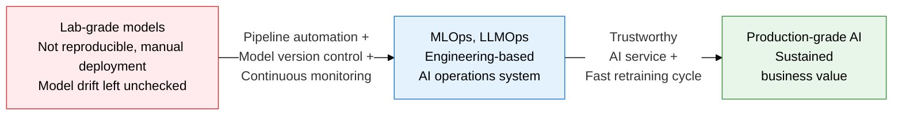
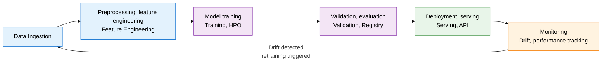
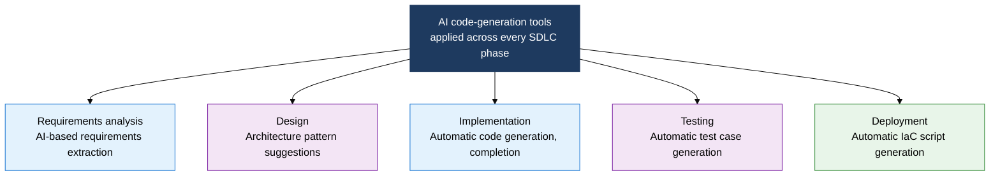

## I. Overview of MLOps and LLMOps, the Engineering Practice That Version-Controls and Operates ML/LLM Models Like Code

**Definition**:  
An engineering methodology that automates the full develop → deploy → monitor cycle of ML/LLM models and version-controls data, model, and code together to secure the reliability and reproducibility of an AI system  
- MLOps applies DevOps principles to the ML pipeline, covering experiment tracking, model serving, and retraining automation  
- LLMOps extends MLOps to also handle issues unique to LLMs, such as prompt version control, hallucination detection, and token-cost optimization  
- AI code-generation tools (GitHub Copilot, Claude Code, etc.) affect every SDLC phase, demanding a new quality-management strategy  

**Characteristics**:  
( **Reproducibility guaranteed** ) Version-controls data, code, hyperparameters, and environment together so experiment results can be reproduced at any time  
( **Model drift detection** ) Monitors production data-distribution shift in real time, catching performance decay early and triggering retraining  
( **Cost-quality balance** ) Tracks LLM token cost, latency, and quality metrics together to pick the optimal model and build a caching strategy  

---

## II. Core Structure of MLOps and LLMOps

### A. MLOps Pipeline Structure and Key Components

| Item | MLOps | LLMOps |
|---|---|---|
| **Target model** | Traditional ML models (classification, regression, recommendation) | Large language models (GPT, Claude, Llama, etc.) |
| **Pipeline characteristics** | Cycle of data ingestion → feature engineering → training → deployment | Cycle of prompt design → RAG assembly → fine-tuning → evaluation |
| **Core tools** | MLflow (experiment tracking), DVC (data versioning), Kubeflow, Airflow | LangSmith, Weights & Biases, PromptLayer, LlamaIndex |
| **Key issues** | Data dependency, pipeline instability, model drift | Hallucination detection, prompt version control, token-cost optimization |
| **Monitoring metrics** | Accuracy, F1, data-distribution shift (PSI), latency | BLEU, ROUGE, G-Eval, token cost, hallucination rate |

---

### B. SDLC Impact of AI Code Generation and Quality Management

| Phase | How AI tools are used | Expected benefit | Risk factor | Mitigation strategy |
|---|---|---|---|---|
| **Requirements analysis** | Auto-converts natural-language requirements into use cases and user stories | Fewer missed requirements, shorter documentation time | Wrong requirements extracted from misread context | Domain-expert review combined with a requirements traceability matrix |
| **Design** | Auto-generates pattern recommendations, API design, ERDs, sequence diagrams | Shorter time exploring design alternatives, knowledge reuse | Bias toward certain patterns, adoption of a sub-optimal architecture | Mandatory Architecture Review Board (ARB) review |
| **Implementation** | Auto-completes and generates code with GitHub Copilot, Cursor, Claude Code | 50%+ reduction in time spent on repetitive code | Generated code with security flaws, copyright issues, uncritical acceptance | SAST integration, mandatory code review, license scanning |
| **Testing** | Auto-generates unit, integration, and edge-case test code | Higher test coverage, less burden writing tests | Superficial tests, real defects going undetected | Verify test quality with mutation testing |
| **Deployment** | Auto-generates Terraform, Kubernetes manifests, Dockerfiles | Shorter IaC authoring time, standardized infrastructure | Overly permissive security groups, poor cost optimization | Security policy scanning (Checkov) combined with cost-estimation tools |

---

## III. Expected Benefits and Practical Applications of Adopting MLOps and LLMOps

| Category | Key benefits | Use and practical application |
|---|---|---|
| **Reproducibility and governance** | Full tracking of experiment conditions, data, and models enables audit response and regulatory compliance, securing AI trustworthiness | Auto-log experiment metadata and dataset versions with MLflow/DVC; deploy to production only models approved in the model registry |
| **Operational automation** | Automating retraining, deployment, and rollback as a pipeline minimizes the operational burden on AI-system staff | A Kubeflow pipeline auto-triggers retraining on data-drift detection and deploys the new model only after A/B-test validation |
| **LLM cost optimization** | Tracking token usage, latency, and quality together cuts cost through optimal model choice and prompt compression | Apply prompt caching and semantic caching; auto-find the cost-quality sweet spot with lightweight-model routing |
| **AI code quality** | Adopting AI code-generation tools raises development productivity while systematically controlling security and copyright risk | Integrate SAST/SCA as a mandatory CI pipeline gate; track the AI-generated code ratio and defect density as separate metrics |
