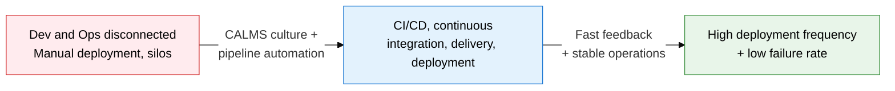
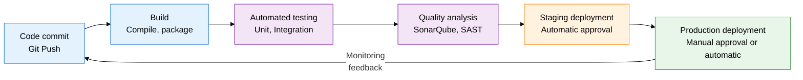
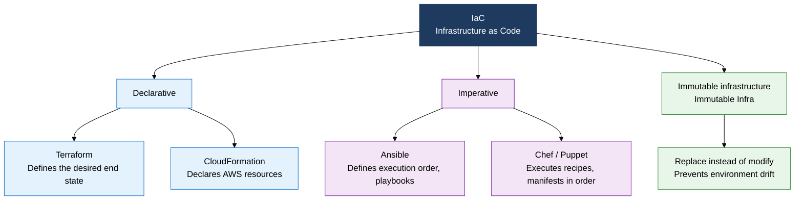

## I. Overview of DevOps and CI/CD, Achieving Both Deployment Speed and Quality by Removing the Dev-Ops Silo

**Definition**:  
A cultural and technical methodology that removes the silo between development (Dev) and operations (Ops), achieving software quality and deployment speed together through an automated CI/CD pipeline  
- Built on the CALMS framework (Culture, Automation, Lean, Measurement, Sharing), integrating everything from organizational culture to tooling  
- Automates the entire path from code commit to production deployment, shortening the release cycle to daily or weekly  
- Secures environment consistency with IaC (Infrastructure as Code), solving "works on my machine" at the root  

**Characteristics**:  
( **Automation-first** ) Automates the entire build, test, and deploy path as a pipeline, removing human error and deployment delay  
( **Shortened feedback** ) Test results are visible within minutes of a code commit, catching defects early and minimizing fix cost  
( **Immutable infrastructure** ) Defines environments as code and prevents drift by replacing rather than modifying (Immutable Infrastructure)  

---

## II. Core Structure of DevOps and CI/CD

### A. DevOps Culture (CALMS) and CI/CD Pipeline Structure

| Stage | Automation scope | Core activities | Deployment approval | Key tools |
|---|---|---|---|---|
| **CI (Continuous Integration)** | Code commit through test results | Build, unit test, code-quality analysis, vulnerability scan | Automatic (on pipeline pass) | Jenkins, GitHub Actions, GitLab CI |
| **CD (Continuous Delivery)** | After CI through staging deployment | Integration test, performance test, staging deployment | Manual approval before production | ArgoCD, Spinnaker, Jenkins |
| **CD (Continuous Deployment)** | Fully automatic through to production | Canary/blue-green deployment, auto-rollback, monitoring | Fully automatic (condition-based) | ArgoCD, Flux, Kubernetes |

---

### B. The IaC Concept and the DevOps Tool Ecosystem

| Category | Representative tools | Core function |
|---|---|---|
| **Source management** | Git, GitHub, GitLab | Code version control, branch strategy, code review |
| **CI engine** | Jenkins, GitHub Actions, GitLab CI | Auto-runs the build/test pipeline |
| **CD / Deployment** | ArgoCD, Spinnaker, Flux | GitOps-based continuous deployment and rollback |
| **Containers** | Docker, Kubernetes, Helm | Application packaging and orchestration |
| **Monitoring** | Prometheus, Grafana, ELK Stack | Metrics, logs, alerts, dashboards |
| **IaC** | Terraform, Ansible, CloudFormation | Codifying infrastructure, provisioning automation |

---

## III. Expected Benefits and Practical Applications of Adopting DevOps and CI/CD

| Category | Key benefits | Use and practical application |
|---|---|---|
| **Deployment speed** | Shortens the release cycle from monthly/quarterly to daily/weekly, responding fast to market demand | Combine trunk-based development with feature flags for safe, high-frequency deployment |
| **Quality stability** | Automated testing catches regressions early, sharply cutting the production failure rate | Set SAST/DAST and an 80%+ code-coverage gate in the CI pipeline to block defects from entering |
| **Operational efficiency** | IaC automates environment provisioning, removing manual configuration errors and optimizing infrastructure cost | Codify multi-cloud infrastructure with Terraform; track and audit change history through PR review |
| **Organizational culture** | Strengthens Dev-Ops collaboration to remove silos, establishing a shared-responsibility culture during incident response | Combine a blameless post-mortem culture with SRE principles to build a continuous-improvement cycle |
