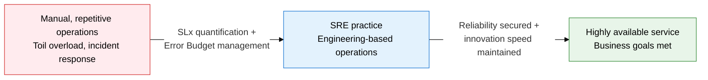
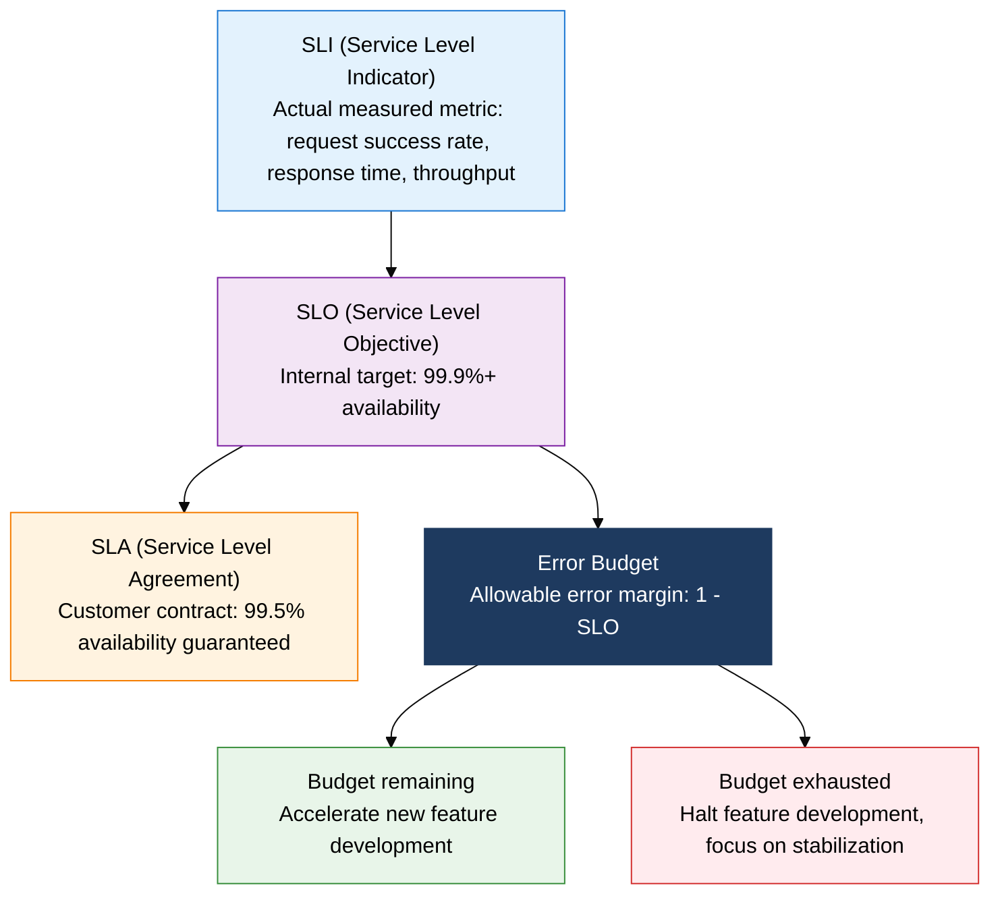
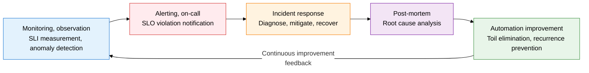

## I. Overview of SRE, Balancing Reliability and Innovation Speed with the Error Budget

**Definition**:  
A software engineering technique originated by Google, an operations methodology that quantifies and manages service reliability through SLx (SLI, SLO, SLA) and the error budget  
- A concrete implementation of DevOps: if DevOps is the culture and philosophy, SRE defines how to practice it  
- Caps toil (repetitive manual work) at 50% or less of total work and invests the rest in automation and engineering  
- Runs a data-driven decision system that halts new feature development and focuses on stability once the error budget is exhausted  

**Characteristics**:  
( **Quantified reliability** ) Defines reliability numerically through SLI measurements, SLO targets, and SLA contracts, enabling objective decisions  
( **Error budget** ) Manages allowable downtime as a budget, structurally reconciling the tension between development and operations teams  
( **Toil elimination** ) Converts repetitive manual work into automation, freeing engineer capacity for high-value improvement work  

---

## II. Core Structure of SRE

### A. The SLI/SLO/SLA/Error Budget System

| Item | Definition | Set by | Example value | Role |
|---|---|---|---|---|
| **SLI** | The actual metric that measures service level | SRE team (technical measurement) | 99.95% request success rate, 200 ms P99 response time | Objectively measures current reliability |
| **SLO** | The internal target and tolerance for an SLI | SRE team + product team, agreed | 99.9% monthly availability (43 minutes downtime allowed) | Sets the reliability target and derives the error budget |
| **SLA** | The legally contracted service level with the customer | Business team + legal team | Credit issued if monthly availability falls below 99.5% | Penalty/compensation basis on contract breach |
| **Error Budget** | The allowable error margin (1 - SLO) | Automatically derived from the SLO | 99.9% SLO → 0.1% = 43 minutes downtime allowed per month | Balances development speed against stability |

---

### B. SRE vs. DevOps Compared, and Core Practices

| Aspect | SRE | DevOps | Traditional operations |
|---|---|---|---|
| **Goal** | Quantify reliability, balance via the error budget | Remove the dev-ops silo, accelerate deployment | Keep the system stable, minimize change |
| **Core metrics** | SLI, SLO, error budget, MTTR | Deployment frequency, change failure rate, lead time | Uptime, MTBF, ticket resolution time |
| **Automation level** | Toil capped at 50%, engineering-based | Emphasizes CI/CD pipeline and IaC automation | Centered on manual procedure and a change-management process |
| **Incident response** | Blameless post-mortem, eliminates root cause | Fast deployment enables easy hotfixes and rollback | Change Advisory Board (CAB) approval and documentation |
| **Organizational structure** | SRE team shares operational responsibility, embedded model | Developers share some operational responsibility (you build it, you run it) | Development and operations fully separated, fixed roles |

---

## III. Expected Benefits and Practical Applications of Adopting SRE

| Category | Key benefits | Use and practical application |
|---|---|---|
| **Reliability** | SLI/SLO quantification clarifies what "reliable enough" means and prevents over-investment in reliability | Build a per-service SLO dashboard and feed remaining error budget into sprint planning to auto-adjust feature-development priority |
| **Operational efficiency** | Toil-elimination automation converts repetitive manual work into engineering time, focused on high-value improvement | Adopt runbook automation and self-healing scripts to reduce on-call burden and prevent engineer burnout |
| **Incident management** | A blameless post-mortem culture builds root-cause analysis and recurrence-prevention practice | Codify the incident-response playbook (IRP) and regularly verify recovery capability with Game Day exercises |
| **Organizational collaboration** | Turns the dev-ops tension into a cooperative relationship through the shared metric of the error budget | Deploy SRE embedded in product teams so reliability requirements are reflected from the design stage |
