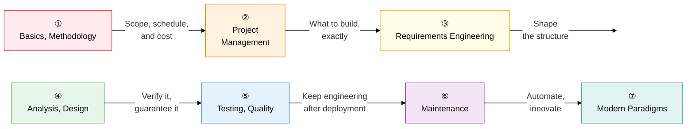

Software engineering is a systematic answer to the question **"How can we build better software more efficiently?"**  
Born out of the 1968 software crisis, this discipline covers the entire software life cycle — methodology, design, testing, quality, and operations.

## Learning Roadmap — 7-Stage Flow

---

## ① Basics and Development Methodology

> Understand **"Why do we need software engineering?"** and trace the historical evolution of development approaches.  
> Follow the causal chain: software crisis → SDLC concept established → model diversification → traditional methodologies → Agile.

| Order | Topic | Key Keywords | Importance |
|:---:|---|---|:---:|
| 1 | [Software Crisis](01-basics/software-crisis) | 1968 NATO, Brooks's Law, complexity barrier | ★★★ |
| 2 | [SDLC Overview](01-basics/sdlc) | Planning → Analysis → Design → Implementation → Testing → Maintenance | ★★★ |
| 3 | [SDLC Model Types](01-basics/sdlc-models) | Waterfall, Spiral (Boehm), V-model, iterative | ★★★ |
| 4 | [Traditional Development Methodologies](01-basics/traditional-methodology) | Structured (DFD), Information Engineering (ISP), OO, CBD, component visibility | ★★☆ |
| 5 | [Agile Methodology](01-basics/agile-methodology) | Manifesto's 4 values and 12 principles, Scrum, XP, SAFe, LeSS | ★★★ |

**→ Key study point**: Organize each methodology around **what limitation of the prior methodology it overcame**.

---

## ② Project Management

> Once you've chosen a methodology, learn **how to actually run the project**.  
> The scope-schedule-cost triple constraint and EVM metrics are a recurring exam topic.

| Order | Topic | Key Keywords | Importance |
|:---:|---|---|:---:|
| 6 | [Project Management](02-project-management/project-management) | PMBOK 7th, WBS, CPM, PERT, EVM (CV, SV, CPI, SPI) | ★★★ |
| 7 | [Software Size Estimation](02-project-management/estimation) | Delphi, LOC, COCOMO, FP (ILF, EIF, EI, EO, EQ) | ★★★ |
| 8 | [Risk Management](02-project-management/risk-management) | P-I Matrix, EMV, avoid/transfer/mitigate/accept, exploit/share/enhance | ★★☆ |

**→ Key study point**: Memorize EVM's `CV = EV - AC` and `CPI = EV / AC` formulas and how to interpret them, plus the FP estimation procedure (UFP × VAF = AFP).

---

## ③ Requirements Engineering

> Many development failures stem from **misunderstood requirements**.  
> Learn the systematic process for eliciting, specifying, and verifying requirements.

| Order | Topic | Key Keywords | Importance |
|:---:|---|---|:---:|
| 9 | [Requirements Engineering](03-requirements/requirements-engineering) | Elicitation, analysis, specification, verification, SRS, RTM, CCB, inspection | ★★★ |

**→ Key study point**: Organize the requirements engineering 4-stage process, the **deliverables (SRS, RTM)** for each stage, and the **differences** between inspection, walkthrough, and peer review.

---

## ④ Analysis and Design

> This stage **transforms requirements into an implementable structure**.  
> Model the system with UML, and raise design quality with architectural patterns and design patterns.  
> SOLID, the invariant principles of object-oriented design, is a frequent exam topic.

| Order | Topic | Key Keywords | Importance |
|:---:|---|---|:---:|
| 10 | [UML](04-analysis-design/uml) | Structural (class, component, deployment) vs. behavioral (use case, sequence, state) | ★★★ |
| 11 | [Architectural Patterns](04-analysis-design/architecture-patterns) | Layered, MVC, MVVM, MSA, Saga, CQRS, API Gateway | ★★★ |
| 12 | [Design Patterns (GoF)](04-analysis-design/design-patterns) | Creational (Singleton, Factory), structural (Adapter, Proxy), behavioral (Observer, Strategy) | ★★★ |
| 13 | [SOLID Principles](04-analysis-design/solid-principles) | SRP, OCP, LSP, ISP, DIP, violation cases, resolution patterns | ★★★ |

**→ Key study point**: Summarize each pattern's **"what problem it solves"** and **"core structure"** in one line each. For UML diagrams, start by memorizing the structural/behavioral classification.

---

## ⑤ Testing and Quality Assurance

> Verify that the implemented software **actually works correctly**.  
> The white-box coverage hierarchy (MC/DC in particular) and the CMMI 5 levels are the most frequent exam topics.

| Order | Topic | Key Keywords | Importance |
|:---:|---|---|:---:|
| 14 | [Software Testing](05-testing-quality/software-testing) | 7 principles, black/white box, MC/DC, V-model by stage, inspection | ★★★ |
| 15 | [Software Quality Standards](05-testing-quality/quality-standards) | ISO 25010 (8 characteristics), CMMI 5 levels, SPICE 6 levels | ★★★ |

**→ Key study point**: Memorize the coverage hierarchy **in order of strength** (statement < decision < condition < MC/DC < multiple condition < path). For CMMI, memorize **the keyword for each level**.

---

## ⑥ Maintenance and Configuration Management

> Software stays alive after deployment.  
> Control change, modernize legacy systems, and guarantee integrity with configuration baselines.

| Order | Topic | Key Keywords | Importance |
|:---:|---|---|:---:|
| 16 | [Software Maintenance](06-maintenance/maintenance) | Corrective, adaptive, perfective, preventive, 3R (reverse engineering, re-engineering, reuse), refactoring | ★★☆ |
| 17 | [Software Configuration Management](06-maintenance/scm) | Identification → control (CCB) → audit → reporting, 4 baselines, Git Flow | ★★☆ |

**→ Key study point**: Organize the maintenance types by **share of effort** (perfective 50% > adaptive 25% > corrective 20% > preventive 5%) and the **direction** of the 3Rs (reverse engineering: code → design; re-engineering: reverse engineering followed by restructuring).

---

## ⑦ Modern Software Engineering Paradigms

> This is the trendiest area, and the one that **determines a high exam score**.  
> Clearly distinguish DevOps's culture (CALMS) from SRE's quantification (SLI/SLO/SLA/Error Budget),  
> and understanding the pipeline differences between MLOps and LLMOps lets you write a differentiated answer.

| Order | Topic | Key Keywords | Importance |
|:---:|---|---|:---:|
| 18 | [DevOps and CI/CD](07-modern-paradigm/devops-cicd) | CALMS, CI → CD (delivery) → CD (deployment), IaC, immutable infrastructure | ★★★ |
| 19 | [SRE](07-modern-paradigm/sre) | SLI, SLO, SLA, Error Budget, toil elimination, difference from DevOps | ★★★ |
| 20 | [AI- and Data-Centric Software Engineering](07-modern-paradigm/ai-mlops) | MLOps pipeline, LLMOps, model drift, AI code generation | ★★★ |

**→ Key study point**: You should be able to explain the relationship between DevOps (culture, philosophy) and SRE (concrete implementation) in one sentence. Memorize the Error Budget formula `1 - SLO` and the response strategy for when it's exhausted.

---

## ITPE Exam Strategy

| Question Pattern | Key Strategy |
|---|---|
| **Comparison questions** | Memorize comparison tables between methodologies, models, and standards (Waterfall vs. Agile, CMMI vs. SPICE, etc.) |
| **Calculation questions** | Master the EVM formulas (CV, SV, CPI, SPI), the FP estimation procedure, and the PERT three-point estimation formula |
| **Diagram description** | Components by UML diagram type, the SDLC flow by stage, the CI/CD pipeline flowchart |
| **Latest trends** | MSA patterns (Saga, CQRS), MLOps/LLMOps pipelines, SRE Error Budget application cases |
| **Definition + characteristics** | Practice writing each topic's definition (one sentence) plus 3 characteristics in the ( **keyword** ) format |
