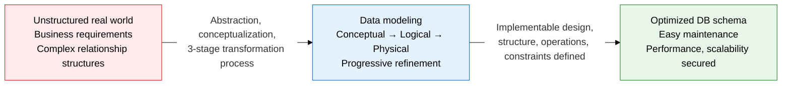
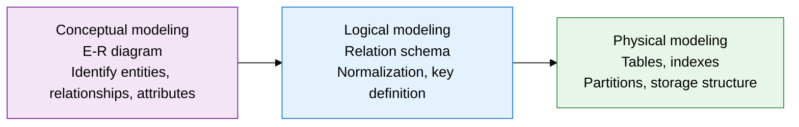
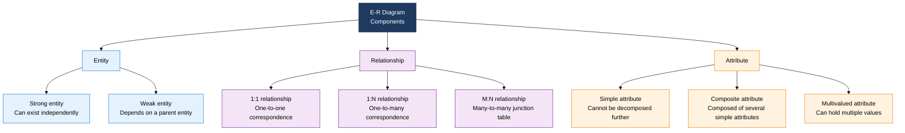
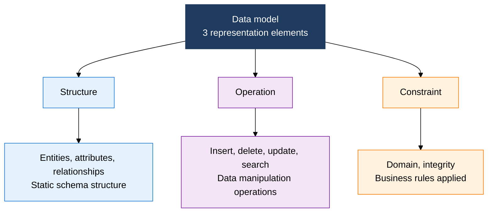
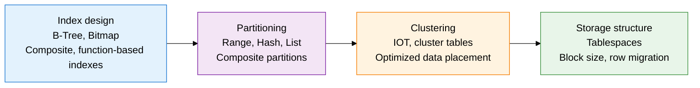

## 1. Overview of Data Modeling, a Systematic Design Technique That Transforms the Real World into a DB Structure Through 3-Stage Abstraction

**Definition**: A systematic technique that designs a database structure by progressively abstracting real-world business concepts and relationships through three stages — conceptual, logical, and physical.
- Conceptual modeling represents business entities and relationships with an E-R diagram; logical modeling converts them into a relation schema
- Physical modeling determines indexes, partitions, and storage structure to produce a DBMS-optimized final schema
- It responds flexibly to requirement changes and serves as a communication tool between the development team and domain experts

**Characteristics**:
- **Progressive refinement**: Detail grows progressively from the highly abstract conceptual model to the implementation-level physical model, catching errors early
- **Independent representation**: A logical model that isn't tied to a specific DBMS lets the physical model map to various platforms
- **Communication tool**: The E-R diagram works as a shared language that even non-technical staff can understand, and it's used to verify requirements

---

## 2. Core Structure of Data Modeling

### A. The 3-Stage Data Modeling Procedure and E-R Diagram Components

**Core Components of the E-R Diagram**

| Modeling Stage | Deliverable | Key Activities | Participants |
|:---:|:---|:---|:---|
| **Conceptual modeling** | E-R diagram | Identify entities, define relationships, derive key attributes, determine cardinality | Business staff, DA |
| **Logical modeling** | Relation schema | E-R → table conversion, normalization, PK/FK definition, domain setup | DBA, DA |
| **Physical modeling** | DDL script | Index design, partition strategy, storage parameters, clustering decisions | DBA, system engineer |

**E-R Diagram → Relation Schema Conversion Rules**

| Conversion Target | Conversion Rule | Result |
|:---:|:---|:---|
| **Strong entity** | Entity → independent table, primary-key attribute → PK | Creates a standalone table |
| **Weak entity** | Partial key + parent PK → composite PK | Table includes the parent's FK |
| **1:1 relationship** | Add FK to the table with lower participation, or merge the tables | FK added, or a single table |
| **1:N relationship** | Add the "1" side's PK as an FK on the "N" side table | FK column on the "N" side |
| **M:N relationship** | Create a separate junction table, both PKs → composite PK | Creates a cross-reference table |
| **Multivalued attribute** | Split into a separate table, original entity's PK → FK | A separate table in a 1:N structure |

---

### B. Data Model Representation Elements and Physical Modeling Design Strategy

**Core Design Elements of Physical Modeling**

| Physical Design Element | Design Criteria | Performance Effect | Cautions |
|:---:|:---|:---|:---|
| **B-Tree index** | High-cardinality columns, range-search conditions | 10-100x faster point and range searches | Degrades DML performance; avoid over-indexing |
| **Bitmap index** | Low-cardinality columns (gender, status code), OLAP | Parallel AND/OR processing, optimized aggregate queries | Unsuited to OLTP; wide lock scope |
| **Range partition** | Large history tables keyed by date or sequence | Partition pruning greatly narrows the scan range | Partition key choice determines performance |
| **Hash partition** | When even distribution is needed; optimizes join performance | Guarantees uniform distribution with no data skew | No range search; use a power of two for partition count |
| **Cluster index** | Table groups that are frequently queried together | Minimizes join I/O via the cluster key | Changing the cluster key requires data relocation |

---

## 3. Expected Benefits and Practical Applications of Data Modeling

| Category | Key Benefits | Practical Application |
|:---:|:---|:---|
| **Design quality** | Catches requirement errors early, cutting downstream rework costs by 60-80% | Adopt a conceptual model review checklist; run joint E-R diagram review workshops with domain experts |
| **Communication** | Using the E-R diagram as a shared language minimizes requirement misunderstandings between business, development, and DBA teams | Define API contracts based on the logical model; use the domain model to design microservice boundaries |
| **System flexibility** | Keeping a DBMS-independent logical model eases cloud migration and multi-DB architecture changes | Manage a logical model repository; automate the physical model with DDL generation tools (ERwin, DataGrip) |
| **Performance optimization** | Pre-designing indexes and partitions at the physical modeling stage proactively prevents performance issues after go-live | Design indexes based on query-pattern analysis; cut lookup response time with a partition strategy for large history tables |
