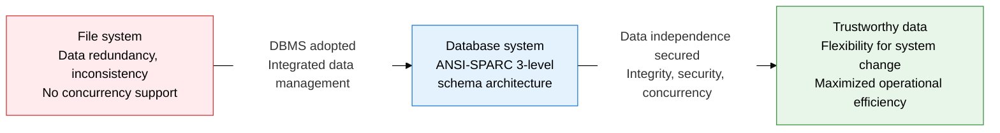
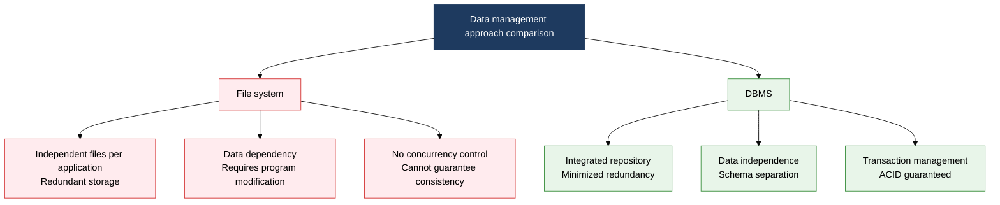
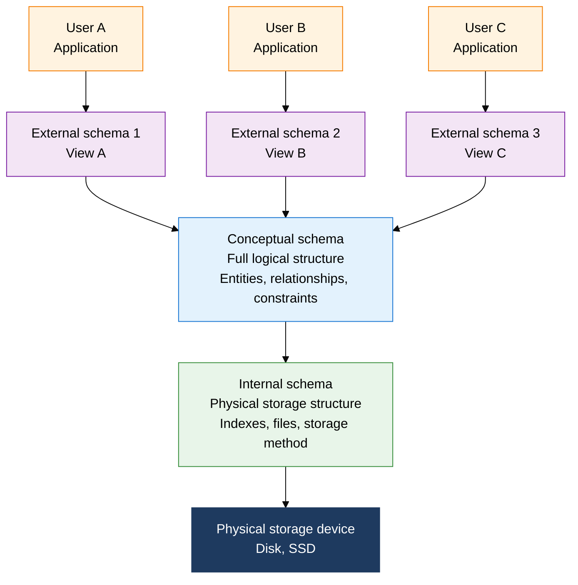

## 1. Overview of the Database System, an Integrated Management Structure That Structurally Eliminates Data Redundancy and Inconsistency

**Definition**: A **database management system (DBMS)** that integrates and shares an organization's data to minimize redundancy and maintain consistency, together with the 3-level schema architecture that supports it.
- An integrated data management platform that emerged to solve the file system's data dependency, redundancy, and inconsistency problems
- The external, conceptual, and internal 3-tier structure proposed by ANSI/SPARC (1975) guarantees logical and physical data independence
- Transaction ACID properties secure both data integrity and concurrency at the same time in a multi-user environment

**Characteristics**:
- **Data independence**: A dual-independence structure in which changes to the physical storage structure don't affect application programs, and changes to the logical schema don't affect user views
- **Data sharing and integration**: A centralized management approach in which many users and applications share the same data concurrently while maintaining consistency
- **Data integrity and security**: Constraints, triggers, and access control block inaccurate data entry at the source and govern data access by permission level

---

## 2. Core Structure of the Database System

### A. File System vs. DBMS Comparison

| Comparison Trait | File System | DBMS | DBMS Advantage |
|:---:|:---|:---|:---|
| **Data redundancy** | Separate files per application, severe redundancy | Integrated repository, minimized redundancy | Saves storage space, maintains consistency |
| **Data dependency** | File structure changes force a full rewrite of the application | Schema separation guarantees independence | Sharply cuts maintenance cost |
| **Concurrent access** | No locking mechanism, conflicts occur | Concurrency control via transactions and locks | Safely supports multiple users |
| **Integrity control** | Verified directly in the application | Guaranteed at the DB level via constraints and triggers | Centralized integrity management |
| **Security management** | Relies solely on OS file permissions | Fine-grained user- and role-based permissions | Column- and row-level access control |
| **Failure recovery** | Depends on file backups, no partial recovery | Log-based rollback and roll-forward support | Atomic recovery per transaction |

---

### B. The ANSI-SPARC 3-Level Schema Architecture and Data Independence

| Schema Level | Role and Definition | User's Viewpoint | Independence Effect |
|:---:|:---|:---|:---|
| **External schema** | Defines the logical view for a specific user or application, recomposing the same conceptual schema into different viewpoints | General users, application developers | Delivers logical independence: a conceptual schema change requires only an update to the external-schema mapping |
| **Conceptual schema** | The organization's integrated, overall logical structure; defines entities, relationships, and constraints (managed by the DBA) | DBA, data architect | Acts as a buffer between the other two levels; physical changes have no effect on the logical level |
| **Internal schema** | Specifies the physical storage structure; defines record format, indexes, and access paths | System programmer, DBMS engine | Delivers physical independence: a storage-structure change has no effect on the conceptual schema |

**Comparing Types of Data Independence**

| Category | Logical Independence | Physical Independence |
|:---:|:---|:---|
| **Definition** | A conceptual-schema change has no effect on the external schema or applications | An internal-schema change has no effect on the conceptual or external schemas |
| **How it's achieved** | Update the mapping table between external and conceptual | Update the mapping table between conceptual and internal |
| **Change examples** | Add/remove a table column, split/merge tables | Add an index, partitioning, replace the storage device |
| **Difficulty to achieve** | Relatively hard (tied to business logic) | Relatively easy (handled by the DBMS engine) |

---

## 3. Expected Benefits and Practical Applications of Adopting a Database System

| Category | Key Benefits | Practical Application |
|:---:|:---|:---|
| **Data quality** | Deduplication and integrity constraints deliver a trustworthy single source of truth (SSOT) | Build master data management (MDM); run a constraint-based automated data-quality validation pipeline |
| **Operational efficiency** | A standardized SQL interface lets diverse applications and users share the same data, raising development productivity | Use ANSI-SPARC views for department-tailored data access; design a common data layer |
| **Change flexibility** | Logical and physical independence minimize the blast radius when business requirements change or infrastructure is replaced | Automate schema migration during a move to microservices; reduce risk when migrating a DB to the cloud |
| **Security and audit** | Role-based access control (RBAC) and audit logs meet compliance requirements and counter insider threats | Column-level encryption for GDPR/personal-data-protection compliance; build an access-history audit trail |
