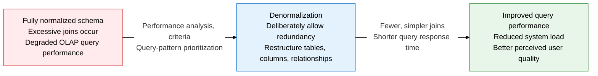
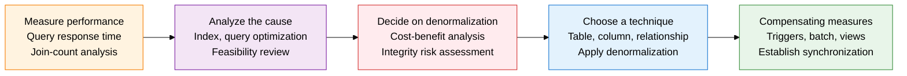

## 1. Overview of Denormalization, a Design Strategy That Deliberately Allows Redundancy for Read Performance

**Definition**: A database design optimization technique that deliberately merges relations that normalization separated, or adds redundant data, to improve query performance.
- While normalization maximizes data integrity and update efficiency, denormalization is a conflicting design strategy that prioritizes read performance
- Apply it selectively, only when a performance drop is clearly measured and other remedies (indexing, query optimization) fall short
- Because it increases the integrity-management burden afterward (triggers, batch synchronization), a rigorous cost-benefit analysis must come first

**Characteristics**:
- **Performance vs. integrity trade-off**: An unavoidable conflict in which improved query performance comes with an increased risk of update anomalies from data redundancy
- **Purposeful redundancy**: Planned, documented redundancy grounded in a performance goal — not an accidental design flaw
- **Requires active management**: Trigger, batch, or application-level compensating mechanisms are mandatory to keep redundant data synchronized

---

## 2. Core Structure of Denormalization

### A. Criteria for Judging the Need for Denormalization, and the Application Process

**Criteria for Deciding Whether to Apply Denormalization**

| Criterion | Recommends Denormalization | Avoid Denormalization |
|:---:|:---|:---|
| **Query frequency** | The same join query makes up 80%+ of all queries | An OLTP environment with more inserts/updates than reads |
| **Join complexity** | Joins across 5+ tables, repeated complex subqueries | Simple joins across 2-3 tables |
| **Response time** | Still misses the target time after index and query optimization | Index additions alone hit the performance target |
| **Data change rate** | The source data changes rarely — once a month or less | Master data that changes frequently in real time |
| **Consistency tolerance** | Statistical/analytical data where slight staleness is acceptable | Absolute real-time accuracy required, as with financial transactions |

---

### B. Denormalization Technique Classification

```mermaid
%%{init: { 'theme': 'base', 'themeVariables': { 'edgeLabelBackground': '#fff' }}}%%
flowchart TD
    ROOT["Denormalization techniques"] --> TBL["Table denormalization"]
    ROOT --> COL["Column denormalization"]
    ROOT --> REL["Relationship denormalization"]
    TBL --> TBL_M["Table merging"]
    TBL --> TBL_S["Table splitting"]
    TBL --> TBL_A["Table addition"]
    TBL_M --> M1["Merge 1:1 relationship"]
    TBL_M --> M2["Merge 1:N relationship"]
    TBL_M --> M3["Consolidate supertype/subtype"]
    TBL_S --> S1["Vertical split<br/>Column grouping"]
    TBL_S --> S2["Horizontal split<br/>By row range"]
    TBL_A --> A1["Add a history table"]
    TBL_A --> A2["Add a partial table"]
    TBL_A --> A3["Add a statistics table"]
    COL --> COL1["Add a duplicate column"]
    COL --> COL2["Add a derived column"]
    COL --> COL3["Add a PK-based column"]
    REL --> REL1["Add a redundant relationship"]
    style ROOT fill:#1E3A5F,stroke:#1E3A5F,color:#fff
    style TBL fill:#E3F2FD,stroke:#1976D2,color:#000
    style COL fill:#F3E5F5,stroke:#7B1FA2,color:#000
    style REL fill:#FFF3E0,stroke:#F57C00,color:#000
    style TBL_M fill:#E3F2FD,stroke:#1976D2,color:#000
    style TBL_S fill:#E3F2FD,stroke:#1976D2,color:#000
    style TBL_A fill:#E3F2FD,stroke:#1976D2,color:#000
    style M1 fill:#E0F2F1,stroke:#00796B,color:#000
    style M2 fill:#E0F2F1,stroke:#00796B,color:#000
    style M3 fill:#E0F2F1,stroke:#00796B,color:#000
    style S1 fill:#E0F2F1,stroke:#00796B,color:#000
    style S2 fill:#E0F2F1,stroke:#00796B,color:#000
    style A1 fill:#E0F2F1,stroke:#00796B,color:#000
    style A2 fill:#E0F2F1,stroke:#00796B,color:#000
    style A3 fill:#E0F2F1,stroke:#00796B,color:#000
    style COL1 fill:#F3E5F5,stroke:#7B1FA2,color:#000
    style COL2 fill:#F3E5F5,stroke:#7B1FA2,color:#000
    style COL3 fill:#F3E5F5,stroke:#7B1FA2,color:#000
    style REL1 fill:#FFF3E0,stroke:#F57C00,color:#000
```

**Table Denormalization Techniques in Detail**

| Technique Category | Specific Technique | When to Apply | Effect | Cautions |
|:---:|:---|:---|:---|:---|
| **Table merging** | Merge a 1:1 relationship | The two tables are always queried together, with an identical row count | Removes a join, reduces I/O | More NULL columns, possible page waste |
| **Table merging** | Merge a 1:N relationship | The child table has very few rows and is always queried with its parent | Saves one join | Parent data becomes redundant; update-anomaly risk |
| **Table merging** | Consolidate supertype/subtype | 2-3 subtypes, high overall query frequency | Removes a join, simpler queries | Many NULL columns; needs a type-discriminator column |
| **Table splitting** | Vertical split | Frequently used and rarely used columns are clearly distinguishable | Concentrates I/O on hot columns, better page efficiency | Requires a join to reassemble |
| **Table splitting** | Horizontal split | Queries concentrate on a specific row range (e.g., the last year's history) | Partition pruning effect, narrower scan range | Full queries require a UNION |
| **Table addition** | Add a history table | The source table needs change history, but keeping it inline would bloat the table | Keeps the source table slim; separates history queries | Requires a sync batch or trigger |
| **Table addition** | Add a partial table | Only some columns out of the full set are repeatedly queried in bulk | Sharply reduces scan I/O | Sync burden whenever the source changes |
| **Table addition** | Add a statistics table | Real-time aggregation (sum, average, max, etc.) isn't feasible | Dramatically shortens aggregate-query response time | Choosing the aggregation cadence (real-time/batch) matters |

**Column and Relationship Denormalization Techniques in Detail**

| Technique Category | Specific Technique | Application Example | Effect | Integrity Management Approach |
|:---:|:---|:---|:---|:---|
| **Column denormalization** | Add a duplicate column | Store the customer name redundantly in the order table (show it without a join) | Removes the join to the customer table | Sync via trigger when the customer name changes |
| **Column denormalization** | Add a derived column | Add a total-amount column (unit price × quantity) to the order table | No need to compute it every time | Recalculate the derived value when the source data changes |
| **Column denormalization** | Add a PK-based column | Add a simple surrogate key instead of a complex composite FK | Simplifies join conditions, improves index efficiency | Dual maintenance of the surrogate key and the natural key |
| **Relationship denormalization** | Add a redundant relationship | Add a direct A→C FK alongside the A→B→C path | Direct joins that skip the intermediate table | Update the direct FK too whenever the intermediate relationship changes |

---

## 3. Expected Benefits and Practical Applications of Denormalization

| Category | Key Benefits | Practical Application |
|:---:|:---|:---|
| **Query performance** | Replaces complex multi-way joins with a single-table scan, cutting query response time by tens of times | Build separate aggregate tables in OLAP/data-mart environments; periodically sync statistics tables via a batch update scheduler |
| **System load** | Fewer join operations lower CPU, memory, and I/O load, letting the same hardware serve more concurrent users | Precompute statistics columns to spread aggregate-query load off OLTP peak hours; use alongside read-only replicas |
| **Operational simplicity** | Data access via simple queries, without complex views or subqueries, raises development productivity and maintainability | Reduces ORM mapping complexity; supports self-service BI in reporting tools via single-table access without joins |
| **Architecture optimization** | An HTAP architecture that separates a normalized model (OLTP) from a denormalized model (OLAP) meets both sets of requirements at once | Sync OLTP→OLAP via a CDC (Change Data Capture) real-time data pipeline; implement a Lambda/Kappa architecture |
