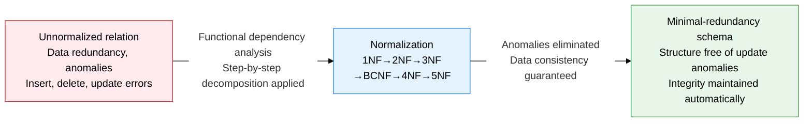
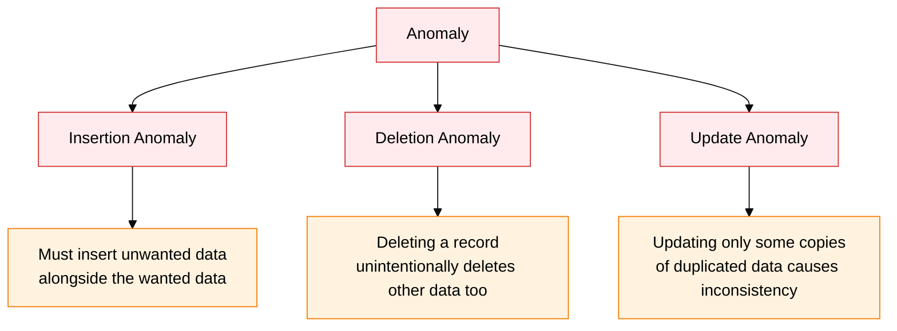
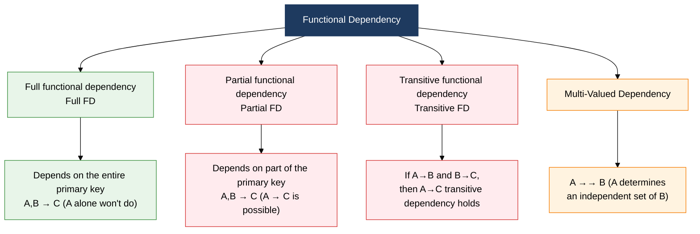

## 1. Overview of Normalization, a Relation Decomposition Technique That Eliminates Anomalies at the Source Through Functional Dependency Analysis

**Definition**: A systematic schema design technique that analyzes functional dependencies (FDs) within a relation, removes redundant data that causes anomalies, and losslessly decomposes the relation into smaller, well-defined relations.
- Removes the three anomaly types — insertion, deletion, and update — progressively as the normal form level rises
- Analysis of full functional dependency, transitive functional dependency, multi-valued dependency, and join dependency is the core criterion at each normalization stage
- The higher the normal form, the better the data integrity, but this trades off against performance degradation from more join operations

**Characteristics**:
- **Lossless decomposition**: A reversible transformation — a natural join of the decomposed relations fully restores the original relation
- **Dependency preservation**: The original relation's set of functional dependencies stays intact after decomposition, so integrity constraints continue to hold
- **Progressive application**: Each normal form subsumes the previous one, so a relation must satisfy a lower normal form before it can reach a higher one

---

## 2. Core Structure of Normalization

### A. Anomaly Types and Functional Dependency Classification

**Functional Dependency Type Classification**

| Anomaly Type | Cause | Concrete Example | Solution |
|:---:|:---|:---|:---|
| **Insertion anomaly** | When data for part of a composite key is missing, unnecessary dummy data must be inserted alongside it | A student with no enrollment history cannot be inserted into the enrollment table | Split the table (normalize) so independent insertion is possible |
| **Deletion anomaly** | Deleting a specific record also destroys other meaningful, related information | Deleting a student's last enrollment record also deletes the student's information | Split the table to secure data independence |
| **Update anomaly** | Updating only some copies of redundantly stored data causes inconsistency with the rest | Changing a professor's phone number fails to update it everywhere in the enrollment table | Remove the redundant column; switch to a reference structure |

**Comparing Functional Dependency Types**

| FD Type | Definition | Problem | Normal Form That Removes It |
|:---:|:---|:---|:---|
| **Full functional dependency** | The entire primary key is the determinant (normal case) | None | The target state of 2NF |
| **Partial functional dependency** | A proper subset of the primary key is the determinant | Redundancy, insertion, deletion anomalies | Removed at 2NF |
| **Transitive functional dependency** | A→B and B→C hold, giving a transitive A→C dependency | Update anomaly, redundancy | Removed at 3NF |
| **Multi-valued dependency** | A→→B (A determines an independent set of B) | Causes redundant tuples | Removed at 4NF |

---

### B. Decomposition Criteria and Flow by Normalization Stage

| Normal Form | Prerequisite | Decomposition Criterion | Removal Target | Key Rule |
|:---:|:---|:---|:---|:---|
| **1NF** | Meets the basic relation conditions | Every attribute must have an atomic value | Repeating groups, multivalued attributes | Each cell holds only one value |
| **2NF** | Satisfies 1NF | Fully functionally dependent on the primary key | Partial functional dependency | Separate out attributes determined by only part of a composite primary key |
| **3NF** | Satisfies 2NF | Directly functionally dependent on the primary key | Transitive functional dependency | Remove functional dependencies between non-key attributes |
| **BCNF** | Satisfies 3NF | Every determinant is a candidate key | A determinant that isn't a candidate key | Violated even under 3NF when there are multiple candidate keys with overlapping dependencies |
| **4NF** | Satisfies BCNF | Removes nontrivial multi-valued dependencies | Multi-valued dependency (MVD) | If A →→ B, separate out attributes unrelated to A →→ B |
| **5NF** | Satisfies 4NF | A join dependency holds only through candidate keys | Join dependency (JD) | A structure where the original can be restored only by re-joining after lossless decomposition |

**Example by Normalization Stage (Enrollment Relation)**

| Stage | Relation Structure | Problem | Decomposition Result |
|:---:|:---|:---|:---|
| **Unnormalized** | StudentID, Name, {CourseCode, CourseName, Grade} | Repeating group present | Needs to be flattened into rows |
| **After 1NF** | (StudentID, CourseCode, Name, CourseName, Grade) | A partial FD, StudentID→Name, exists | Composite key (StudentID, CourseCode) |
| **After 2NF** | Student(StudentID, Name) + Enrollment(StudentID, CourseCode, Grade) + Course(CourseCode, CourseName) | Review for further anomalies | Split into 3 tables |
| **After 3NF** | Keeps the same structure if no transitive FD remains | Review for a BCNF violation | Further decomposition if candidate keys overlap |

---

## 3. Expected Benefits and Practical Applications of Normalization

| Category | Key Benefits | Practical Application |
|:---:|:---|:---|
| **Data quality** | Eliminating insertion, deletion, and update anomalies at the source automatically guarantees data consistency and blocks bad data from entering | Set a 3NF-BCNF achievement target at the logical design stage; run design reviews with a normalization checklist |
| **Maintainability** | A minimal-redundancy structure means a data change requires editing only one place, cutting maintenance effort | Auto-analyze dependencies with ERD tools (ERwin, DA#); use normalization-violation warning features |
| **Storage efficiency** | Removing redundant data saves physical storage space and reduces I/O load | Remove redundant columns from large history tables to cut storage cost and improve compression efficiency |
| **Design stability** | Applying mathematically proven normal-form theory keeps the blast radius of a schema change predictable and minimal | Guarantee 3NF per aggregate when designing microservice boundaries; improve API contract stability |
