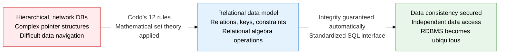
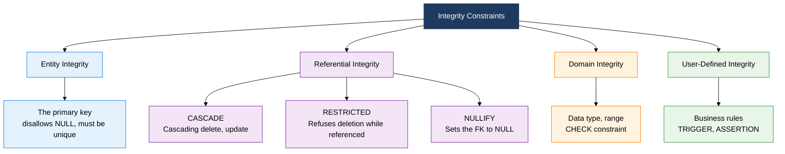
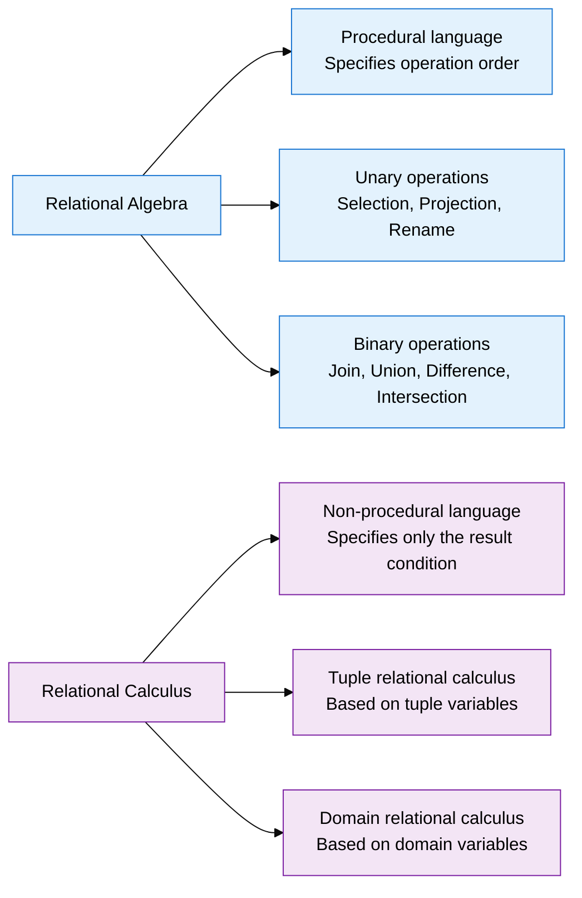

## 1. Overview of the Relational Data Model, a Relation Theory That Guarantees Data Consistency Based on Mathematical Set Theory

**Definition**: A data model proposed by E.F. Codd (1970) that represents data as two-dimensional tables (relations) based on mathematical set theory, and manages data consistently through integrity constraints and relational algebra operations.
- Represents both data and the relationships between data as relations (tables), delivering structural simplicity and theoretical completeness at the same time
- A key system and integrity constraints automatically guarantee data quality independently of the application
- SQL, based on relational algebra, enables non-procedural data access and raises productivity

**Characteristics**:
- **Set-based processing**: Data is processed with set operations at the relation level rather than record by record, enabling processing efficiency and a declarative approach
- **Grounded in mathematical theory**: Relational algebra and relational calculus, based on set theory and first-order predicate logic, deliver correctness and an optimization theory for data manipulation
- **Physical independence**: Data can be manipulated through relation-level logical access alone, regardless of the physical storage method

---

## 2. Core Structure of the Relational Data Model

### A. Relation Structure and the Key System

```mermaid
%%{init: { 'theme': 'base', 'themeVariables': { 'edgeLabelBackground': '#fff' }}}%%
flowchart TD
    REL["Relation"] --> TUP["Tuple<br/>Tuple (row)"]
    REL --> ATT["Attribute<br/>Attribute (column)"]
    REL --> DOM["Domain"]
    TUP --> TUP1["Cardinality<br/>Number of tuples (row count)"]
    ATT --> ATT1["Degree<br/>Number of attributes (column count)"]
    DOM --> DOM1["A set of atomic values<br/>the range of values an attribute can hold"]
    REL --> KEY["Key system"]
    KEY --> K1["Super key<br/>Satisfies only uniqueness"]
    KEY --> K2["Candidate key<br/>Uniqueness + minimality"]
    KEY --> K3["Primary key (PK)<br/>The chosen candidate key"]
    KEY --> K4["Alternate key (AK)<br/>A candidate key not chosen"]
    KEY --> K5["Foreign key (FK)<br/>References another relation"]
    style REL fill:#1E3A5F,stroke:#1E3A5F,color:#fff
    style TUP fill:#E3F2FD,stroke:#1976D2,color:#000
    style ATT fill:#E3F2FD,stroke:#1976D2,color:#000
    style DOM fill:#E3F2FD,stroke:#1976D2,color:#000
    style KEY fill:#F3E5F5,stroke:#7B1FA2,color:#000
    style TUP1 fill:#E3F2FD,stroke:#1976D2,color:#000
    style ATT1 fill:#E3F2FD,stroke:#1976D2,color:#000
    style DOM1 fill:#E3F2FD,stroke:#1976D2,color:#000
    style K1 fill:#F3E5F5,stroke:#7B1FA2,color:#000
    style K2 fill:#F3E5F5,stroke:#7B1FA2,color:#000
    style K3 fill:#1E3A5F,stroke:#1E3A5F,color:#fff
    style K4 fill:#F3E5F5,stroke:#7B1FA2,color:#000
    style K5 fill:#FFF3E0,stroke:#F57C00,color:#000
```

| Relation Component | Definition | Characteristics |
|:---:|:---|:---|
| **Tuple** | Each row of a relation, a set of actual data values | Unordered, no duplicates allowed (a set property) |
| **Attribute** | Each column of a relation, a characteristic or property of the entity | Unordered, only atomic values allowed (1NF) |
| **Domain** | The set of atomic values an attribute may take | Constrained by data type, length, and range |
| **Degree** | The number of attributes in a relation | Changes only on a schema change; a static property |
| **Cardinality** | The number of tuples in a relation | Changes dynamically with DML operations |

**Comparing the Key System**

| Key Type | Condition | Characteristics | Example |
|:---:|:---|:---|:---|
| **Super key** | Uniqueness | No minimality required; a superset concept | {StudentID}, {StudentID+Name} |
| **Candidate key** | Uniqueness + minimality | Eligible to become the primary key | {StudentID}, {Email} |
| **Primary key (PK)** | Uniqueness + minimality + NOT NULL | The representative identifier; no duplicates or NULLs | {StudentID} |
| **Alternate key (AK)** | Uniqueness + minimality | A candidate key not chosen as primary | {Email} |
| **Foreign key (FK)** | Referential integrity | The referenced table's PK value, or NULL | {StudentID} in the enrollment table |

---

### B. Integrity Constraints, and Relational Algebra vs. Relational Calculus

**Integrity Constraints in Detail**

| Integrity Type | Definition and Rule | On Violation | SQL Implementation |
|:---:|:---|:---|:---|
| **Entity integrity** | The primary key attribute disallows NULL and duplicates within the relation | INSERT/UPDATE rejected | PRIMARY KEY constraint |
| **Referential integrity - CASCADE** | Deleting or updating a parent record cascades to child records | Child records are auto-deleted or auto-updated | ON DELETE/UPDATE CASCADE |
| **Referential integrity - RESTRICTED** | Refuses to delete or update a parent record that a child record references | The parent-record operation is rejected | ON DELETE/UPDATE RESTRICT |
| **Referential integrity - NULLIFY** | Deleting the parent record sets the child's FK to NULL | The FK column is set to NULL | ON DELETE SET NULL |
| **Domain integrity** | An attribute's value must fall within its defined domain | INSERT/UPDATE rejected | CHECK, DEFAULT, NOT NULL |
| **User-defined integrity** | A composite business-rule-based constraint (e.g., inventory ≥ 0) | Handled by a trigger or the application | TRIGGER, ASSERTION |

**Comparing Relational Algebra and Relational Calculus**

| Category | Relational Algebra | Relational Calculus |
|:---:|:---|:---|
| **Language type** | Procedural | Non-procedural |
| **Expression style** | Specifies how (How) to retrieve data, as an operation sequence | Specifies only what (What) to retrieve, as a condition |
| **Underlying theory** | Set theory, algebraic operations | First-order predicate logic, logical formulas |
| **Key operations** | σ (Selection), π (Projection), ⋈ (Join), ∪ (Union), - (Difference) | Tuple-variable condition expressions, existential quantifier, universal quantifier |
| **Relation to SQL** | The theoretical foundation for SQL's internal optimization and execution plans | Semantically equivalent to the way SQL queries are written |
| **Completeness** | Relationally complete | Equivalent expressive power to relational algebra |

---

## 3. Expected Benefits and Practical Applications of the Relational Data Model

| Category | Key Benefits | Practical Application |
|:---:|:---|:---|
| **Data integrity** | Automatic entity, referential, and domain integrity cuts the validation burden on the application layer and raises data quality | Set CASCADE/RESTRICT policies to match business rules; enforce business rules at the DB level with CHECK constraints |
| **Standardized access** | The standard SQL interface allows the same data access and manipulation regardless of the DBMS vendor | Use ORM tools (JPA, Hibernate) to auto-map the relational model to the object model; secure portability |
| **Theory-driven optimization** | A relational-algebra-based query optimizer automatically selects the best execution plan, improving performance | Optimize join order and index usage via execution-plan analysis (EXPLAIN PLAN); use hint clauses |
| **Design verification** | Applying mathematically defined normalization theory removes anomalies at the source and guarantees schema quality | Apply a verification checklist per normalization stage; confirm integrity constraints are met during logical design review |
