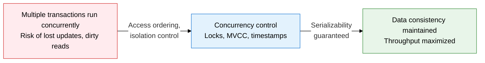
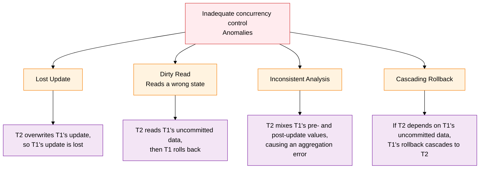
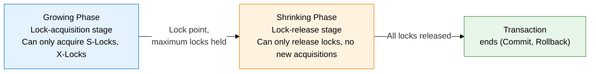

**A mechanism that blocks conflicts from concurrent multi-user access**

## 1. Overview of Concurrency Control, Blocking Conflicts from Concurrent Multi-User Access

**Definition**: A core DBMS control technique that prevents the data-inconsistency problems that arise when multiple transactions access a database concurrently, and guarantees serializability.
- Without concurrency control, concurrent access to the same data by multiple transactions produces anomalies such as lost updates, dirty reads, and inconsistent analysis
- Various approaches exist: locking, timestamp ordering, optimistic concurrency control, MVCC, and more
- The ultimate goal is guaranteeing a serializable schedule, ensuring that the result of concurrent execution matches that of serial execution

**Characteristics**:
- **Guaranteeing serializability**: A concurrent execution schedule produces a result equivalent to some serial schedule, securing data consistency
- **Managing starvation and deadlock**: Includes mechanisms to detect and resolve deadlock and starvation, which can occur with locking techniques
- **Performance-consistency trade-off**: Stronger concurrency control raises consistency but lowers throughput, so the technique must match the workload's characteristics

---

## 2. Core Structure of Concurrency Control

### A. The 4 Problems That Arise Without Adequate Concurrency Control

| Problem Type | Cause | Scenario | Solution |
|---|---|---|---|
| **Lost Update** | Two transactions read the same data concurrently, then each writes | T1 reads X=100, T2 reads X=100 → T1 saves X=150, T2 saves X=120 → T1's update (+50) is lost | Force serial execution with an exclusive lock (X-Lock) |
| **Dirty Read (reads a wrong state)** | Another transaction reads uncommitted data | T1 is changing X to 200, T2 reads X=200 → T1 rolls back → T2 has processed data that never existed | Apply an isolation level of Read Committed or higher |
| **Inconsistent Analysis** | Another transaction changes data while a transaction is in progress | T1 updates some data while T2 is aggregating → T2 reads a mix of pre- and post-update values, producing a wrong aggregate | Apply an isolation level of Repeatable Read or higher |
| **Cascading Rollback** | Transactions that depend on a rolled-back transaction's data must also roll back in cascade | T2 and T3 sequentially read and process T1's uncommitted data → when T1 rolls back, T2 and T3 must roll back too | Block dirty reads (Read Committed or higher) |

---

### B. Locking Techniques, the Two-Phase Locking Protocol (2PL), Deadlock, and Alternatives

**Lock Compatibility Matrix**

| Request \ Held | No lock held | S-Lock held | X-Lock held |
|:---:|:---:|:---:|:---:|
| **S-Lock request** | Granted | Granted | Wait |
| **X-Lock request** | Granted | Wait | Wait |

| Technique | Details | Advantages | Disadvantages |
|---|---|---|---|
| **Shared lock (S-Lock)** | Set for a Read operation. Coexists with other transactions' S-Locks, but blocks an X-Lock | Allows read concurrency, raising throughput | Writes may stall waiting for an X-Lock |
| **Exclusive lock (X-Lock)** | Set for a Write operation. Blocks both S-Locks and X-Locks | Fully blocks lost updates and dirty reads | Throughput drops under high contention |
| **Two-phase locking (2PL)** | Acquires locks during the Growing Phase, only releases them during the Shrinking Phase | Guarantees serializability | Can cause deadlock; cascading-rollback risk |
| **Deadlock** | T1 holds lock A, waits for lock B; T2 holds lock B, waits for lock A → indefinite wait | - | Resolved by detection (cycle search on a wait-for graph), then choosing and rolling back a victim |
| **Timestamp ordering** | Assigns each transaction a timestamp based on its start time; older transactions take priority | No deadlock | Starvation risk; frequent rollbacks on conflict |
| **Optimistic concurrency control (OCC)** | 3 phases — Read → Validation → Write: assumes no conflict and validates just before completion | High throughput in low-conflict environments | Rollback overhead grows in high-conflict environments |
| **MVCC** | Creates a new version on each data change; reads reference the appropriate version (uses the undo area) | No read-write conflicts, high concurrency | Version-management overhead; requires cleanup of old versions (vacuum) |

---

## 3. Expected Benefits and Practical Applications of Adopting Concurrency Control

| Category | Key Benefits | Practical Application |
|---|---|---|
| **Data correctness** | Fully blocks concurrency anomalies such as lost updates, dirty reads, and inconsistent analysis | Apply the right locking strategy to inventory and balance processing in finance and e-commerce to guarantee correctness |
| **Processing performance** | MVCC-based read-write separation raises read concurrency and overall throughput | Use the default MVCC settings of MySQL InnoDB and PostgreSQL in OLTP environments to spread read load |
| **Deadlock prevention** | Wait-for-graph detection and timeout-based resolution prevent system stalls | Standardize resource-access order at the application level and set a DB-level deadlock timeout as a second layer of defense |
| **Scalability** | Optimistic concurrency control and partitioning enable handling large-scale transaction volumes | Optimize per environment: apply OCC to low-conflict, read-heavy workloads and 2PL to high-conflict, write-heavy workloads |
