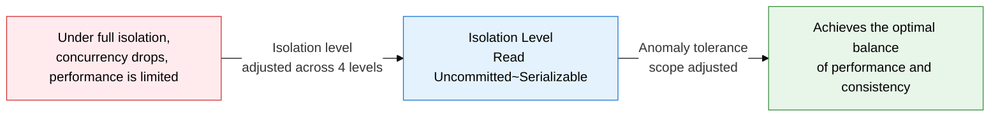
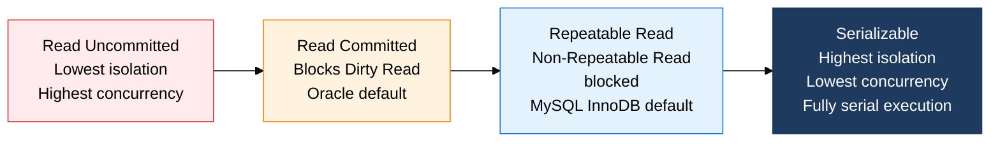

**A 4-level control scheme that determines the balance between consistency and concurrency**

## 1. Overview of Transaction Isolation Level, a Scheme for Balancing Consistency and Concurrency

**Definition**: A DBMS setting defined by the SQL standard (SQL-92) that divides the permitted scope of cross-transaction data visibility into four levels, controlling the trade-off between data consistency and the system's concurrent-processing performance.
- The higher the isolation level, the better the data consistency, but concurrent-processing performance drops from increased lock contention
- The lower the isolation level, the higher the throughput, but it permits the Dirty Read, Non-Repeatable Read, and Phantom Read anomalies
- The default isolation level differs by DBMS (MySQL InnoDB: Repeatable Read; Oracle: Read Committed), so the choice must match the workload's characteristics

**Characteristics**:
- **Standardized into 4 levels**: The SQL-92 standard defines four levels: Read Uncommitted → Read Committed → Repeatable Read → Serializable
- **Anomaly tolerance matrix**: The combination of the three anomalies (Dirty/Non-Repeatable/Phantom Read) allowed or blocked at each isolation level is clearly defined
- **Varying DBMS implementations**: Beyond the standard definition, some DBMSs provide different behavior through their own implementations, such as MVCC

---

## 2. Core Structure of Transaction Isolation Level

### A. The 3 Data Anomalies Depending on Isolation Level

```mermaid
%%{init: { 'theme': 'base', 'themeVariables': { 'edgeLabelBackground': '#fff' }}}%%
flowchart TD
    subgraph DR_BOX["Dirty Read Occurrence Timeline"]
        direction LR
        T1A["T1: X=100→200 Write<br/>(uncommitted)"] --> T2A["T2: X=200 Read<br/>(reads T1's uncommitted value)"]
        T2A --> T1B["T1: Rollback<br/>(restored to X=100)"]
        T1B --> RESULT_DR["T2 finishes processing<br/>based on an X=200 that never existed"]
    end
    subgraph NRR_BOX["Non-Repeatable Read Occurrence Timeline"]
        direction LR
        T1C["T1: X=100 Read<br/>(first read)"] --> T2B["T2: changes X=100→200,<br/>commits"]
        T2B --> T1D["T1: X=200 Read<br/>(second read, different result)"]
    end
    subgraph PR_BOX["Phantom Read Occurrence Timeline"]
        direction LR
        T1E["T1: query for ages in their 20s<br/>5 rows returned"] --> T2C["T2: inserts a row with age=25,<br/>commits"]
        T2C --> T1F["T1: re-queries ages in their 20s<br/>6 rows returned (a phantom row appears)"]
    end
    style DR_BOX fill:#FFEBEE,stroke:#D32F2F,color:#000
    style NRR_BOX fill:#FFF3E0,stroke:#F57C00,color:#000
    style PR_BOX fill:#F3E5F5,stroke:#7B1FA2,color:#000
    style T1A fill:#E3F2FD,stroke:#1976D2,color:#000
    style T2A fill:#E3F2FD,stroke:#1976D2,color:#000
    style T1B fill:#FFEBEE,stroke:#D32F2F,color:#000
    style RESULT_DR fill:#FFEBEE,stroke:#D32F2F,color:#000
    style T1C fill:#E3F2FD,stroke:#1976D2,color:#000
    style T2B fill:#FFF3E0,stroke:#F57C00,color:#000
    style T1D fill:#FFEBEE,stroke:#D32F2F,color:#000
    style T1E fill:#E3F2FD,stroke:#1976D2,color:#000
    style T2C fill:#FFF3E0,stroke:#F57C00,color:#000
    style T1F fill:#FFEBEE,stroke:#D32F2F,color:#000
```

| Anomaly | Definition | Occurrence Condition | Real-World Impact Example |
|---|---|---|---|
| **Dirty Read** | Reading another transaction's changed data before it's committed | T1 is changing data (uncommitted); T2 reads it, then T1 rolls back | Inventory is deducted based on an order amount that later gets rolled back → inventory error |
| **Non-Repeatable Read** | Re-querying the same data within a transaction returns a different value | T2 changes and commits the data between T1's reads | A balance queried twice within the same transaction returns different values → a transfer-logic error |
| **Phantom Read** | Re-running a range-condition query within a transaction shows new rows appearing or disappearing | T2 inserts, deletes, and commits a row within that range between T1's range queries | A newly inserted row changes an aggregate value while statistics are being computed |

---

### B. Detailed Comparison of the 4 Isolation Levels

**Anomaly Tolerance Matrix by Isolation Level (Core ITPE Exam Topic)**

| Isolation Level | Dirty Read | Non-Repeatable Read | Phantom Read | Implementation Mechanism | Key Use Cases |
|:---:|:---:|:---:|:---:|---|---|
| **Read Uncommitted** | Allowed | Allowed | Allowed | Reads the latest version directly, with no lock | Cases where speed matters more than accuracy, such as real-time statistics or log analysis |
| **Read Committed** | **Blocked** | Allowed | Allowed | Reads only the latest committed version (short S-Lock or MVCC) | Oracle/SQL Server default, most general OLTP workloads |
| **Repeatable Read** | **Blocked** | **Blocked** | Allowed | Snapshot at transaction start; holds an S-Lock on rows read | MySQL InnoDB default, financial lookups and report generation |
| **Serializable** | **Blocked** | **Blocked** | **Blocked** | Range S-Lock (Next-Key Lock); guarantees fully serial execution | High-risk transactions requiring full correctness, such as accounting and settlement |

> **MySQL InnoDB quirk**: At Repeatable Read, MVCC blocks most Phantom Reads (for a plain SELECT). However, a locking read such as `SELECT ... FOR UPDATE` can still produce a Phantom Read.

> **Oracle quirk**: Supports only Read Committed and Serializable, implementing Non-Repeatable Read behavior via MVCC so that even Read Committed allows only Dirty Read.

**Criteria for Choosing an Isolation Level**

| Workload Type | Recommended Isolation Level | Reason |
|---|---|---|
| Real-time dashboards, monitoring | Read Uncommitted | Tolerates slight inaccuracy; needs top performance |
| General web application CRUD | Read Committed | Basic correctness via blocking Dirty Read, while keeping high concurrency |
| Financial lookups, batch aggregation | Repeatable Read | Guarantees consistent read results within the same transaction |
| Accounting close, settlement, audit | Serializable | Fully serial execution guarantees correctness as the top priority |

---

## 3. Expected Benefits and Practical Applications of Transaction Isolation Level

| Category | Key Benefits | Practical Application |
|---|---|---|
| **Data correctness** | Blocking anomalies to match business requirements secures data trustworthiness | Tier by workload — Serializable for finance/accounting systems, Read Committed for general OLTP — for the optimal correctness-performance balance |
| **Performance optimization** | Avoiding an unnecessarily high isolation level reduces lock contention and raises throughput | Explicitly set Read Committed for read-only report transactions, and the minimum required level for write-heavy transactions |
| **Incident response** | Understanding the anomalies enables rapid diagnosis of data-error root causes | Establish an operating procedure that responds immediately, by adjusting the isolation level, when a Non-Repeatable Read or Phantom Read error occurs |
| **Standards compliance** | Basing behavior on the SQL-92 standard isolation levels makes it predictable during a DBMS migration | Build an isolation-level mapping table when replacing a DBMS or running a multi-DBMS environment, to systematize correctness management across heterogeneous systems |
