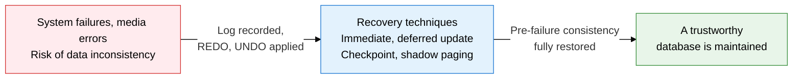
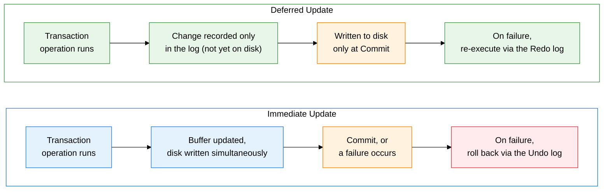
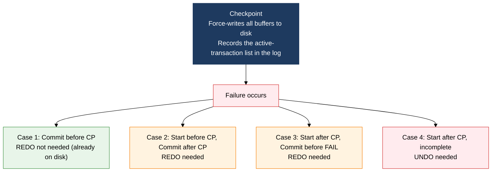

**A log-based mechanism that restores database consistency after a failure**

## 1. Overview of Recovery Techniques, a Mechanism for Restoring Data Consistency After a Failure

**Definition**: A core DBMS mechanism that, when a database system suffers a failure (system failure, media failure, transaction failure, etc.), performs REDO/UNDO operations based on log information to restore the database to a consistent state.
- The foundation of recovery is Write-Ahead Logging (WAL): the principle that the log must always be written before the data change
- Checkpointing narrows the recovery scope on failure, shortening recovery time
- Whether REDO/UNDO is needed depends on whether the immediate-update or deferred-update approach is used

**Characteristics**:
- **The WAL (Write-Ahead Logging) principle**: The log is always written to stable storage before the data is written to disk, guaranteeing recoverability
- **REDO and UNDO work together**: Committed transactions are re-executed via REDO, and incomplete transactions are rolled back via UNDO, so consistency can be restored regardless of when the failure occurs
- **Minimizing recovery scope via checkpoints**: Recovery starts from the last checkpoint instead of replaying the entire log, cutting recovery time to a realistic level

---

## 2. Core Structure of Recovery Techniques

### A. Log-Based Recovery Mechanisms (Immediate Update vs. Deferred Update)

| Comparison | Immediate Update | Deferred Update |
|---|---|---|
| **Update timing** | Buffer→disk write happens simultaneously with the operation | Written to disk only at transaction Commit |
| **Redo needed?** | Yes (re-executes on a failure after Commit) | Yes (re-executes data not yet written after Commit) |
| **Undo needed?** | Yes (rolls back incomplete transactions) | No (since incomplete changes were never written to disk) |
| **Log contents** | Before Image (pre-change) + After Image (post-change) | Only the After Image (post-change) is recorded |
| **Advantage** | Data survives even a buffer overflow | No Undo needed, simplifying recovery logic |
| **Disadvantage** | Undo overhead, more complex recovery logic | A failure before Commit can lose all changes |
| **Used by** | Most commercial DBMSs, including InnoDB and Oracle | Some simple systems, read-heavy DBs |

**REDO and UNDO in Detail**

| Operation | Applies To | What It Does | Purpose |
|---|---|---|---|
| **REDO** | Transactions committed before the failure | Re-executes the change based on the After Image log | Restores a committed change that was never written to disk |
| **UNDO** | Transactions that were incomplete at the time of failure | Cancels the change based on the Before Image log | Removes the partially applied data of an incomplete transaction |

---

### B. Checkpoint-Based Recovery and Shadow Paging

**The 4 Recovery Cases by Checkpoint**

| Case | Start Time | End Time | Redo Needed | Undo Needed | Reason |
|:---:|---|---|:---:|:---:|---|
| **1** | Before checkpoint | Committed before checkpoint | Not needed | Not needed | Already fully written to disk at the checkpoint |
| **2** | Before checkpoint | Committed after checkpoint | Needed | Not needed | Commit finished, but a portion was never written to disk |
| **3** | After checkpoint | Committed before the failure | Needed | Not needed | Commit finished, but it may not have been written to disk |
| **4** | After checkpoint | Incomplete at the time of failure | Not needed | Needed | Must remove the partially applied data of the incomplete transaction |

**Shadow Paging**

| Item | Description |
|---|---|
| **Concept** | When data changes, the original page (the shadow page) is kept as-is, and the change is recorded only in a new page |
| **On Commit** | The new, changed page is registered in the current page table, and the original (shadow) page is discarded |
| **On Rollback** | The new, changed page is discarded, and the original (shadow) page table is restored |
| **Advantage** | No Undo log needed; recovery is simple and fast |
| **Disadvantage** | Worse page fragmentation, garbage-collection overhead, harder concurrency control |
| **Current status** | Log-based recovery dominates in practice; shadow paging is used in some SQLite modes |

---

## 3. Expected Benefits and Practical Applications of Adopting Recovery Techniques

| Category | Key Benefits | Practical Application |
|---|---|---|
| **System availability** | REDO/UNDO-based automatic recovery on failure minimizes service downtime | Tune the checkpoint interval to the business SLA (e.g., shorten it for a financial system with a sub-1-minute RPO target) |
| **Data integrity** | The WAL principle guarantees the durability of every committed transaction | Apply WAL strictly with MySQL InnoDB's `innodb_flush_log_at_trx_commit=1` setting to make durability the top priority |
| **Operational efficiency** | Narrowing the recovery scope via checkpoints keeps recovery time realistic even at large scale | Configure PITR (Point-In-Time Recovery) with archive logs, allowing restoration to any point before the failure |
| **Disaster recovery** | Remote log shipping and redundancy enable recovery with no data loss even on a media failure | Build a disaster-recovery site with log-based replication such as Oracle Data Guard or MySQL binlog replication, meeting RTO/RPO targets |
