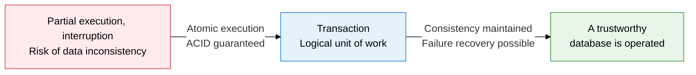
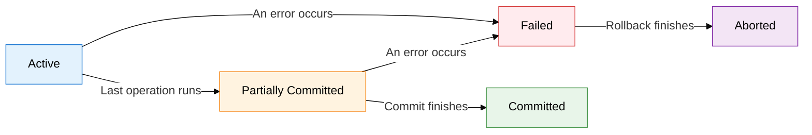
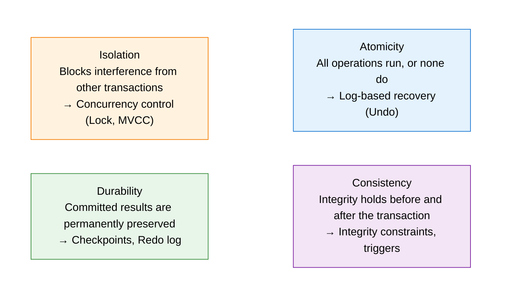

**The smallest logical unit of work in a database**

## 1. Overview of Transaction, the Smallest Logical Unit of Data Consistency

**Definition**: The basic unit of work for performing a single logical function in a database — a set of operations that guarantees data consistency and integrity through the ACID properties.
- Every operation within a transaction must either all execute (Commit) or all be canceled (Rollback)
- Multiple SQL statements are bundled into one logical unit that transforms the database's state
- The DBMS applies its recovery, concurrency control, and integrity-guarantee mechanisms at the transaction level

**Characteristics**:
- **Atomicity**: Every operation in a transaction must either fully execute or not execute at all; a partial-execution result is never permitted
- **ACID-based reliability**: The four properties — atomicity, consistency, isolation, durability — guarantee data integrity even in a multi-user environment
- **The basic unit for recovery and concurrency control**: The DBMS's recovery manager and concurrency-control manager both operate at the transaction level to handle failures and prevent conflicts

---

## 2. Core Structure of Transaction

### A. Transaction State Transition Diagram

| State | Name | Meaning | Transition Condition |
|---|---|---|---|
| **Active** | From transaction start until the last operation runs | The normal in-progress state while SQL statements execute | Entered when the transaction starts |
| **Partially Committed** | Right after the last operation, before Commit | All operations are done, but the result is reflected only in the buffer | After the last SQL statement finishes |
| **Committed** | Permanently applied after Commit finishes | The final state where the changes are permanently written to disk | The Commit command executes successfully |
| **Failed** | Cannot proceed normally due to an error | Halted by a hardware, software, or logic error | An error during Active or Partially Committed |
| **Aborted** | The prior state is restored after Rollback finishes | The database is reverted to its pre-transaction state | The Rollback command finishes executing |

---

### B. The ACID Properties and DBMS Guarantee Mechanisms

| ACID Property | Definition | DBMS Guarantee Mechanism | Problem If Violated |
|---|---|---|---|
| **Atomicity** | Every operation in a transaction either fully executes or does not execute at all | Write-Ahead Log (WAL), Undo-log-based rollback | Partial execution causes data inconsistency |
| **Consistency** | The database always stays consistent before and after a transaction runs | Integrity constraints (PK, FK, Check), triggers, cascade rules | Broken referential integrity, business-rule violations |
| **Isolation** | Concurrently executing transactions cannot access each other's intermediate results | Locks (shared, exclusive), 2PL, MVCC, timestamp ordering | Dirty Read, Lost Update, Phantom Read |
| **Durability** | The result of a successfully committed transaction survives even a system failure | WAL, Redo log, checkpoints, redundancy, backup | Loss of committed data after a failure |

---

## 3. Expected Benefits and Practical Applications of Transactions

| Category | Key Benefits | Practical Application |
|---|---|---|
| **Data integrity** | ACID guarantees maintain data consistency even in a multi-user environment | Bundle a single piece of business logic — such as a financial transfer or order processing — into one transaction to guarantee atomic execution |
| **Failure recovery** | On a system failure, Undo/Redo automatically restores a consistent state | Establish automatic recovery procedures per failure type using WAL (Write-Ahead Logging)-based logs |
| **Concurrency control** | Isolation guarantees prevent conflicts when multiple transactions run concurrently | Choose an isolation level suited to the workload for the optimal balance of performance and consistency |
| **Audit and traceability** | Transaction logs make it possible to fully trace the history of data changes | Meet regulatory-compliance (SOX, ISMS) requirements to retain change history via transaction logs, strengthening audit readiness |
