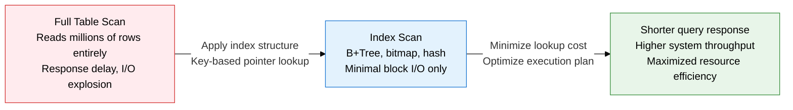
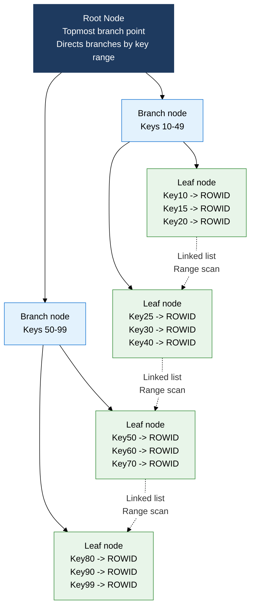
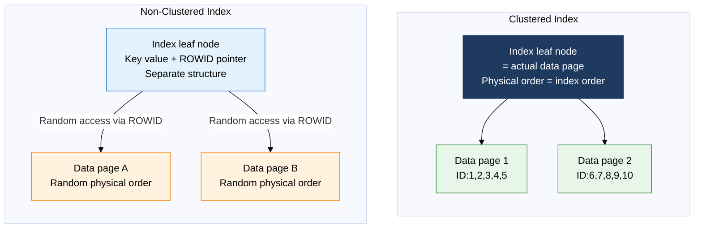

## 1. Overview of Indexes — Locating Data Instantly Without a Full Scan

**Definition**: A separate data structure that maps a table's specific column values to the physical location (ROWID) of the corresponding rows — a performance optimization mechanism that avoids a full table scan and reaches the desired data directly with minimal I/O.
- Different structures — B+Tree, bitmap, hash, and others — suit different lookup goals; a poorly designed index can instead degrade DML performance
- A clustered index physically sorts the table data itself in index-key order, maximizing range-scan performance
- Index selectivity and cardinality are the key criteria for judging an index's usefulness

**Characteristics**:
- **Structural lookup**: Tree traversal (O(log n)) or hashing (O(1)) cuts I/O by tens to thousands of times compared to a full scan
- **DML overhead trade-off**: INSERT, UPDATE, and DELETE also update the index, which can degrade write performance — avoid excessive indexing
- **Dependence on selectivity**: Effectiveness peaks on high-cardinality columns (a high ratio of unique values); a bitmap index suits columns with only two or three values, like gender

---

## 2. Core Structure of Indexes

### A. Comparing Index Structure Types

B+Tree is the most frequently tested structure on the professional engineer exam; you must understand its three-tier root/branch/leaf structure and the linked list between leaf nodes.

**B+Tree core structural points**:
- **Internal nodes (root, branch)**: store only key values and child pointers, no actual data pointers
- **Leaf nodes**: store key value + ROWID (physical address); every search must reach a leaf node
- **Leaf node linking**: adjacent leaf nodes connect through a doubly linked list -> a range search (BETWEEN, >=) can scan consecutive blocks
- **Balance maintenance**: automatic rebalancing on insert/delete keeps the tree height uniform -> guarantees O(log n) search time

| Index type | Data structure | Lookup complexity | Range search | Suitable columns | Main drawback |
|:---:|:---|:---:|:---:|:---|:---|
| **B-Tree** | Balanced binary search tree. Both internal and leaf nodes hold data pointers | O(log n) | Supported | General purpose, mid cardinality | No links between leaves, so a range scan needs backtracking |
| **B+Tree** | An improvement on B-Tree. Internal nodes hold only keys; leaves hold data pointers plus a linked list | O(log n) | Optimal | Range-search/sort columns, PK | Rebalancing overhead on insert/delete |
| **Bitmap index** | A bit vector per column value; combines multiple conditions via bitwise AND/OR | O(1)-O(n/8) | Inefficient | Low-cardinality columns like gender, status code, region | Severe bit-lock contention under concurrent DML, unsuited to OLTP |
| **Hash index** | Computes a bucket address directly via a hash function, with chaining within the bucket | O(1) average | Not supported | Columns used only with equality (=) comparisons | No support at all for range/sort search; performance drops on hash collisions |
| **Function-based index** | Indexes the result of applying a function to a column value | O(log n) | Supported | UPPER, SUBSTR, date conversion, etc. | Index invalidated if the function's result changes |
| **Composite index** | A B+Tree built from two or more combined columns | O(log n) | By leading column | Composite-condition queries, covering index | Unused by queries that omit the leading column |

---

### B. Clustered vs. Non-Clustered Index and Scan Methods

| Category | Clustered index | Non-clustered index |
|:---:|:---|:---|
| **Physical sort** | Table data is physically sorted in index-key order | Independent of physical data order, a separate index structure |
| **Count per table** | Only one allowed (physical sort supports only one order) | Multiple allowed (around 1000 on Oracle) |
| **Leaf node** | The leaf node itself is the actual data page | Leaf node stores key + ROWID, referencing a separate data page |
| **Range search** | Very efficient range scan thanks to physical contiguity | Random I/O possible; performance drops on large ranges |
| **DML overhead** | Physical reorganization and costly page splits on insert | Relatively fast insert/delete |
| **Suitable columns** | PK, columns with frequent range search (date, ID range) | Columns with varied search conditions, covering-index design |

**Comparing index scan methods**

| Scan method | Operating principle | Usage condition | Performance characteristics |
|:---:|:---|:---|:---|
| **Index Unique Scan** | Finds a single matching entry in the index and stops immediately | Equality (=) condition on a PK/Unique-constrained column | Best performance, minimal I/O |
| **Index Range Scan** | Traverses root -> branch -> leaf, then moves across the leaf chain for the range | Range conditions such as BETWEEN, >=, <=, LIKE 'A%' | Scales with range size, especially efficient on a clustered index |
| **Index Full Scan** | Scans every leaf node of the index from start to end | Avoiding ORDER BY/GROUP BY sorts, covering index | Favorable when it reads fewer blocks than a full table scan |
| **Index Skip Scan** | Searches a composite index even without a condition on the leading column | Low cardinality on the leading column with a condition on a trailing column | Runs a Range Scan per leading-column value segment — has overhead |
| **Index Fast Full Scan** | Reads the entire index in multiblock I/O | Query is fully answered by columns in the index (covering) | Faster than a full scan but gives no sort guarantee |

---

## 3. Expected Benefits and Practical Applications of Indexing

| Category | Key benefits | Practical application |
|:---:|:---|:---|
| **Query performance** | Eliminates full table scans, delivering sub-millisecond responses even on multi-million-row tables and cutting I/O cost by tens to thousands of times | Analyze the execution plan (EXPLAIN PLAN) to identify full-scan segments, then add a B+Tree index on high-selectivity columns |
| **Design optimization** | Composite/covering-index design can answer a query from the index alone, without touching the table (zero block reads) | Include frequently selected columns in the index to build a covering index, balancing DML overhead against read performance |
| **OLAP analysis** | Bitwise AND/OR on bitmap indexes maximizes multidimensional aggregation and filtering performance | Apply bitmap indexes to low-cardinality columns like gender, region, or status in DW/BI environments, with an index rebuild strategy after batch loads |
| **Maintenance** | Monitor index fragmentation and rebuild periodically to prevent performance decay | Schedule automatic statistics refreshes, and remove unused indexes (unused-index monitoring) to reduce DML overhead |
