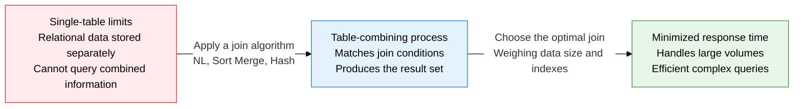
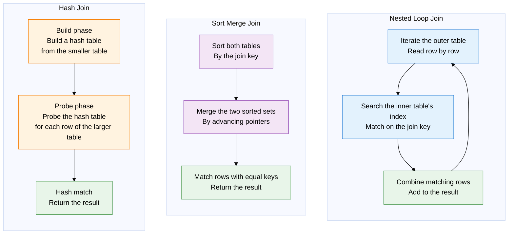
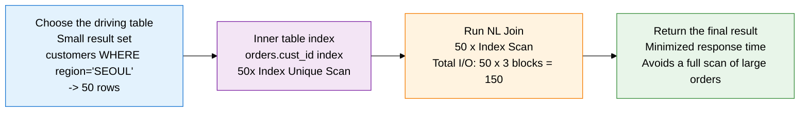

## 1. Overview of Join Mechanisms — Choosing the Optimal Algorithm to Combine Two Tables

**Definition**: An internal DBMS algorithm that combines two or more tables according to a join condition (the ON clause) to produce a single result set, choosing among Nested Loop, Sort Merge, and Hash Join based on data size, index availability, and join type.
- Join performance depends on the size of the driving table's result set, whether the inner table has an index, and the amount of available memory (PGA/work_mem)
- The optimizer automatically picks the lowest-cost algorithm among the three based on statistics, and a developer can force a join method and order with hints
- Choosing the wrong driving table can degrade join performance by tens of times, so the table with the smallest result set should always be the outer (driving) table

**Characteristics**:
- **Algorithm diversity**: NL Join suits small-scale OLTP, Hash Join suits large-scale OLAP, and Sort Merge Join suits already-sorted data or inequality joins — each mechanism optimized for its own case
- **Memory sensitivity**: Hash Join and Sort Merge Join need sufficient memory (PGA/sort buffer) to reach peak performance; a memory shortage triggers a disk spill and a sharp performance drop
- **Decisive role of the driving table**: In NL Join, the driving table's result-set size determines the number of inner-loop iterations — choosing the wrong driving table is the most common performance problem

---

## 2. Core Structure of Join Mechanisms

### A. Comparing How the Three Join Algorithms Work

| Join method | Operating principle | Time complexity | Suitable situation | Advantages | Drawbacks |
|:---:|:---|:---:|:---|:---|:---|
| **Nested Loop Join** | Iterates the outer table row by row, repeatedly probing the inner table; the inner table's join column requires an index | O(n × log m) | Small driving result set, inner table indexed, OLTP single/small-volume lookups | Returns the first row fast (minimal response time), low memory use, maximizes index use | Inner loop explodes if the driving set is large, unusable without an index |
| **Sort Merge Join** | Sorts both tables by the join key first, then merges them by advancing pointers | O(n log n + m log m) | Already-sorted results, inequality joins, range joins, large volumes with no index | Predictable performance from a linear merge after sorting, supports inequality joins | High sort cost; a disk sort under memory pressure sharply degrades performance |
| **Hash Join** | Builds an in-memory hash table from the smaller table, then matches each row of the larger table via a hash lookup | O(n + m) average | Large-scale equality joins, tables without an index, OLAP/DW aggregate queries | High performance even without an index, dramatically outperforms NL at scale | Only supports equality (=) joins; falls back to a disk hash (Grace Hash Join) under memory pressure — degrades performance |

---

### B. Join Performance Optimization Techniques

**Principles for choosing the driving table**:
- In NL Join, the driving table's result-set size = the number of inner-loop iterations
- After applying the WHERE condition, the table whose result set is **smallest** should always be the driving table
- In Hash Join, the build target should be the **smaller table** (the one loaded into memory)

| Optimization technique | Applicable condition | Effect | Caution |
|:---:|:---|:---|:---|
| **Minimize the driving table** | Always applies when using NL Join — make the table with the most selective WHERE condition the driving table | Minimizes inner-loop count, cutting total I/O by tens of times | Misjudging selectivity backfires. Always confirm actual Rows with EXPLAIN |
| **Index the join column** | The inner table in an NL Join, and the join-key column for every join type | Minimizes inner-loop cost via an Index Range/Unique Scan | Place the join key as the leading column when building a composite index |
| **Optimize join order** | When joining three or more tables — use the LEADING hint | Minimizes intermediate result sets, reducing the cost of later joins | Determine join order based on intermediate result-set size |
| **Convert a subquery to a join** | A correlated subquery — one re-executed for every row of the outer query | Converting to a join runs it once, boosting performance by tens of times | Verify semantic equivalence. Use the NOT EXISTS -> LEFT JOIN + IS NULL pattern |
| **Tune hash join memory** | When using Hash Join — the build table must fit comfortably in memory | Prevents a disk spill, keeping hash join at peak performance | Raising PGA_AGGREGATE_TARGET (Oracle) or work_mem (PostgreSQL) affects the whole session — consider the impact |
| **Batched NL join** | Small OLTP tables that need to process large volumes — Batched Key Access (BKA) | Batches inner-table access, converting random I/O into sequential I/O | Use MySQL 8.0 Hash Join or the BKA hint |

---

## 3. Expected Benefits and Practical Applications of Join Optimization

| Category | Key benefits | Practical application |
|:---:|:---|:---|
| **OLTP performance** | NL Join plus an inner-table index gives sub-millisecond responses even joining multi-million-row tables, maximizing concurrent-user throughput | Check the driving table via EXPLAIN on join queries; tune small OLTP joins with the USE_NL hint and a join-key index |
| **OLAP analysis** | Hash Join processes equality joins on hundreds-of-millions-of-row tables with no index, at high speed, in memory | Force Hash Join in DW queries (USE_HASH), raise work_mem/PGA to prevent disk spills, combine with partition pruning |
| **Query structure improvement** | Rewrites correlated subqueries and inline views as joins to remove repeated-execution structures, minimizing total executions | Convert correlated subqueries to LEFT JOIN + GROUP BY or a window function, and convert ORM-generated N+1 queries to joins |
| **Architecture design** | Understanding join mechanisms balances normalization against denormalization, informs partitioning strategy, and minimizes distributed-DB cross-join cost | When splitting databases per microservice, replace cross-service joins with API-level aggregation or event sourcing |
