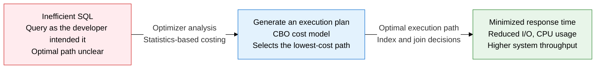
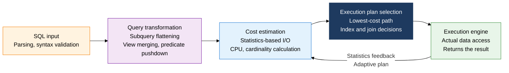
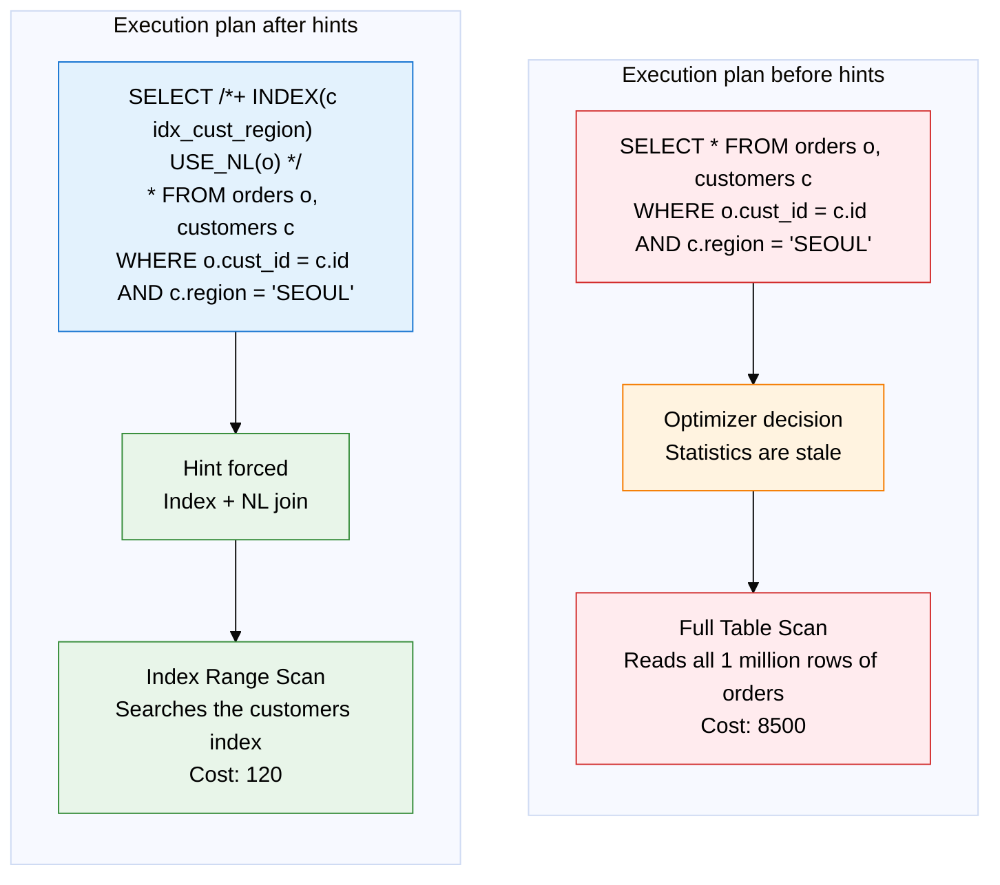

## 1. Overview of the Optimizer — Turning SQL into the Lowest-Cost Execution Path

**Definition**: An internal DBMS query optimization engine that parses an SQL statement, evaluates every feasible execution path, and automatically selects the lowest-cost execution plan using a statistics-based cost model.
- Optimizers evolved from rule-based (RBO) to cost-based (CBO); modern DBMSs (Oracle 10g and later, PostgreSQL, MySQL 8.0+) use CBO by default
- Optimization quality depends heavily on the accuracy of the statistics (row count, cardinality, histograms, block count) — stale statistics are the leading cause of a poor execution plan
- A developer can intervene in the optimizer's decisions through the hint mechanism, forcing a specific index or join order

**Characteristics**:
- **Cost-based optimization**: A scientific decision mechanism that quantifies I/O cost, CPU cost, and network cost to compare and select among multiple candidate execution plans
- **Dependence on statistics**: Optimization quality is determined by the accuracy of statistics such as table row count, column cardinality, histograms, and index clustering factor
- **Hint override**: When the optimizer produces a poor execution plan, an SQL hint can force control — but overuse risks a performance reversal once statistics are refreshed

---

## 2. Core Structure of the Optimizer

### A. Comparing RBO vs. CBO and the CBO Optimization Process

**Three factors in CBO cost estimation**:
- **I/O cost**: disk block reads x cost per block — makes up 70-80% of total cost
- **CPU cost**: per-row processing cost x expected row count — grows for hash- and sort-intensive operations
- **Network cost**: data-transfer cost between nodes in a distributed DB/RAC environment

| Comparison | RBO (Rule-Based Optimizer) | CBO (Cost-Based Optimizer) |
|:---:|:---|:---|
| **Optimization basis** | 15 predefined rule priorities — uses an index unconditionally if one exists | Selects the lowest-cost path by calculating a statistics-based cost figure |
| **Use of statistics** | None. Ignores table size and data distribution | Requires row count, cardinality, histograms, block count, and more |
| **Applicable DBMS version** | Pre-Oracle 9i (modern Oracle enables it only via a hint) | Default from Oracle 10g on, PostgreSQL, MySQL 8.0+ |
| **Predictability** | Easy to predict results since it's rule-based | Execution plan can vary with statistics accuracy |
| **Handling data skew** | Cannot handle it. Uses an index on a gender column even if one exists | Reflects data distribution via histograms, selective index use |
| **Complex query performance** | Rule priority often misses the optimal path | Finds the optimal path by exploring join order and index combinations |
| **Maintenance** | No statistics refresh needed, simple upkeep | Requires periodic statistics refresh (ANALYZE/DBMS_STATS) |

---

### B. Using Hints and Analyzing Execution Plans

**Key points for analyzing an execution plan**:
- Check the execution plan with `EXPLAIN PLAN FOR [SQL]` or `EXPLAIN [SQL]`
- **Rows (cardinality)**: the row count the optimizer predicted — a large gap from the actual row count suggests stale statistics
- **Cost**: a relative cost figure — the root node's total cost is the overall execution cost
- **Access type**: performance improves in the order ALL (full scan) -> range -> ref -> const (MySQL)

| Hint type | Syntax (Oracle) | Purpose | Caution |
|:---:|:---|:---|:---|
| **INDEX** | `/*+ INDEX(table index_name) */` | Force a specific index, avoid a full scan | If data growth changes index efficiency, the hint can backfire |
| **FULL** | `/*+ FULL(table) */` | Ignore indexes and force a full scan — small tables, DW batch jobs | Never use on large-scale OLTP |
| **USE_NL** | `/*+ USE_NL(table) */` | Force a Nested Loop Join | Performance can reverse if the inner table is large |
| **USE_HASH** | `/*+ USE_HASH(table) */` | Force a Hash Join — equality joins on large tables | A disk spill occurs if PGA memory is insufficient |
| **PARALLEL** | `/*+ PARALLEL(table 4) */` | Spread a full scan across N parallel processes | Serious resource contention with many concurrent users |
| **NO_INDEX** | `/*+ NO_INDEX(table index_name) */` | Suppress use of a specific index | Falls back to another index or a full scan |
| **LEADING** | `/*+ LEADING(table1 table2) */` | Force the join order | Picking the wrong driving table sharply degrades NL join performance |

---

## 3. Expected Benefits and Practical Applications of the Optimizer

| Category | Key benefits | Practical application |
|:---:|:---|:---|
| **Query performance** | The CBO cost model automatically picks the optimal path among thousands of candidate execution plans, cutting manual tuning effort by 80% or more | Schedule periodic statistics refreshes (DBMS_STATS, ANALYZE), and collect histograms to improve accuracy on skewed columns |
| **Stability** | SQL Plan Baseline and Adaptive Plan keep a verified execution plan intact even when statistics change | Use Oracle SPM (SQL Plan Management) or pg_hint_plan, and check for execution-plan changes with EXPLAIN before deployment |
| **Problem diagnosis** | Identifies cardinality errors and underestimated-cost segments in an execution plan to pinpoint tuning targets | Analyze AWR/ASH reports or the slow query log to list high-cost SQL, then apply three-stage tuning with hints, indexes, and statistics |
| **Operational automation** | Adaptive Query Optimization (Oracle 12c+) re-adjusts the execution plan in real time based on runtime statistics feedback | Build a CI pipeline that automatically compares EXPLAIN output in dev/test environments, ensuring deployment quality by detecting execution-plan regressions |
