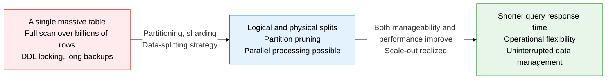
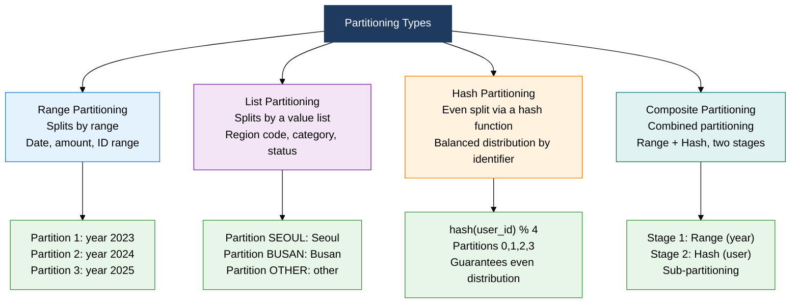
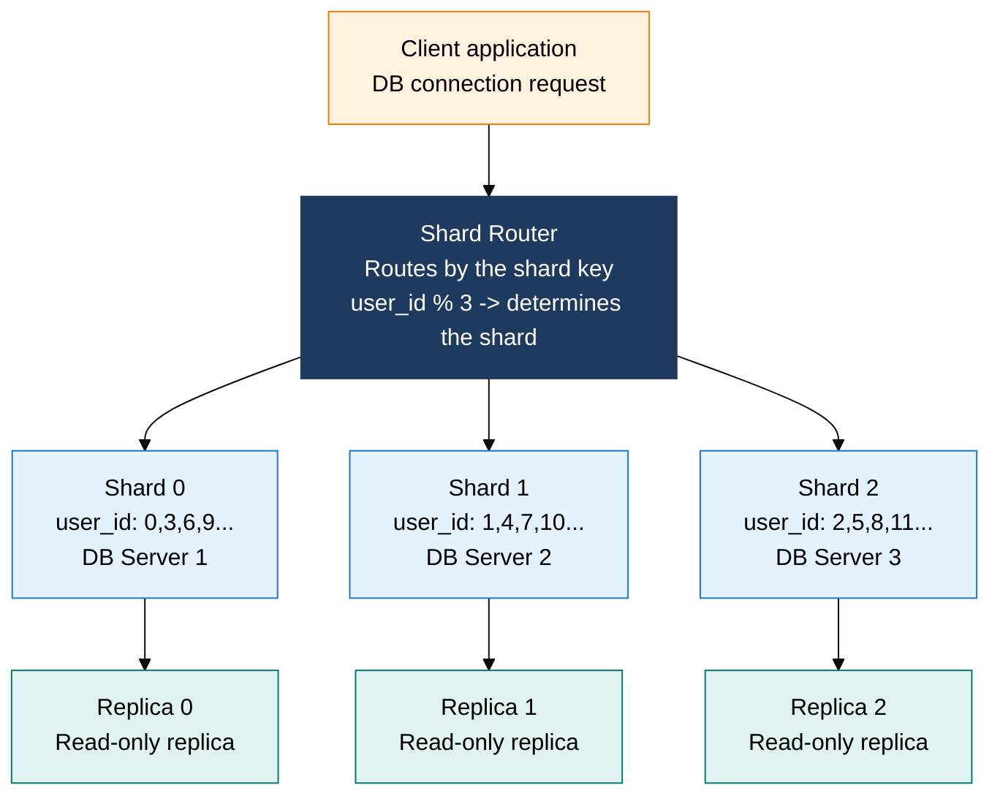

## 1. Overview of Partitioning and Sharding — Splitting Large Data for Performance and Manageability



**Definition**: A data-distribution design technique that splits a large table logically or physically by a chosen criterion (range, list, or hash) to narrow query scope and improve parallel processing and manageability.
- Partitioning splits a table logically within a single DB server, while sharding extends the same splitting concept horizontally across multiple physical servers
- Partition pruning lets a query scan only the relevant partitions, blocking unnecessary I/O at the source
- Choosing a shard key must balance the conflicting goals of even data distribution and minimizing cross-shard joins

**Characteristics**:
- **Partition pruning**: when a WHERE condition includes the partition key, only that partition is scanned, cutting I/O in proportion to the number of partitions
- **Independent management units**: each partition can be backed up, restored, dropped (DROP PARTITION), or compressed on its own, maximizing operational flexibility and minimizing lock scope
- **Basis for scale-out**: sharding overcomes a single server's physical limits to achieve horizontal scale-out, but brings operational complexity in the form of cross-shard joins and resharding cost

---

## 2. Core Structure of Partitioning and Sharding

### A. Comparing Four Partitioning Types



| Type | Splitting criterion | Advantages | Drawbacks | Suitable cases |
|:---:|:---|:---|:---|:---|
| **Range Partitioning** | A continuous range of column values — `PARTITION BY RANGE (reg_date)` | Full partition pruning on date-range queries, old partitions can be dropped instantly | Hotspots from INSERTs concentrating on the newest partition, empty partitions must be predefined | History data/log tables (daily/monthly), archiving strategy |
| **List Partitioning** | A predefined list of values — `PARTITION BY LIST (region_cd)` | Complete separation of data by a specific value, independent management by region or category | New partitions needed when new values appear, partition-size skew if value distribution is uneven | Enumerated columns like region code, department code, status value |
| **Hash Partitioning** | The result of applying a hash function — `PARTITION BY HASH (user_id) PARTITIONS 8` | Guarantees even data distribution, no hotspots, predictable partition size | No pruning possible on range queries — scans all partitions; redistribution cost when partition count changes | User ID, transaction ID where even distribution matters |
| **Composite Partitioning** | Two criteria combined — a two-tier scheme like Range-Hash or Range-List | Combines the benefits of Range pruning and Hash's even distribution, fine-grained partition management | Partition count grows rapidly, higher management complexity | Environments needing both large history tables and even distribution |

**Partition pruning example**:

```sql
-- Range partition pruning: scans only the 2024 partition
SELECT * FROM orders WHERE order_date BETWEEN '2024-01-01' AND '2024-12-31';

-- List partition pruning: scans only the SEOUL partition
SELECT * FROM customers WHERE region_cd = 'SEOUL';

-- Hash partition: no pruning possible — scans all 8 partitions
SELECT * FROM users WHERE user_id BETWEEN 100 AND 200;
```

---

### B. Sharding Architecture and Operational Strategy



**Key differences between partitioning and sharding**:

| Comparison | Partitioning | Sharding |
|:---:|:---|:---|
| **Distribution scope** | Logical split within a single DB server | Horizontal distribution across multiple physical servers |
| **Scale** | Bounded by server resources (CPU, memory, disk) | Theoretically unlimited expansion by adding servers |
| **SQL transparency** | The DBMS handles it transparently, no application changes | Requires application- or middleware-level routing |
| **Cross joins** | Low join cost since everything is on the same server | A cross-shard join means very costly network transfer and distributed aggregation |
| **Transactions** | Full ACID guarantee on a single server | A cross-shard transaction requires 2PC (Two-Phase Commit) |
| **Operational complexity** | Relatively simple, a built-in DBMS feature | High complexity from shard-key design, resharding, global sequences, and more |

**Comparing sharding methods**:

| Sharding method | Routing mechanism | Advantages | Drawbacks | Use cases |
|:---:|:---|:---|:---|:---|
| **Modular sharding** | shard_id = key % shard_count. The remainder of the key value divided by the shard count | Simple to implement, guarantees even distribution, O(1) routing | Adding a shard requires relocating most of the data — resharding cost is enormous | Initial designs where the shard count can stay fixed |
| **Range-based sharding** | shard_id = range_table(key). A mapping table from key ranges to shards | Range queries touch only specific shards, exploits sequential data locality | Hotspots: load concentrates on specific shards holding recent/popular data | Time-series data, game-character ID ranges |
| **Directory-based sharding** | A separate lookup table manages the key -> shard mapping | Flexible shard movement, resharding only requires updating the lookup table | The lookup table is a single point of failure (SPOF), and every lookup adds an extra query | Multi-tenant systems with frequent, complex shard movement |
| **Consistent hashing** | Places shards on a hash ring (consistent hash ring), mapping keys onto the ring | Adding or removing a shard relocates only a minimal share of data (only 1/n moves) | Complex to implement, uneven distribution without virtual nodes (vnodes) | Cassandra, DynamoDB, Redis Cluster |

**Key sharding issues and responses**:
- **Cross-shard joins**: avoid joins through denormalization/duplicated storage, application-level aggregation, or a separate data lake for OLAP
- **Global sequences**: generate globally unique IDs with UUID v4 (random), Snowflake ID (timestamp + server ID combination), or the Twitter Snowflake scheme
- **Resharding**: consistent hashing minimizes relocated data; cut over after a gradual dual-write phase

---

## 3. Expected Benefits and Practical Applications of Partitioning and Sharding

| Category | Key benefits | Practical application |
|:---:|:---|:---|
| **Query performance** | Partition pruning scans only the relevant partitions of a table with billions of rows, cutting I/O in proportion to the partition count | Force Range partitioning plus a WHERE condition on the partition key, and confirm pruning via the execution plan (partition pruning: yes) |
| **Operational efficiency** | Dropping an old partition clears data instantly without a billion-row DELETE, and backups/statistics refreshes run per partition | Automate monthly/daily partition creation, schedule DROP for partitions past their retention period, apply per-partition compression |
| **Horizontal scaling** | Sharding overcomes a single server's limits, allowing linear scaling just by adding shards as traffic and data grow | Use consistent-hashing-based sharding to minimize resharding cost, and scale reads with independent replicas per shard |
| **Architecture design** | Building partitioning/sharding strategy into the initial design removes later migration cost and lays the groundwork for multi-tenant, global services | Apply the per-service independent DB (shard) principle when splitting databases across microservices, and build a globally unique key scheme with Snowflake IDs |
