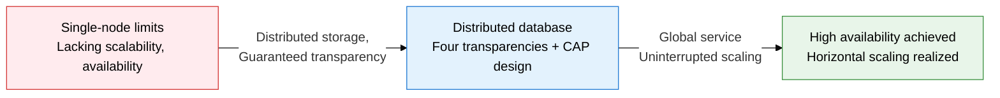
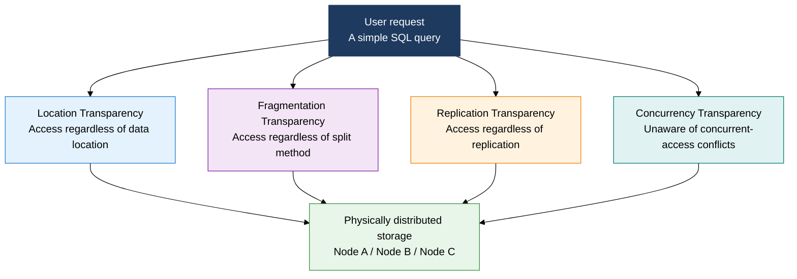
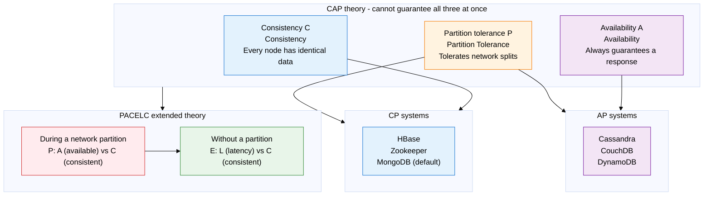

## 1. Overview of Distributed Databases — A Single Logical DB System Spread Geographically

**Definition**: A DB system that distributes data across multiple physical nodes connected by a network, while providing users the transparency of a single logical database.
- Each node operates independently and can handle both local and distributed transactions.
- Consistency is maintained through distributed transaction protocols such as 2PC (Two-Phase Commit) or the Saga pattern.
- Under CAP theory, only two of consistency (C), availability (A), and partition tolerance (P) can be guaranteed at the same time.

**Characteristics**:
- **Transparency**: provides logical unity so users can access data without knowing its physical location, splitting method, or replication status
- **Autonomy**: a distributed control structure where each node manages its local data independently while still cooperating at the system-wide level
- **Horizontal scalability**: processing capacity scales linearly just by adding nodes, overcoming a single server's physical limits

---

## 2. Core Structure of Distributed Databases

### A. The Four Transparencies of a Distributed DB

| Transparency type | Definition | Implementation mechanism | Effect |
|---|---|---|---|
| **Location transparency** | Accessible without knowing which node stores the data | Global catalog, distributed directory service | No application change when physically relocating the DB |
| **Fragmentation transparency** | Data appears whole even when horizontally or vertically split | Query decomposer, union recombination | No application change when the splitting strategy changes |
| **Replication transparency** | Data replicated across multiple nodes appears as a single copy | Replication manager, version vectors | No application change when adjusting the replication count |
| **Concurrency transparency** | Concurrent access by many users hides conflicts from them | Distributed lock, MVCC | Concurrency control logic is handled automatically at the DB layer |
| **Failure transparency** | The whole system appears to work normally even when some nodes fail | Automatic failover, retry mechanism | Prevents partial failures from reaching users |

---

### B. CAP Theory and PACELC Theory

| CAP combination | What is sacrificed | Characteristics | Representative systems | Suitable use cases |
|---|---|---|---|---|
| **CP system** | Availability (A) | Rejects some requests during a partition, guarantees strong consistency | HBase, Zookeeper, MongoDB (default) | Financial transactions, inventory management, distributed coordination |
| **AP system** | Consistency (C) | Can return stale data during a partition, always responds | Cassandra, CouchDB, DynamoDB | Social feeds, shopping carts, DNS systems |
| **CA system** | Partition tolerance (P) | Single node or same network, does not tolerate partitions | Traditional RDBMS (MySQL, PostgreSQL) | Single-datacenter OLTP systems |
| **PACELC: PC/EL** | Availability, latency | Prioritizes consistency both during a partition and normally | HBase, VoltDB | Environments requiring strong consistency, such as finance and healthcare |
| **PACELC: PA/EL** | Consistency (both cases) | Available during a partition, minimizes latency normally | Cassandra, DynamoDB | Large-scale global services, eventual consistency acceptable |
| **PACELC: PA/EC** | Consistency, latency (mixed) | Available during a partition, consistent normally | PNUTS, Megastore | Multi-region, read-heavy services |

---

## 3. Expected Benefits and Practical Applications of Distributed Databases

| Category | Key benefits | Practical application |
|---|---|---|
| **Scalability** | Horizontal scaling maintains linear performance even under a data explosion | Dynamically add nodes to handle peak load for high-traffic services (commerce, gaming) |
| **Availability** | Eliminating a single point of failure (SPOF) keeps the service continuous even when some nodes fail | Achieve uninterrupted service and RPO 0 with an Active-Active configuration |
| **Performance** | Region-based data placement minimizes network latency and spreads reads | Combine with a CDN pattern to serve global users with the lowest possible data latency |
| **Design optimization** | CAP/PACELC theory lets you choose a DB suited to the service's characteristics | Apply the selection criteria: CP systems (HBase) for finance, AP systems (Cassandra) for social media and logs |
