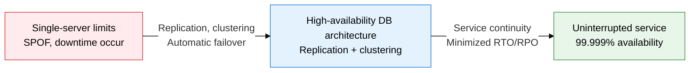
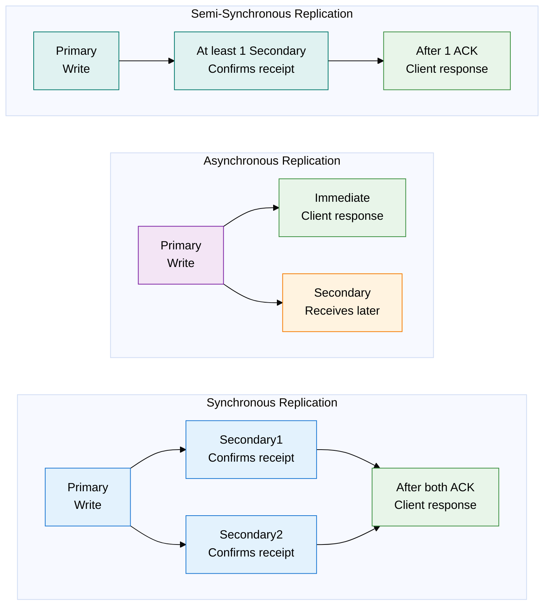
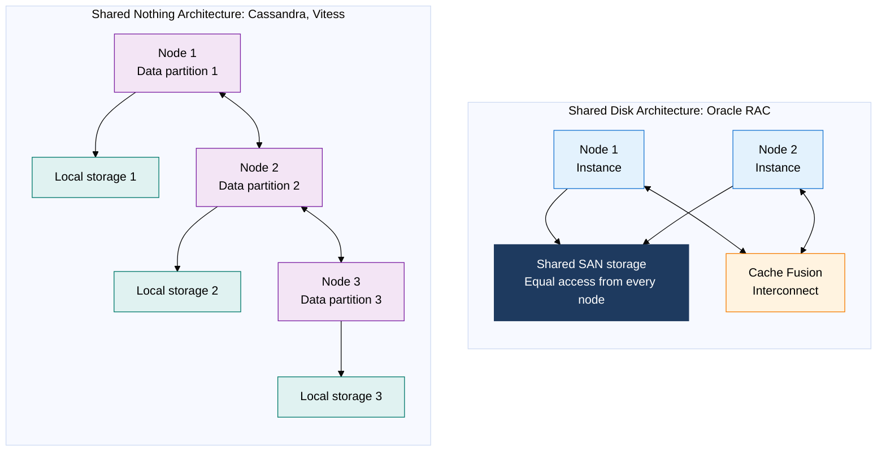

## 1. Overview of High Availability Architecture — DB Design That Keeps the Service Running Through Failures

**Definition**: A DB redundancy architecture designed to guarantee service continuity within a predefined recovery target (RTO/RPO) even when hardware, software, or network failures occur.
- RTO (Recovery Time Objective): the maximum allowed time for the service to recover after a failure
- RPO (Recovery Point Objective): the maximum allowed data-loss point in the event of a failure (how recently the system can recover)
- Availability is expressed as (uptime / total time x 100%); 99.999% ("five nines") allows only about 5 minutes 26 seconds of downtime per year

**Characteristics**:
- **Automatic failover**: promotes a Secondary automatically upon detecting a Primary failure, resuming service without manual intervention
- **Data replication**: delivers changes from the Primary to the Secondary in real time or asynchronously to keep the data redundant
- **Health check**: periodic status monitoring proactively detects failures and triggers automatic recovery

---

## 2. Core Structure of High Availability Architecture

### A. Comparing Data Replication Methods

| Replication method | Data safety | Performance impact | RTO | RPO | Suitable cases |
|---|---|---|---|---|---|
| **Synchronous replication** | Highest (guarantees no data loss) | High (waits for Secondary response) | Within a few seconds | 0 (no loss) | Financial transactions, medical records, legal data |
| **Asynchronous replication** | Low (some data loss possible) | Minimal (only the Primary commits) | Tens of seconds | Seconds to minutes | Large-volume logs, analytics data, long-distance geo-replication |
| **Semi-synchronous replication** | Medium (guarantees at least 1 Secondary) | Medium (waits for only 1 response) | Seconds to tens of seconds | Minimized | E-commerce, general business systems, MySQL's default HA |
| **Group replication** | High (majority-node consensus) | Medium-high (consensus-protocol overhead) | Automatic, immediate | 0 to a few seconds | Multi-master environments, MySQL InnoDB Cluster |
| **Delayed replication** | Low (deliberately delayed) | Minimal | Minutes to hours | Minutes to hours | Recovering from logical errors, guarding against accidental deletes |

---

### B. Comparing DB Clustering Architectures

| Architecture type | Configuration | Advantages | Drawbacks | Representative products |
|---|---|---|---|---|
| **Shared Disk** | Every node accesses the same shared storage (SAN), sharing the buffer cache via Cache Fusion | High data consistency, simple data management, easy to add nodes | Storage is a SPOF, high storage cost, limited horizontal scaling | Oracle RAC, IBM DB2 pureScale |
| **Shared Nothing** | Each node holds independent storage, data distributed via partitioning | Fully horizontal scaling, no storage SPOF, cost efficient | Partitioning complexity, cost of cross-partition queries | Cassandra, Vitess, CockroachDB |
| **Active-Active** | Every node handles reads and writes simultaneously | Maximizes load distribution, uninterrupted on node failure | Complex conflict resolution, write-consistency challenges | Oracle RAC, Galera Cluster, CockroachDB |
| **Active-Standby** | Only one Active node writes; Standby waits to receive replication | Simple configuration, easy to guarantee consistency | Wasted Standby resources, RTO exists on failover | MySQL MHA, PostgreSQL Patroni, AWS RDS |
| **Active-Active (asynchronous)** | Active-Active but replication runs asynchronously | Performance-first, allows geographic distribution | RPO exists, conflicts need manual resolution | MySQL Group Replication (asynchronous mode) |

---

## 3. Expected Benefits and Practical Applications of High Availability Architecture

| Category | Key benefits | Practical application |
|---|---|---|
| **Continuity** | Uninterrupted service at RTO of a few seconds and RPO of 0 achieves an SLA of 99.999% | Meet legal requirements for financial, medical, and e-commerce systems with synchronous replication + Active-Standby |
| **Performance** | An Active-Active configuration spreads read load to Secondaries, increasing throughput | Deploy multiple read replicas in read-heavy systems, cutting Primary load by 70-80% |
| **Data protection** | Geographically distributed replication preserves data even through a disaster (fire, flood) | Combine asynchronous replication to a DR (disaster recovery) site with regular snapshots to minimize RPO |
| **Operational efficiency** | Automatic failover and health checks enable unattended recovery from overnight or weekend failures | Automate failover with an orchestrator such as Patroni (PostgreSQL) or MHA (MySQL) |
