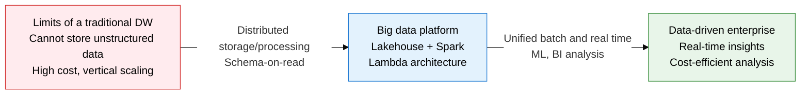
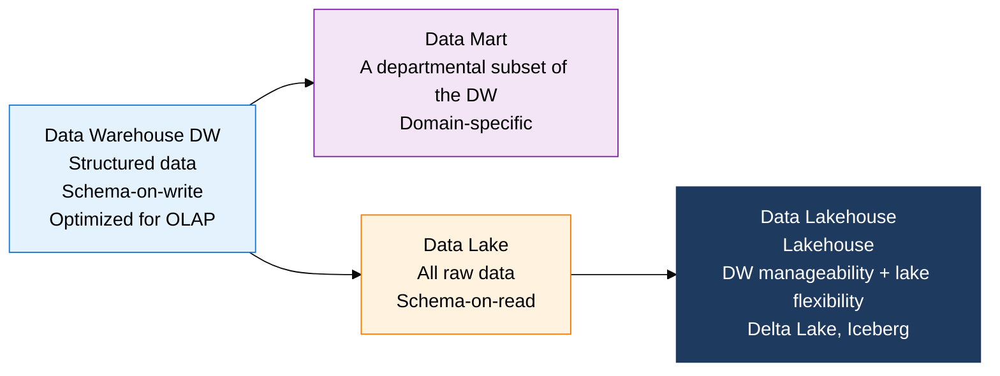
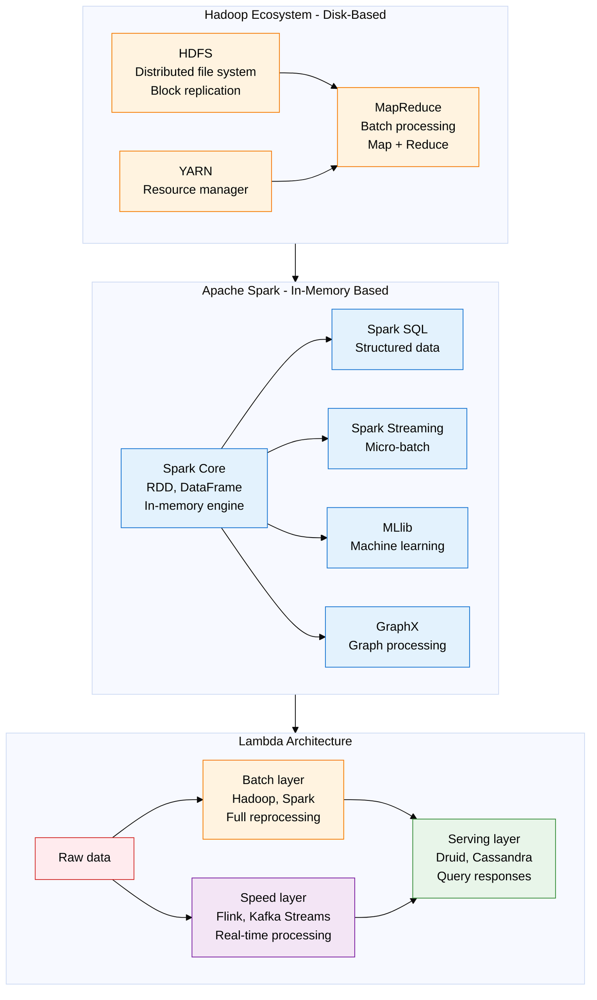

## 1. Overview of Big Data Architecture — An Ecosystem That Handles Collection, Storage, and Analysis End to End

**Definition**: A distributed-computing data-platform architecture that collects, stores, processes, and analyzes large volumes of structured, semi-structured, and unstructured data, handling data with the 4V characteristics — Volume, Velocity, Variety, and Veracity.
- Data storage has evolved from schema-on-write (DW) to schema-on-read (Data Lake), and now to the lakehouse, which unifies the strengths of both.
- Processing frameworks have progressed from Hadoop MapReduce batch processing to Spark's in-memory processing, and on to Flink's real-time stream processing.
- Lambda architecture and Kappa architecture are the representative design patterns that unify batch and real-time data processing.

**Characteristics**:
- **Handling multiple data forms**: manages structured (CSV, DB), semi-structured (JSON, XML, logs), and unstructured (images, video, text) data together on a single platform
- **Linearly scaling distributed processing**: a horizontally scaling architecture that processes petabyte-scale data in parallel across hundreds to thousands of commodity servers
- **Cost-efficient storage**: uses inexpensive commodity disks and object storage (S3) instead of costly SAN, cutting the cost per TB stored to roughly a tenth

---

## 2. Core Structure of Big Data Architecture

### A. The Evolution of Data Storage Architecture

**Data warehouse (DW) multidimensional modeling**:
- **MOLAP (Multidimensional OLAP)**: stores data pre-aggregated as a hypercube; fastest query speed, inefficient storage space
- **ROLAP (Relational OLAP)**: stores data in a relational DB via a star or snowflake schema; flexible but slower aggregation
- **HOLAP (Hybrid OLAP)**: a mix of MOLAP and ROLAP — summary data in a cube, detail data stored relationally

| Storage type | Data form | Schema approach | Strengths | Weaknesses |
|---|---|---|---|---|
| **Data warehouse** | Structured data, ETL preprocessing done | Schema-on-write (predefined) | High-performance OLAP queries, guaranteed data quality | Cannot handle unstructured data, schema-change cost |
| **Data mart** | A DW subset, department-specific | Schema-on-write | Fast domain analysis, easy for users to understand | Depends on the DW, burden of managing duplicate data |
| **Data lake** | Structured, semi-structured, and unstructured raw data | Schema-on-read (defined at use time) | Stores all data, low-cost object storage | Governance failures create a data swamp |
| **Data lakehouse** | Unified structured and unstructured data, ACID support | Metadata management + schema evolution | DW performance + lake flexibility, unified governance | New-technology adoption complexity, still maturing |
| **Data mesh** | Domain-distributed management | Domain-ownership based | Organizational autonomy, scalability | Governance standardization is challenging |

---

### B. Large-Scale Processing Frameworks

| Framework | Processing method | Strengths | Weaknesses | Suitable cases |
|---|---|---|---|---|
| **Hadoop MapReduce** | Disk-based batch processing, Map -> Shuffle -> Reduce | Proven stability, handles petabytes, open-source ecosystem | Slow processing from a disk I/O bottleneck, inefficient for iterative work | Log analysis, large-scale ETL, overnight batch jobs |
| **Apache Spark** | In-memory RDD/DataFrame, DAG-optimized execution | 10x faster than MapReduce for batch, 100x faster in-memory | Memory cost, OOM risk, inefficient for small data | Machine learning, interactive analytics, streaming, SQL queries |
| **Apache Flink** | True event-driven stream processing, stateful operations | Lowest latency for real-time processing, guarantees exactly-once | Learning curve, less optimized for batch processing | Real-time fraud detection, event-driven processing |
| **Kafka Streams** | Stream processing on Kafka topics, a lightweight library | No separate cluster needed, integrates with the Kafka ecosystem | Limited processing complexity, no batch support | Real-time data transformation, event aggregation |
| **Delta Lake / Iceberg** | Lakehouse table format, ACID transaction support | Schema evolution, time travel, statistics-based optimization | Extra metadata management, small-file problem | Lakehouse-based analytics workloads needing ACID guarantees |

---

## 3. Expected Benefits and Practical Applications of Big Data Architecture

| Category | Key benefits | Practical application |
|---|---|---|
| **Cost reduction** | Combining object storage (S3) with Spark instead of an expensive DW cuts cost per TB to roughly a tenth | Migrate an existing Teradata/Oracle DW to an S3-based lakehouse (Delta Lake) on AWS |
| **Processing speed** | Spark's in-memory processing shrinks daily batch jobs to hours or minutes, minimizing decision-making delay | Convert an overnight batch ETL pipeline to Spark, turning D+1 reports into a real-time dashboard |
| **Data integration** | Unifying structured and unstructured data in a single lake breaks down data silos and enables integrated analysis | Combine purchase history (DB), social media text, and app logs into a 360-degree customer view |
| **AI/ML integration** | Tools like MLlib and TensorFlow on Spark build large-scale, data-driven machine learning pipelines | Automate a Spark-based ML pipeline from feature engineering through model training and serving |
