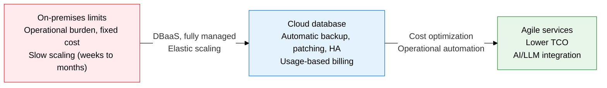
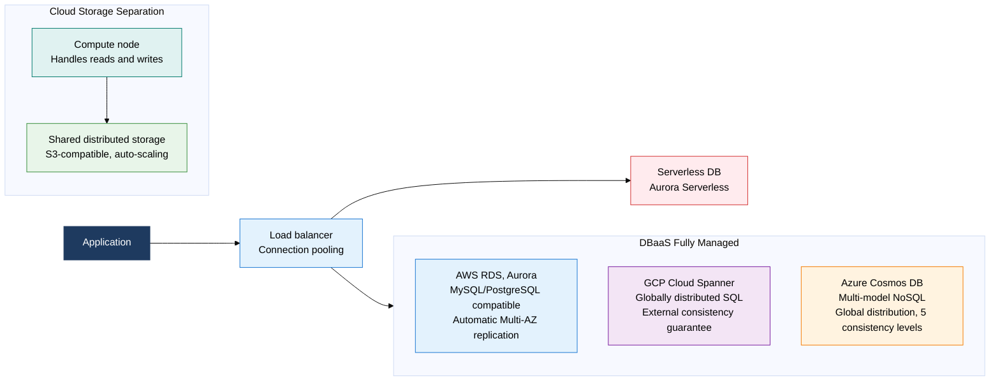

## 1. Overview of Cloud Databases — Elastic Scaling and Fully Managed DB Infrastructure

**Definition**: A fully managed database service that runs on cloud infrastructure with built-in automatic backup, patching, scaling, and high availability, billed on a usage-based model.
- Delivered as DBaaS (Database as a Service), letting DBAs focus on data design and optimization rather than infrastructure management.
- Special-purpose DBs — time-series, vector, and others — are offered in cloud-native form to support IoT and AI/LLM workloads.
- A serverless DB shuts down automatically when idle, minimizing cost in development and test environments.

**Characteristics**:
- **Fully managed**: the cloud provider handles hardware provisioning, OS patching, DB upgrades, and automatic backups, eliminating operational overhead
- **Elastic scaling**: compute and storage scale up or down automatically with traffic patterns, optimizing cost without over-provisioning
- **Multi-AZ high availability**: automatic replication across multiple Availability Zones guarantees service continuity even through a single-datacenter failure

---

## 2. Core Structure of Cloud Databases

### A. Characteristics and Types of Cloud-Native DBMS

| Cloud DB type | Characteristics | Representative services | Suitable cases |
|---|---|---|---|
| **Relational DBaaS** | MySQL/PostgreSQL compatible, automatic Multi-AZ HA, automatic backup | AWS RDS, Azure Database, GCP Cloud SQL | Easy migration, existing RDBMS workloads |
| **Cloud-native SQL** | Storage-compute separation, automatic scaling, high performance | AWS Aurora, Google AlloyDB | High-performance OLTP, read-heavy workloads |
| **Globally distributed SQL** | External consistency, multi-region ACID, TrueTime API | GCP Cloud Spanner, CockroachDB | Global financial and inventory systems |
| **Multi-model NoSQL** | Multiple APIs (SQL, Graph, Document), globally distributed | Azure Cosmos DB, Amazon DynamoDB | Environments needing a single multi-model platform |
| **Serverless DB** | Automatic start/stop on use, ACU-based billing | Aurora Serverless, Neon | Development/test, intermittent-traffic services |

---

### B. Special-Purpose Databases

```mermaid
%%{init: { 'theme': 'base', 'themeVariables': { 'edgeLabelBackground': '#fff' }}}%%
flowchart TD
    subgraph TSDB["Time-Series DB"]
        direction LR
        IOT["IoT sensors<br/>Timestamped data"] --> TSSTORE["InfluxDB, TimescaleDB<br/>Time-based compressed storage<br/>Downsampling, aggregation"]
        TSSTORE --> TSQUERY["Range queries<br/>Aggregate functions<br/>Anomaly detection"]
        style IOT fill:#FFF3E0,stroke:#F57C00,color:#000
        style TSSTORE fill:#E3F2FD,stroke:#1976D2,color:#000
        style TSQUERY fill:#E8F5E9,stroke:#388E3C,color:#000
    end

    subgraph RAG["Vector DB Use in a RAG Pipeline"]
        direction LR
        QDOC["User question<br/>Document upload"] --> EMB["Embedding model<br/>OpenAI, HuggingFace<br/>Text-to-vector conversion"]
        EMB --> VDB["Vector DB<br/>Pinecone, Weaviate<br/>pgvector<br/>HNSW, IVF index"]
        VDB --> SEARCH["Similarity search<br/>ANN algorithm<br/>Returns top-K results"]
        SEARCH --> LLM["LLM generation<br/>GPT, Claude<br/>Context-injected response"]
        style QDOC fill:#FFEBEE,stroke:#D32F2F,color:#000
        style EMB fill:#F3E5F5,stroke:#7B1FA2,color:#000
        style VDB fill:#1E3A5F,stroke:#1E3A5F,color:#fff
        style SEARCH fill:#E3F2FD,stroke:#1976D2,color:#000
        style LLM fill:#E8F5E9,stroke:#388E3C,color:#000
    end
```

**Vector DB ANN search algorithms**:
- **HNSW (Hierarchical Navigable Small World)**: navigates high-dimensional vector space with a layered graph structure; a strong balance of search speed and accuracy
- **IVF (Inverted File Index)**: splits vector space into clusters and searches only the relevant clusters, suited to large-scale processing
- **PQ (Product Quantization)**: compresses vectors to cut memory usage, trading speed against memory

| Special-purpose DB type | Storage structure | Search method | Representative products | Use scenarios |
|---|---|---|---|---|
| **Time-series DB** | Timestamp-based columnar compression, automatic downsampling | Time-range queries, aggregate functions (average, max, min) | InfluxDB, TimescaleDB, Prometheus | IoT sensor data, server metrics, financial tick data |
| **Vector DB** | High-dimensional array of real-valued vectors, HNSW/IVF index | ANN (approximate nearest neighbor) similarity search | Pinecone, Weaviate, Qdrant, pgvector | LLM/RAG pipelines, image similarity, recommendation engines |
| **Search engine DB** | Inverted index, morphological analysis | Full-text search, BM25 scoring | Elasticsearch, OpenSearch, Solr | Unified search, log analysis, product search |
| **Spatial DB** | R-Tree/GiST spatial index, coordinate data | Radius search, geographic aggregation, route analysis | PostGIS, MongoDB Atlas Search | Location-based services, GIS, geofencing |
| **In-memory DB** | DRAM-based storage, AOF/RDB persistence | Hash, list, set, sorted-set data structures | Redis, Memcached, VoltDB | Session cache, real-time rankings, distributed locking |

---

## 3. Expected Benefits and Practical Applications of Cloud Databases

| Category | Key benefits | Practical application |
|---|---|---|
| **Operational efficiency** | Automated patching, backup, and HA cut DBA operational effort by 70% or more, freeing focus for design and optimization | Switch to AWS RDS Multi-AZ, removing overnight incident-response staffing in favor of automatic failover |
| **Cost optimization** | A serverless DB cuts dev/test DB cost by 90% by billing only for active usage time | Apply Aurora Serverless v2 to dev/staging environments, sharply cutting monthly DB cost |
| **AI/LLM integration** | A vector DB plus a RAG pipeline enables an AI chatbot grounded in internal company documents | Add vector search to an existing RDB with pgvector (a PostgreSQL extension) to build an enterprise knowledge search system |
| **Global expansion** | Multi-region replication and globally distributed SQL deliver low-latency DB service to users worldwide | Implement multi-region ACID transactions for a global financial platform with GCP Cloud Spanner |
