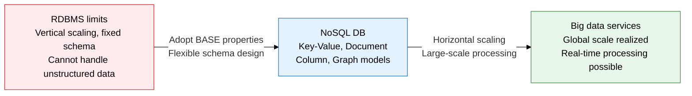
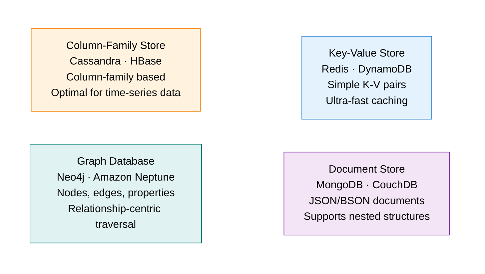

## 1. Overview of NoSQL — Large-Scale Distributed Processing with BASE Instead of ACID

**Definition**: A collective term for non-relational databases that break free from the constraints of the relational model and SQL, distributing large volumes of unstructured data through a flexible schema and horizontal scalability.
- Emerged to handle millions of reads and writes per second in big data, social media, and IoT environments.
- Adopts BASE (Basically Available, Soft-state, Eventual Consistency) instead of ACID, prioritizing availability and scalability over consistency.
- Classified into four types by data model: Key-Value, Document, Column-Family, and Graph Store.

**Characteristics**:
- **Horizontal scalability**: scales linearly by adding commodity servers, solving the vertical-scaling cost problem of an RDBMS
- **Schema-free**: no need to predefine a schema, giving faster development and flexibility to change the data structure
- **Eventual consistency**: tolerates temporary inconsistency but guarantees every replica eventually converges to the same state, securing availability and performance

---

## 2. Core Structure of NoSQL

### A. Why NoSQL Emerged, and Comparing BASE vs. ACID

```mermaid
%%{init: { 'theme': 'base', 'themeVariables': { 'edgeLabelBackground': '#fff' }}}%%
flowchart LR
    subgraph RDBMS["RDBMS - ACID"]
        direction TB
        A1["Atomicity<br/>All or nothing"]
        A2["Consistency<br/>Always a valid state"]
        A3["Isolation<br/>Runs independently"]
        A4["Durability<br/>Guarantees permanent storage"]
        style A1 fill:#FFEBEE,stroke:#D32F2F,color:#000
        style A2 fill:#FFEBEE,stroke:#D32F2F,color:#000
        style A3 fill:#FFEBEE,stroke:#D32F2F,color:#000
        style A4 fill:#FFEBEE,stroke:#D32F2F,color:#000
    end

    subgraph NOSQL["NoSQL - BASE"]
        direction TB
        B1["Basically available<br/>Always guarantees a response"]
        B2["Soft-state<br/>Soft state<br/>Tolerates inconsistency during replication"]
        B3["Eventual consistency<br/>Eventually converges to the same state"]
        style B1 fill:#E3F2FD,stroke:#1976D2,color:#000
        style B2 fill:#E3F2FD,stroke:#1976D2,color:#000
        style B3 fill:#E8F5E9,stroke:#388E3C,color:#000
    end

    RDBMS --"Overcomes the limits"--> NOSQL
```

| Comparison | ACID (RDBMS) | BASE (NoSQL) |
|---|---|---|
| **Consistency** | Strong consistency | Eventual consistency |
| **Availability** | Availability can drop since consistency comes first | Always guarantees a response (basically available) |
| **Scaling approach** | Mainly vertical (scale-up) | Easy horizontal scaling (scale-out) |
| **Schema** | Predefinition required (schema-on-write) | Schema-free (schema-on-read) |
| **Transactions** | Supports complex multi-table transactions | Mainly simple single-entity transactions |
| **Suitable environment** | Environments where correctness is paramount, like finance and ERP | High-volume, high-speed environments like social media, IoT, gaming |

---

### B. Four Types of NoSQL Data Models

| Type | Storage structure | Representative products | Advantages | Suitable use cases |
|---|---|---|---|---|
| **Key-Value Store** | Maps a value (string, binary, object) to a unique key, hash-table based | Redis, DynamoDB, Memcached | Ultra-low-latency (microsecond) lookups, simple structure, memory-based operation | Session management, caching, real-time leaderboards, distributed locking |
| **Document Store** | Stores JSON/BSON-form documents in a collection, supports nesting and arrays | MongoDB, CouchDB, Firestore | Flexible schema, intuitive object mapping, rich querying | Product catalogs, CMS, user profiles, event logs |
| **Column-Family Store** | Row key + column family + columns, stores sparse columns efficiently | Cassandra, HBase, ScyllaDB | High write-intensive performance, optimal for time-series data, linear scaling | Time-series data, IoT sensors, message logs, recommendation history |
| **Graph Database** | A graph structure of nodes (entities), edges (relationships), and properties | Neo4j, Amazon Neptune, JanusGraph | High performance for complex multi-hop relationship traversal, intuitive relationship modeling | Social-graph friend relationships, recommendation engines, fraud detection, knowledge graphs |
| **Wide-Column** | A dynamic column structure where columns can differ per row | Bigtable, HBase | Petabyte-scale processing, Google-scale scalability | Web indexing, large-scale analytics, financial history data |

---

## 3. Expected Benefits and Practical Applications of NoSQL

| Category | Key benefits | Practical application |
|---|---|---|
| **Performance** | A memory-based Key-Value Store delivers 10-100x faster lookup response than an RDBMS | Place Redis as a cache layer in front of the RDBMS, cutting DB load by 80% or more |
| **Scalability** | A horizontal-scaling architecture maintains linear performance even under traffic spikes | Use Cassandra's ring structure to add or remove nodes without interrupting service |
| **Development productivity** | A schema-free document model maps application objects directly to the DB structure | Use MongoDB to add or change fields without a schema migration |
| **Analysis optimization** | Choosing the NoSQL model matched to the data characteristics specializes relationship traversal or time-series analysis | Use Neo4j for social-graph relationship analysis, Cassandra for real-time IoT aggregation, Elasticsearch for search |
