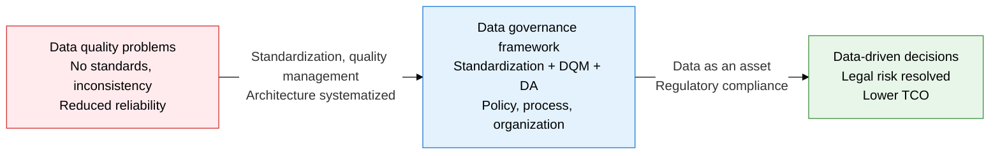
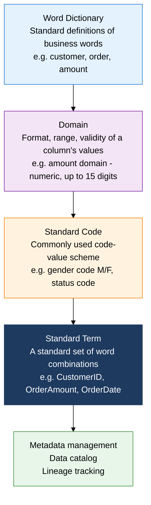
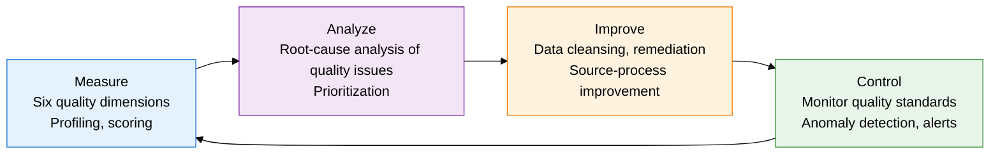

## 1. Overview of Data Governance — Managing Data as a Strategic Enterprise Asset

**Definition**: A management framework that integrates policy, process, organization, and technology for enterprise-wide data standardization, quality management, security, and architecture, keeping data a trustworthy strategic asset.
- Data ownership: clearly defines responsibility for producing and managing data, assigning accountability for quality.
- Data stewardship: a data steward per business domain continuously monitors and improves data quality.
- The public sector applies the Ministry of the Interior and Safety's public data management guidelines, while the financial sector applies BCBS 239 (the principles for effective risk data aggregation).

**Characteristics**:
- **Enterprise-wide data standardization**: the four elements — words, domains, standard codes, and standard terms — keep every department producing and consuming data with the same meaning
- **Continuous data quality management**: measures data quality across six dimensions — completeness, uniqueness, validity, consistency, accuracy, and timeliness — and runs a PDCA cycle of continuous improvement
- **Data lifecycle management**: applies policy and procedure across the full data lifecycle — creation, storage, use, retention, and disposal — to meet legal requirements and maintain data trustworthiness

---

## 2. Core Structure of Data Governance

### A. Data Standardization Framework

| Standardization element | Definition | Management method | Deliverable |
|---|---|---|---|
| **Word dictionary** | A dictionary of standard Korean names, English names, and definitions for the basic words used in business | Operate a terminology review committee, manage synonym/forbidden-word lists | Standard word list, synonym/forbidden-word list |
| **Domain** | Defines the data type, length, format, and allowed value range a column (attribute) can hold | Classify into domain groups (amount, code, date, ID, etc.), map to physical data types | Domain list, physical-type mapping table |
| **Standard code** | Centrally standardizes and manages code values and code names used in common across multiple systems | Build a code-management system, run a code request/review/registration process | Standard code list, code mapping table |
| **Standard term** | A standard set of column and table names built by combining standard words | Apply the rule term = modifier + word, provide abbreviation guidelines | Standard term list, term-combination rules |
| **Data catalog** | A metadata repository that unifies the location, structure, quality, and lineage of enterprise data assets | Automatic collection (crawler) plus manual enrichment, automatic lineage tracking | Data catalog system, lineage map |

---

### B. The Roles of Data Quality Management (DQM) and Data Architecture (DA)

**Role of data architecture (DA)**:
- Designs the enterprise's overall data structure, flow, and storage, and establishes standards
- Serves as the data architecture domain within EA (Enterprise Architecture), the link between business architecture and technical architecture
- Public Data Quality Management Guidelines (Ministry of the Interior and Safety): public agencies must meet completeness, consistency, and validity standards when opening data

| Quality dimension | Definition | Measurement method | Management standard |
|---|---|---|---|
| **Completeness** | The degree to which required data fields have no missing values (NULL/blank) | NULL ratio, count of missing required fields | NULL rate on required fields at or below 0% |
| **Uniqueness** | The degree to which records are uniquely identified with no duplicates | Count of PK duplicates, near-duplicate detection rate | Zero PK duplicates, defined tolerance for near-duplicates |
| **Validity** | The degree to which data conforms to defined business rules, formats, and domains | Count of format errors, value-range violation rate | Validity error rate at or below 0.1% |
| **Consistency** | The degree to which the same data holds the same value across systems | Count of cross-system mismatches, referential-integrity violations | Cross-system mismatch rate at or below 0.5% |
| **Accuracy** | The degree to which data accurately reflects the real world | Match rate against master data, comparison to an external standard | Accuracy at or above 99% against the reference data |
| **Timeliness** | The degree to which up-to-date data is available when needed | Refresh-cycle compliance rate, batch delay time | Refreshed within the defined SLA |

---

## 3. Expected Benefits and Practical Applications of Data Governance

| Category | Key benefits | Practical application |
|---|---|---|
| **Data reliability** | Managing the six quality dimensions cuts data errors by 50% or more, raising confidence in decisions | Build a data-quality dashboard so executives can monitor quality metrics in real time |
| **Regulatory compliance** | Establishes a data lifecycle and lineage-tracking framework to meet personal-data-protection law and GDPR requirements | Tag personal data in the data catalog and track access history to automate audit response |
| **Operational efficiency** | Data standardization cuts inter-system interface design and development effort by 30% or more | Centrally manage standard codes and domains to maximize reuse when building new systems |
| **Turning data into an asset** | Metadata and lineage management shortens data-discovery time and enables an internal data marketplace | An enterprise-wide data catalog shortens analysts' data-search time from days to minutes |
