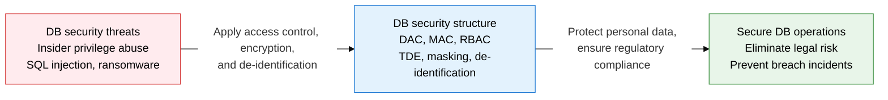
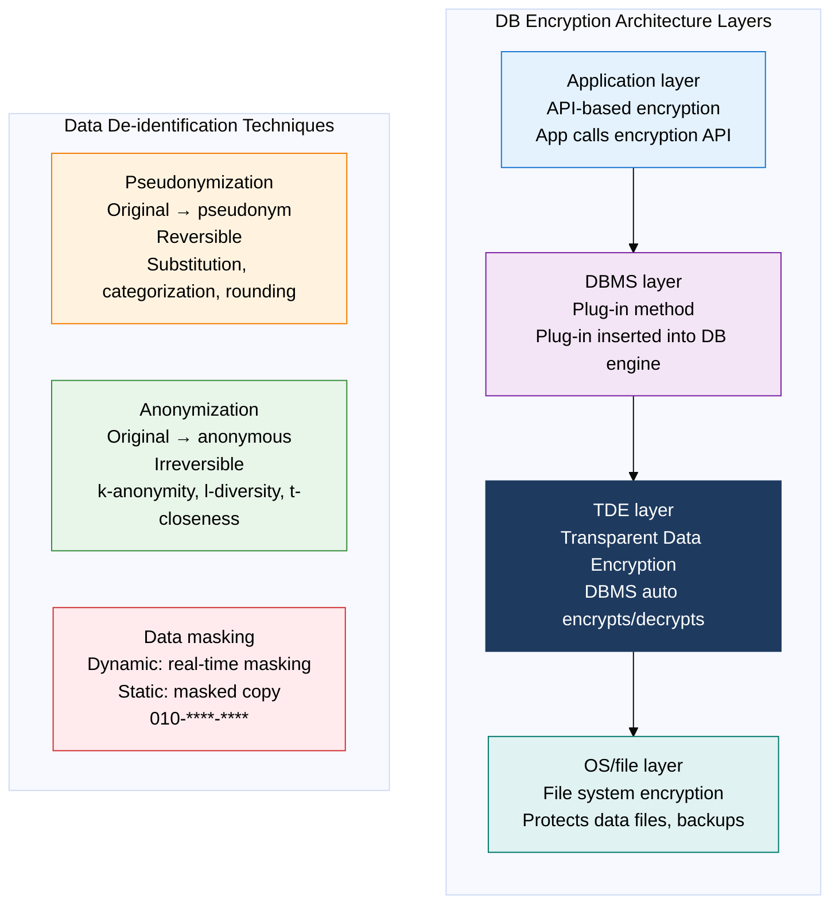

## 1. Protecting DB Assets with Access Control, Encryption, and De-identification — Overview of Database Security

**Definition**: A security management structure that systematically applies access control, encryption, de-identification, and audit logging to protect data stored in a database and the DB system itself from unauthorized access, tampering, leakage, and destruction.
- Access Control: the first line of defense, restricting authenticated users to only the data within their authorized scope
- Encryption: the second line of defense, keeping plaintext unreadable even if data leaks
- De-identification: the third line of defense, processing data so individuals cannot be identified, meeting personal data regulatory requirements

**Characteristics**:
- **Defense in Depth**: Applies independent security controls at each layer — network, OS, DB, application, and data — so protection holds even if a single control is bypassed
- **Least Privilege**: Grants users and roles only the minimum privileges needed for their work, minimizing insider threat and privilege misuse risk
- **Audit Trail**: Records DB access and change history as immutable logs, enabling forensic analysis and regulatory audit response after a breach

---

## 2. Core Structure of Database Security

### A. Three Access Control Models

```mermaid
%%{init: { 'theme': 'base', 'themeVariables': { 'edgeLabelBackground': '#fff' }}}%%
flowchart TD
    subgraph DAC["DAC - Discretionary Access Control"]
        direction LR
        OWNER["Data owner<br/>Grants privileges"] --> DACUSER["User A<br/>User B<br/>Individual privilege settings"]
        style OWNER fill:#FFEBEE,stroke:#D32F2F,color:#000
        style DACUSER fill:#E3F2FD,stroke:#1976D2,color:#000
    end

    subgraph MAC["MAC - Mandatory Access Control"]
        direction LR
        POLICY["Security policy<br/>Set by administrator"] --> LABEL["Security classification label<br/>Confidential, secret, restricted, general"]
        LABEL --> MACUSER["User clearance<br/>Access only on label match"]
        style POLICY fill:#F3E5F5,stroke:#7B1FA2,color:#000
        style LABEL fill:#F3E5F5,stroke:#7B1FA2,color:#000
        style MACUSER fill:#E3F2FD,stroke:#1976D2,color:#000
    end

    subgraph RBAC["RBAC - Role-Based Access Control"]
        direction LR
        ROLE["Role<br/>Admin, general user, auditor"] --> PERM["Permission<br/>SELECT, INSERT, UPDATE"]
        PERM --> RBACUSER["Users are assigned roles<br/>and inherit permissions"]
        style ROLE fill:#FFF3E0,stroke:#F57C00,color:#000
        style PERM fill:#FFF3E0,stroke:#F57C00,color:#000
        style RBACUSER fill:#E3F2FD,stroke:#1976D2,color:#000
    end

    subgraph ABAC["ABAC - Attribute-Based Access Control (latest)"]
        direction LR
        ATTR["Attribute<br/>User, resource, environment attributes"] --> ABACPOL["Policy<br/>Access decided by attribute combination"]
        style ATTR fill:#E0F2F1,stroke:#00796B,color:#000
        style ABACPOL fill:#E8F5E9,stroke:#388E3C,color:#000
    end
```

| Model | Who decides privileges | Characteristics | Advantages | Limitations | Suitable environment |
|---|---|---|---|---|---|
| **DAC** | Data owner | Owner grants and revokes privileges to other users at their discretion | High flexibility, simple to implement | Privilege sprawl makes management hard, Trojan horse risk | Small-scale, collaboration-centered environments |
| **MAC** | System (security policy) | Access decided by security classification label; even the owner cannot change it | Strong confidentiality guarantee | Low flexibility, complex to implement | Government, defense, classified data environments |
| **RBAC** | Role administrator | Privileges assigned to roles; users are granted roles and inherit privileges | Simplifies privilege management, roles are reusable | Role explosion possible | Enterprise internal systems, DBMS privilege management |
| **ABAC** | Policy engine | Combines attributes of user, resource, and environment for dynamic access decisions | Fine-grained access control, context-aware | High policy complexity, performance overhead | Zero Trust, cloud IAM, microservices |
| **IBAC** | Identity administrator | Access control based on personal identity, integrated with OAuth, SAML | Easy SSO integration | Hard to granularize | Federated authentication environments |

---

### B. DB Encryption Methods, Data Masking, and De-identification

**Key de-identification techniques**:
- **k-Anonymity**: Ensures at least k records share the same quasi-identifier combination (k=2: at least 2 people share the same combination)
- **l-Diversity**: Addresses k-anonymity's limitation (identical sensitive attributes within a group) — requires at least l distinct sensitive attribute values within each group
- **t-Closeness**: Addresses l-diversity's bias problem — keeps each group's sensitive attribute distribution within t of the overall distribution

| Encryption method | Implementation point | Performance impact | Protection scope | Suitable environment |
|---|---|---|---|---|
| **API-based** | Encryption function calls within application code | Minimal (processed at app server) | Selective protection of designated columns | Protecting specific sensitive columns, fine-grained encryption control |
| **Plug-in based** | Encryption plug-in inserted inside the DBMS | Moderate (processed at DB server) | DB stored data overall | Environments needing minimal app code changes |
| **Hybrid** | Combined API + plug-in application | Moderate | Differentiated protection level per column | Complex environments with varied security requirements |
| **TDE** | DBMS storage engine layer | Low (uses hardware acceleration) | Data files, backups, logs overall | Primarily defends against disk theft and backup leakage |
| **File system encryption** | OS layer (BitLocker, dm-crypt) | Low | File storage overall | File-level protection, complements DB-layer encryption |
| **Dynamic masking** | DB proxy or DBMS policy layer | Moderate (real-time transformation) | Real-time masking of query results | Prevents exposing sensitive data to developers and DBAs |

---

## 3. Expected Benefits and Practical Applications of Adopting Database Security

| Category | Key benefits | Practical applications |
|---|---|---|
| **Regulatory compliance** | Eliminates legal penalty risk by meeting data protection regulations such as the Personal Information Protection Act, GDPR, and medical laws | Apply TDE plus dynamic masking to personal data columns, preventing plaintext exposure even to DBAs |
| **Blocking insider threats** | RBAC least privilege reduces insider privilege misuse and data theft risk by over 90% | Integrate DB access audit logs with SIEM to detect and alert on abnormal query patterns in real time |
| **Minimizing breach damage** | TDE and column encryption make data unusable in a ransomware or backup leak without the decryption key | Store encryption keys separately in an HSM (Hardware Security Module) to protect data even if a key is stolen |
| **Data usability** | De-identification and masking strike a balance, achieving regulatory compliance and data usability at the same time | Provide statically masked replica data in development/test environments so development proceeds without exposing real data |
