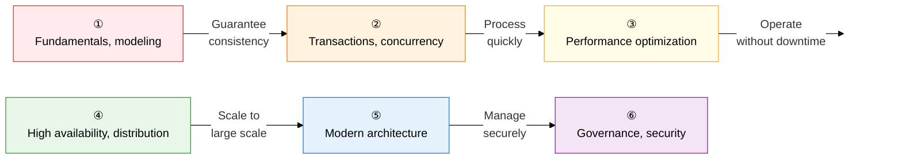

A database is a systematic answer to the question: **"How can data be stored safely, retrieved quickly, and managed consistently?"**
It covers the full data life cycle, from the mathematical foundations of the relational model to the latest distributed and cloud architectures.

## Learning Roadmap — A 6-Stage Flow

---

## ① Database Fundamentals and Data Modeling

> A stage for understanding **"how to structure and abstract data."**
> Trace the design flow from why a DBMS exists, through the ANSI-SPARC three-level architecture, E-R diagrams, the relational model, and on to normalization.

| Order | Topic | Key keywords | Importance |
|:---:|---|---|:---:|
| 1 | [Database System Overview](01-fundamentals/db-system-overview) | File system vs. DBMS, ANSI-SPARC, external/conceptual/internal schema, data independence | ★★★ |
| 2 | [Data Modeling](01-fundamentals/data-modeling) | Conceptual → logical → physical, E-R diagrams, Structure/Operation/Constraint | ★★★ |
| 3 | [Relational Data Model](01-fundamentals/relational-data-model) | Tuple, attribute, domain, degree, cardinality, entity/referential/domain integrity, relational algebra | ★★★ |
| 4 | [Normalization](01-fundamentals/normalization) | Anomalies (insertion, deletion, update), functional dependency, stepwise decomposition 1NF → BCNF → 5NF | ★★★ |
| 5 | [Denormalization](01-fundamentals/denormalization) | Performance vs. integrity trade-off, table merge/split/addition, column and relationship duplication | ★★☆ |

**→ Key study point**: For normalization, work through the **preconditions and violation cases** of each stage by decomposing an example relation yourself.

---

## ② Transactions and Concurrency Control

> Implements the principle that **"data must stay consistent even when many users access it at once."**
> The four ACID properties, the DBMS mechanisms that guarantee them, and the anomaly table by isolation level are a recurring essay topic.

| Order | Topic | Key keywords | Importance |
|:---:|---|---|:---:|
| 6 | [Transactions](02-transaction/transaction) | ACID (atomicity, consistency, isolation, durability), 5-state transition diagram, DBMS guarantee mechanisms | ★★★ |
| 7 | [Concurrency Control](02-transaction/concurrency-control) | Lost update, dirty read, inconsistency, cascading rollback, S/X locks, 2PL, deadlock, MVCC | ★★★ |
| 8 | [Transaction Isolation Levels](02-transaction/isolation-level) | Read Uncommitted → Serializable, dirty/non-repeatable/phantom read matrix | ★★★ |
| 9 | [Recovery Techniques](02-transaction/recovery) | Immediate/deferred update, REDO/UNDO, four checkpoint cases, shadow paging | ★★★ |

**→ Key study point**: You should be able to draw the isolation level × anomaly **permission matrix** from memory. The 2PL Growing/Shrinking Phase graph is also essential.

---

## ③ Database Performance Optimization

> A practice-critical area covering **"how to find and process data faster."**
> Understand index structures, optimizer behavior, and join algorithms from an architectural perspective.

| Order | Topic | Key keywords | Importance |
|:---:|---|---|:---:|
| 10 | [Indexes](03-performance/index-structure) | B+Tree, bitmap, hash, clustered vs. non-clustered, range/full/unique/skip scan | ★★★ |
| 11 | [Optimizer and Execution Plans](03-performance/optimizer) | RBO vs. CBO, cost estimation (statistics), hints, EXPLAIN PLAN | ★★☆ |
| 12 | [Join Mechanisms](03-performance/join-mechanism) | Nested loop, sort merge, hash join — applicable conditions, pros/cons, driving table | ★★★ |
| 13 | [Partitioning and Sharding](03-performance/partitioning-sharding) | Range/list/hash/composite partitioning, sharding key, routing, resharding | ★★☆ |

**→ Key study point**: Build a comparison table of the **time complexity and suitable scenarios** for the three join types, and draw the B+Tree leaf-node linking structure yourself.

---

## ④ High Availability and Distributed Databases

> Designs a structure that **"goes beyond the limits of a single server to serve without downtime across multiple nodes."**
> CAP theorem is an invariant principle of distributed system design and ties directly into NoSQL selection criteria.

| Order | Topic | Key keywords | Importance |
|:---:|---|---|:---:|
| 14 | [Distributed Databases](04-ha-distributed/distributed-db) | The 4 transparencies (location, fragmentation, allocation, replication), CAP theorem, PACELC theorem | ★★★ |
| 15 | [High Availability Architecture](04-ha-distributed/ha-architecture) | Sync/async/semi-sync replication, RTO/RPO, shared disk vs. shared nothing, Oracle RAC | ★★☆ |

**→ Key study point**: Link the CAP theorem's CP/AP selection criteria to representative systems (HBase vs. Cassandra) and memorize the pairing.

---

## ⑤ Modern Data Architecture

> Covers **modern technology that goes beyond the traditional RDB to handle large-scale, unstructured, real-time data.**
> NoSQL's BASE properties, the data lakehouse, and vector DB integration with RAG are current exam trends.

| Order | Topic | Key keywords | Importance |
|:---:|---|---|:---:|
| 16 | [NoSQL](05-modern-architecture/nosql) | BASE vs. ACID, key-value (Redis), document (MongoDB), column (Cassandra), graph (Neo4j) | ★★★ |
| 17 | [Big Data Architecture](05-modern-architecture/big-data-architecture) | DW, data lake, lakehouse, MOLAP/ROLAP/HOLAP, Hadoop HDFS, Spark in-memory | ★★☆ |
| 18 | [Cloud Databases](05-modern-architecture/cloud-db) | DBaaS, serverless DB, time-series DB (InfluxDB), vector DB (Pinecone), RAG pipeline | ★★☆ |

**→ Key study point**: Memorize the **structure, representative product, and suitable use case** of the four NoSQL models in a 2×2 grid, and practice explaining the vector DB's RAG integration flow in one sentence.

---

## ⑥ Data Governance and Security

> A framework for **"managing and protecting data as a strategic enterprise asset."**
> The 3 access control models (DAC/MAC/RBAC), TDE, and de-identification techniques are essential in the security area.

| Order | Topic | Key keywords | Importance |
|:---:|---|---|:---:|
| 19 | [Data Governance](06-governance-security/data-governance) | Data dictionary, domain, standard codes, standard terms, the 6 DQM quality dimensions, data architecture (DA) | ★★☆ |
| 20 | [Database Security](06-governance-security/db-security) | DAC, MAC, RBAC, API/plug-in/TDE encryption, data masking, k-anonymity, l-diversity | ★★★ |

**→ Key study point**: Build a comparison table of **who decides privileges and the suitable environment** for DAC/MAC/RBAC, and distinguish TDE's encryption point (the DBMS layer) from other methods.

---

## Exam Strategy

| Question pattern | Key response strategy |
|---|---|
| **Architecture diagrams** | Be ready to draw the ANSI-SPARC 3-tier structure, the 2PL two-phase graph, the B+Tree structure, and the CAP triangle on a whiteboard |
| **Comparison questions** | Memorize comparison tables: file system vs. DBMS, ACID vs. BASE, clustered vs. non-clustered, RBO vs. CBO, the three join types |
| **Matrix-based answers** | Isolation level × anomaly permission matrix, lock compatibility (S/X) matrix, table of violation conditions by normalization stage |
| **Definition + characteristics** | Practice stating each topic's definition (one sentence) plus 3 characteristics in bold **keyword** format |
| **Latest trends** | Application cases for the 4 NoSQL types, vector DB, RAG pipelines, data lakehouse, PACELC theorem |
