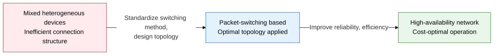
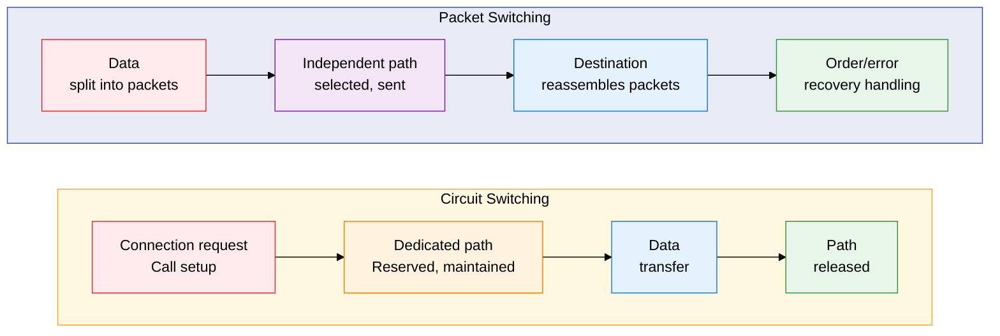

## 1. The Design Foundation for Data Delivery Methods and Connection Structures — Overview of Network Architecture Fundamentals

**Definition**: A network design foundation technology that systematically designs the data delivery method (circuit switching, packet switching) and the physical connection structure (topology) to build reliable communication infrastructure.
- Circuit switching reserves a dedicated path in advance; packet switching splits data into independent packets and sends them over a shared path
- Network topology defines the physical and logical connection form between nodes and directly affects availability, cost, and scalability
- In large enterprise network design, the choice of switching method and topology configuration are the key decisions for optimizing performance and cost

**Characteristics**:
- **Dual switching methods**: Circuit switching (guaranteed fixed bandwidth) and packet switching (efficient resource sharing), applied selectively by service characteristics
- **Topology diversity**: Optimizes the trade-off among availability, cost, and management complexity through 5 structures — mesh, star, bus, ring, tree
- **Hierarchical scalability**: A tree-based hierarchical structure scales the same design principles from small LANs up to large WANs

---

## 2. Core Structure of Network Architecture Fundamentals

### A. Circuit Switching vs. Packet Switching

| Comparison item | Circuit Switching | Packet Switching - Virtual Circuit | Packet Switching - Datagram |
|---|---|---|---|
| **Path setup** | Dedicated path reserved before communication | Logical path pre-established | Independent path decided per packet |
| **Bandwidth guarantee** | Fixed bandwidth exclusively guaranteed | Logical bandwidth guaranteed | No guarantee, best-effort delivery |
| **Transmission delay** | Predictable, constant delay | Relatively low delay | Variable delay (jitter) occurs |
| **Failure response** | Requires re-setup on path failure | Requires re-setup on path failure | Automatic alternate path selection |
| **Resource efficiency** | Wastes resources by holding them even when idle | Moderate resource efficiency | Maximum resource sharing efficiency |
| **Suitable services** | Voice telephone network (PSTN), leased lines | ATM, Frame Relay, MPLS | IP networks, the Internet |

---

### B. 5 Network Topologies

```mermaid
%%{init: { 'theme': 'base', 'themeVariables': { 'edgeLabelBackground': '#fff' }}}%%
flowchart TD
    subgraph MESH["Mesh - Fully Connected"]
        M1["Node A"] --- M2["Node B"]
        M1 --- M3["Node C"]
        M2 --- M3
        style M1 fill:#1E3A5F,stroke:#1E3A5F,color:#fff
        style M2 fill:#1E3A5F,stroke:#1E3A5F,color:#fff
        style M3 fill:#1E3A5F,stroke:#1E3A5F,color:#fff
    end
    subgraph STAR["Star"]
        SH["Hub/Switch"]
        SA["Node A"] --- SH
        SB["Node B"] --- SH
        SC["Node C"] --- SH
        style SH fill:#E3F2FD,stroke:#1976D2,color:#000
        style SA fill:#F3E5F5,stroke:#7B1FA2,color:#000
        style SB fill:#F3E5F5,stroke:#7B1FA2,color:#000
        style SC fill:#F3E5F5,stroke:#7B1FA2,color:#000
    end
    subgraph BUS["Bus"]
        BB["Shared cable"]
        BA["Node A"] --- BB
        BC["Node C"] --- BB
        style BB fill:#FFF3E0,stroke:#F57C00,color:#000
        style BA fill:#E8F5E9,stroke:#388E3C,color:#000
        style BC fill:#E8F5E9,stroke:#388E3C,color:#000
    end
    subgraph RING["Ring"]
        RA["Node A"] --> RB["Node B"]
        RB --> RC["Node C"]
        RC --> RA
        style RA fill:#E0F2F1,stroke:#00796B,color:#000
        style RB fill:#E0F2F1,stroke:#00796B,color:#000
        style RC fill:#E0F2F1,stroke:#00796B,color:#000
    end
    subgraph TREE["Tree"]
        TR["Core switch"]
        TD1["Distribution switch 1"]
        TD2["Distribution switch 2"]
        TA1["Access 1"]
        TA2["Access 2"]
        TR --> TD1
        TR --> TD2
        TD1 --> TA1
        TD2 --> TA2
        style TR fill:#1E3A5F,stroke:#1E3A5F,color:#fff
        style TD1 fill:#E3F2FD,stroke:#1976D2,color:#000
        style TD2 fill:#E3F2FD,stroke:#1976D2,color:#000
        style TA1 fill:#F3E5F5,stroke:#7B1FA2,color:#000
        style TA2 fill:#F3E5F5,stroke:#7B1FA2,color:#000
    end
    style MESH fill:#FAFAFA,stroke:#90A4AE,color:#000
    style STAR fill:#FAFAFA,stroke:#90A4AE,color:#000
    style BUS fill:#FAFAFA,stroke:#90A4AE,color:#000
    style RING fill:#FAFAFA,stroke:#90A4AE,color:#000
    style TREE fill:#FAFAFA,stroke:#90A4AE,color:#000
```

| Topology | Structural characteristics | Advantages | Limitations | Main use environment |
|---|---|---|---|---|
| **Mesh** | Every node directly connected to every other; link count = n(n-1)/2 | Highest availability, path redundancy, maximizes fault tolerance | Very high implementation cost, complex cable management | Core backbone, data center core, military networks |
| **Star** | All nodes connect to a central hub/switch | Easy to manage, simple fault isolation, easy to expand | Central device is a single point of failure (SPOF), hub bottleneck | LANs, corporate offices, small networks |
| **Bus** | All nodes branch off a single shared cable | Simple to implement, saves cabling, minimal initial cost | CSMA/CD collisions, a cable break disables the whole network | Early Ethernet (10BASE-2/5), industrial control networks |
| **Ring** | Nodes connected in a circular form, token-passing method | Guarantees order, fair access control via token | Any single link failure halts the whole ring, increased delay | Token Ring, FDDI, SDH/SONET optical transport networks |
| **Tree** | Hierarchical extension of the star structure, 3 tiers (core, distribution, access) | Easy hierarchical expansion, efficient traffic separation and management | An upper-node failure affects all nodes below it, added complexity | Standard enterprise LAN structure, campus networks |

---

## 3. Expected Benefits and Practical Applications of Network Architecture Fundamentals

| Category | Key benefits | Practical applications |
|---|---|---|
| **Design optimization** | Choosing the switching method to match service characteristics minimizes wasted bandwidth and guarantees quality | Use MPLS virtual circuits for QoS-demanding services (VoIP, video conferencing), separate IP datagrams for general data |
| **Improved availability** | Redundant topology design removes single points of failure, achieving 99.999% high availability | Mesh redundancy at the core switch, HSRP/VRRP at the distribution layer, Spanning Tree at the access layer |
| **Cost efficiency** | Optimizing topology per layer cuts unnecessary link costs and reduces TCO | Combine mesh and tree structures in the core segment, concentrate the edge segment with star topology to improve infrastructure investment efficiency |
| **Failure response** | Automatic path rerouting on a packet-switching base maintains service continuity during a failure | Integrate with OSPF/BGP dynamic routing protocols for automatic failover within hundreds of ms of a link failure |
