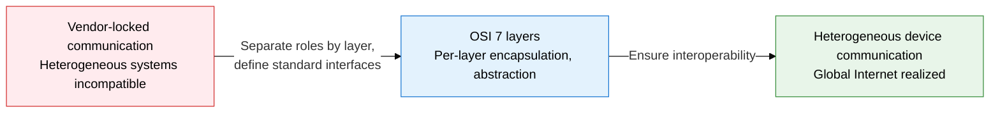
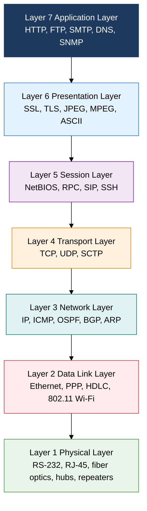

## 1. Standardizing Communication Between Heterogeneous Systems into Layers — Overview of the OSI 7 Layer and TCP/IP Protocol Stack

**Definition**: The ISO/IEC 7498 reference model, which abstracts communication between heterogeneous computer systems into 7 layers and standardizes the role and interface of each layer.
- The Open Systems Interconnection (OSI) standard, established by ISO (the International Organization for Standardization) in 1984
- Each layer provides service to the layers above and below it, and performs peer-to-peer communication with the same layer via its protocol
- The TCP/IP 4-layer model is a practical implementation of the OSI reference model and is the de facto standard of today's Internet as a protocol stack

**Characteristics**:
- **Hierarchical encapsulation**: Encapsulation adds each layer's header (and trailer) to the upper layer's data on send; decapsulation removes headers in reverse order on receive, achieving transparent transfer between layers
- **Layer independence**: Each layer only needs to know the service interface of the adjacent layer, and its internal implementation can change independently — this makes per-layer technology innovation and replacement easy
- **Standard interoperability**: Transparent communication is guaranteed between devices and operating systems from different vendors as long as they follow the same layer protocol — this breaks vendor lock-in

---

## 2. Core Structure of the OSI 7 Layer and TCP/IP Protocol Stack

### A. Full Structure of the OSI 7 Layers

| Layer number | Layer name | Core function | PDU name | Key protocols | Representative devices |
|---|---|---|---|---|---|
| **7** | Application | User interface, provides application services, defines data format | Message | HTTP, HTTPS, FTP, SMTP, POP3, DNS, SNMP, Telnet | Application servers, L7 switches |
| **6** | Presentation | Data format conversion, encryption/decryption, compression/decompression, encoding | Message | SSL/TLS, JPEG, MPEG, GIF, ASCII, EBCDIC, XDR | Gateways |
| **5** | Session | Session establishment, maintenance, and termination, synchronization, dialog control, checkpointing | Message | NetBIOS, RPC, PPTP, SIP, SSH, NFS | Gateways |
| **4** | Transport | End-to-end reliable transfer, flow control, error control, multiplexing | Segment / Datagram | TCP, UDP, SCTP, DCCP | L4 switches, firewalls |
| **3** | Network | Logical addressing (IP), path selection (routing), packet forwarding | Packet | IP, ICMP, IGMP, OSPF, BGP, RIP, ARP | Routers, L3 switches |
| **2** | Data Link | Physical addressing (MAC), frame formation, error detection, media access | Frame | Ethernet, PPP, HDLC, 802.11, ATM, Frame Relay | Switches, bridges |
| **1** | Physical | Converts bit streams to electrical/optical signals, defines physical transmission media | Bit | RS-232, V.35, RJ-45, fiber optics, DSL, USB | Hubs, repeaters, NICs |

---

### B. TCP/IP 4-Layer Mapping and Encapsulation/Decapsulation

| TCP/IP layer | OSI 7-layer mapping | PDU name | Key protocols | Layer role |
|---|---|---|---|---|
| **Application** | Layer 7 (Application) + Layer 6 (Presentation) + Layer 5 (Session) | Message | HTTP/S, FTP, SMTP, POP3, DNS, SNMP, SSH, Telnet | Provides user services, handles data format and session management together |
| **Transport** | Layer 4 (Transport) | Segment / Datagram | TCP (connection-oriented, reliable), UDP (connectionless, fast) | Port-based multiplexing, TCP 3-way handshake, flow/error/congestion control |
| **Internet** | Layer 3 (Network) | Packet | IPv4, IPv6, ICMP, IGMP, OSPF, BGP, RIP | Logical addressing via IP address, routing, fragmentation and reassembly |
| **Network Access** | Layer 2 (Data Link) + Layer 1 (Physical) | Frame / Bit | Ethernet, Wi-Fi (802.11), PPP, ARP, RARP | MAC-address-based frame transmission, physical signal conversion, media access control |

---

## 3. Expected Benefits and Practical Applications of the OSI 7 Layer and TCP/IP Protocol Stack

| Category | Key benefits | Practical applications |
|---|---|---|
| **Standard interoperability** | Guarantees communication between devices and OSs from different vendors, resolving vendor lock-in and enabling multi-vendor environments | Interoperate routers (Cisco), switches (Arista), and firewalls (Palo Alto) on the same protocols (BGP, OSPF, TCP/IP) in a mixed environment |
| **Failure layer isolation** | Rapidly identifies the failed layer using the 7-layer model, reducing MTTR (mean time to recovery) and eliminating unnecessary full-stack checks | Sequential testing of Ping (Layer 3), Telnet (Layer 4), HTTP (Layer 7) isolates the failed layer within 30 seconds, enabling fast escalation to the responsible team |
| **Layered security design** | Applies security controls per layer to implement defense in depth, keeping upper layers protected even if a single layer is breached | Multi-layer security architecture: Layer 1 (physical locks), Layer 2 (802.1X), Layer 3 (ACLs, firewalls), Layer 4 (IPS), Layer 7 (WAF) |
| **Protocol-independent development** | Standardized layer interfaces let a single layer's protocol be replaced or improved without changing the layers above or below it | Migrating IPv4 to IPv6 leaves the upper TCP and HTTP layers unchanged; adopting QUIC at the transport layer minimizes impact on the application layer |
