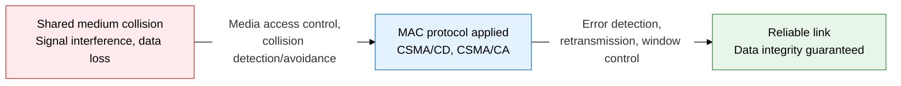
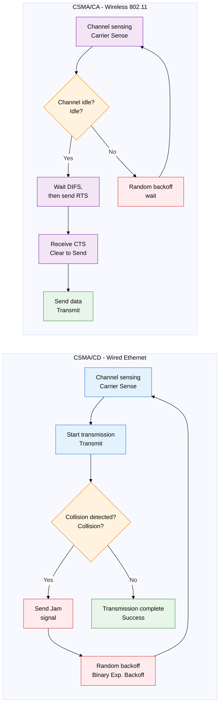

## 1. Securing a Reliable Link Through Collision Avoidance and Error Recovery — Overview of L1/L2 MAC and Error/Flow Control

**Definition**: The core L1/L2 control mechanism that prevents and detects collisions on a shared transmission medium and secures data reliability through ARQ-based retransmission.
- Media Access Control (MAC) decides transmission order and collision handling when multiple nodes share the same channel.
- Error control (ARQ) detects frame loss or corruption, determines the retransmission scope, and guarantees reliable transfer.
- Flow control adjusts the sending rate so it does not exceed the receiver's processing capacity, preventing buffer overflow.

**Characteristics**:
- **Dual collision handling**: Wired (CSMA/CD) retransmits after detecting a collision, wireless (CSMA/CA) avoids collision before transmitting — the optimal strategy is applied per medium characteristic
- **Pipelined transmission**: A sliding window transmits continuously without waiting for each ACK, maximizing channel efficiency — a major performance gain over Stop-and-Wait
- **Selective retransmission**: Go-Back-N and Selective Repeat ARQ minimize the error scope, reducing unnecessary retransmission traffic

---

## 2. Core Structure of L1/L2 MAC and Error/Flow Control

### A. Media Access Control (MAC)

| Comparison item | CSMA/CD | CSMA/CA |
|---|---|---|
| **Applicable environment** | Wired Ethernet (IEEE 802.3) | Wireless LAN (IEEE 802.11 Wi-Fi) |
| **Collision handling** | Jam signal after collision detection → random backoff retransmission | Avoid collision via RTS/CTS handshake before transmitting |
| **Channel efficiency** | Efficiency drops under frequent collisions, high efficiency under low load | Overhead exists but no collisions, stable in wireless environments |
| **Operating method** | Collision detectable during transmission (signal strength monitoring) | Wireless cannot detect collision → avoidance-first strategy |
| **Core mechanism** | Binary Exponential Backoff (wait time doubles on collision) | DIFS wait + RTS/CTS + SIFS + ACK exchange |

---

### B. Error Control and Flow Control (ARQ)

```mermaid
%%{init: { 'theme': 'base', 'themeVariables': { 'edgeLabelBackground': '#fff' }}}%%
flowchart LR
    subgraph SW["Stop-and-Wait"]
        S1["Send frame 1"] --> S2["Wait for ACK"] --> S3["Send frame 2"]
    end
    subgraph SLD["Sliding Window"]
        W1["Send frame 1"] --> W2["Send frame 2"] --> W3["Send frame 3"] --> W4["Receive ACK 1<br/>Window slides"]
        W4 --> W5["Send frame 4"]
    end
    subgraph GBN["Go-Back-N ARQ"]
        G1["Frames 1-4<br/>Sent continuously"] --> G2["Frame 3 error<br/>NAK received"] --> G3["Frames 3-4<br/>All retransmitted"]
    end
    subgraph SR["Selective Repeat ARQ"]
        R1["Frames 1-4<br/>Sent continuously"] --> R2["Frame 3 error<br/>NAK received"] --> R3["Only frame 3<br/>Selectively retransmitted"]
    end
    style S1 fill:#E3F2FD,stroke:#1976D2,color:#000
    style S2 fill:#FFF3E0,stroke:#F57C00,color:#000
    style S3 fill:#E3F2FD,stroke:#1976D2,color:#000
    style W1 fill:#F3E5F5,stroke:#7B1FA2,color:#000
    style W2 fill:#F3E5F5,stroke:#7B1FA2,color:#000
    style W3 fill:#F3E5F5,stroke:#7B1FA2,color:#000
    style W4 fill:#E8F5E9,stroke:#388E3C,color:#000
    style W5 fill:#F3E5F5,stroke:#7B1FA2,color:#000
    style G1 fill:#E0F2F1,stroke:#00796B,color:#000
    style G2 fill:#FFEBEE,stroke:#D32F2F,color:#000
    style G3 fill:#FFF3E0,stroke:#F57C00,color:#000
    style R1 fill:#E0F2F1,stroke:#00796B,color:#000
    style R2 fill:#FFEBEE,stroke:#D32F2F,color:#000
    style R3 fill:#E8F5E9,stroke:#388E3C,color:#000
```

| ARQ method | How it works | Efficiency | Receive buffer | Suitable environment |
|---|---|---|---|---|
| **Stop-and-Wait** | Sends 1 frame, then waits until the ACK arrives | Very low (1 frame per RTT) | Not needed | Short distance, simple implementation |
| **Sliding Window** | Sends continuously up to the window size (W), advances the window on ACK receipt | High (W-deep pipeline) | Needed (W buffers) | High-speed, long-distance links |
| **Go-Back-N ARQ** | Retransmits everything from the errored frame number N onward | Moderate (large retransmission scope on error) | Sender only | Simple implementation, low-error environments |
| **Selective Repeat** | Retransmits only the errored frame, keeps the rest | Highest (minimal retransmission) | Both sender and receiver | Frequent errors, high performance required |

> **Sliding window key point**: Window size W = 2^n - 1 (Go-Back-N), W = 2^(n-1) (Selective Repeat). n is the number of sequence-number bits.

---

## 3. Expected Benefits and Practical Applications of L1/L2 MAC and Error/Flow Control

| Category | Key benefits | Practical applications |
|---|---|---|
| **Media access control** | Minimizes shared-medium collisions, improving network throughput and reducing latency | Wired networks use CSMA/CD in a full-duplex switch environment; wireless networks apply CSMA/CA plus QoS (802.11e) |
| **Error control** | ARQ-based automatic retransmission guarantees data integrity and reduces the burden on upper layers | ARQ principles applied directly in the design of TCP sliding windows and Selective ACK (SACK) |
| **Flow control** | Prevents receive buffer overflow, resolves send/receive rate mismatches, ensures stable transfer | Tune buffer size and window scaling parameters in network device QoS policy |
| **Exam and security use** | Provides a foundation for analyzing network-layer vulnerabilities and understanding protocol design | Analyze the vulnerability from disabling CSMA/CA RTS/CTS; design defenses against ARQ timeout and retransmission attacks |
