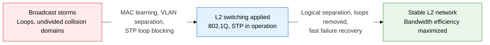
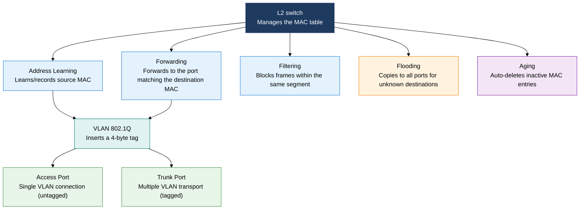
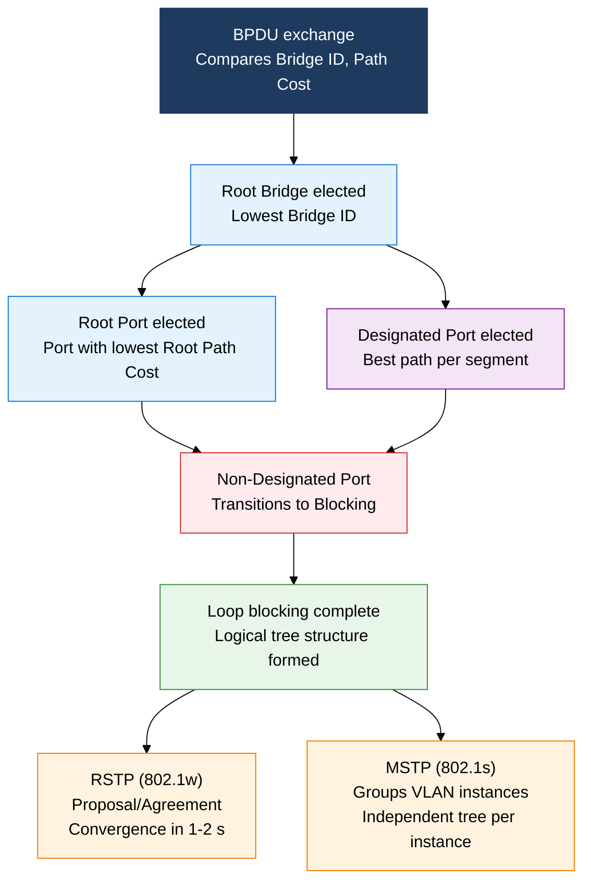

## 1. Stabilizing L2 with MAC Learning, VLAN Separation, and STP Loop Blocking — Overview of L2 Switching, VLAN, and STP

**Definition**: A data link layer switching mechanism that secures L2 network stability through selective frame forwarding based on MAC address learning, IEEE 802.1Q VLAN trunking, and STP loop prevention.
- An L2 switch dynamically manages a MAC address table (CAM table) and suppresses unnecessary broadcasts.
- VLANs separate logical broadcast domains independent of physical topology, improving security and performance.
- STP prevents loops on redundant paths and, evolving into RSTP/MSTP, improves convergence time and VLAN scalability.

**Characteristics**:
- **Selective forwarding**: Forwards only to the destination port based on the MAC table, separating collision domains per port — a major improvement in bandwidth utilization over hubs
- **Logical separation (VLAN)**: The IEEE 802.1Q 4-byte tag builds up to 4094 independent networks without changing the physical infrastructure — controlling broadcast domains
- **Loop prevention (STP)**: Forms a logical tree structure through Root Bridge election and port role assignment; RSTP cuts the 50-second convergence time down to 1-2 seconds

---

## 2. Core Structure of L2 Switching, VLAN, and STP

### A. The 5 L2 Switch Operating Principles and VLAN

| Operation | Description | Condition | Result |
|---|---|---|---|
| **Address Learning** | Records the source MAC and inbound port of a received frame into the CAM table | Every received frame | Dynamically builds the MAC table |
| **Forwarding** | Sends the frame only to the port whose entry matches the destination MAC | Destination MAC found | Selective unicast delivery |
| **Filtering** | Blocks forwarding when source and destination share the same port | Communication within the same segment | Removes unnecessary traffic |
| **Flooding** | Destination MAC unregistered, or the frame is broadcast/multicast | Unknown unicast, broadcast | Copies to and forwards on all ports |
| **Aging** | Deletes an entry when a MAC has been unused for a set time (default 300 s) | Timeout elapsed | Keeps the table current |

> **IEEE 802.1Q tag structure**: TPID (2B, 0x8100) + PCP (3-bit priority) + DEI (1-bit drop eligible indicator) + VID (12-bit, VLAN ID 0-4095, 4094 usable)

---

### B. The STP, RSTP, and MSTP Loop-Prevention Mechanisms

**5 STP port states**: Disabled → Blocking → Listening → Learning → Forwarding

- **Blocking**: Can only receive BPDUs, data frames blocked (20 s wait)
- **Listening**: Sends and receives BPDUs, deciding port role (15 s wait, Forward Delay)
- **Learning**: Begins MAC address learning, no data forwarded yet (15 s wait, Forward Delay)
- **Forwarding**: Fully operational, sends and receives data frames
- **Disabled**: Administratively disabled or in a failure state

| Comparison item | STP (802.1D) | RSTP (802.1w) | MSTP (802.1s) |
|---|---|---|---|
| **Standard** | IEEE 802.1D-1998 | IEEE 802.1w-2001 | IEEE 802.1s-2002 |
| **Convergence time** | 30-50 s (MaxAge + 2x ForwardDelay) | 1-2 s (Proposal/Agreement handshake) | 1-2 s (RSTP-based) |
| **VLAN support** | Single instance (shared by all VLANs) | Single instance (PVST+ is a Cisco extension) | Multiple VLAN instances grouped |
| **Port states** | 5 (Disabled/Blocking/Listening/Learning/Forwarding) | 3 (Discarding/Learning/Forwarding) | 3 (follows RSTP) |
| **Characteristics** | TCN (topology change notification) propagates to the root | Edge Port/P2P links go to Forwarding immediately | Independent load balancing per instance within an MST Region |

> **Bridge ID structure**: Priority (4 bits, default 32768) + VLAN ID (12 bits) + MAC address (6B). Use `spanning-tree vlan [id] priority [value]` to force the Root Bridge election.

**RSTP's key improvements**:
- **Proposal/Agreement handshake**: The upstream Designated Port sends a Proposal → the downstream switch's non-edge port immediately switches to Discarding, then replies with Agreement → immediate transition to Forwarding. No timer wait needed.
- **Edge Port (PortFast)**: A port connected to an end device enters Forwarding immediately. It automatically reverts to a normal STP port on receiving a BPDU (combined with BPDUGuard, the port is Err-Disabled to defend against an attack).
- **P2P link auto-detection**: Full-duplex ports are automatically recognized as P2P for fast convergence.

**MSTP components**:
- **MST Region**: A group of switches sharing the same Region Name, Revision Number, and VLAN mapping table
- **IST (Internal Spanning Tree)**: The default instance (Instance 0) within a Region, communicating with external RSTP
- **MSTI (Multiple Spanning Tree Instance)**: Maps VLAN groups to instances for independent load balancing (e.g., VLANs 10-20 → Instance 1, VLANs 30-40 → Instance 2)

---

## 3. Expected Benefits and Practical Applications of L2 Switching, VLAN, and STP

| Category | Key benefits | Practical applications |
|---|---|---|
| **Security, isolation** | VLAN separation blocks broadcast traffic and unauthorized access between departments/systems, minimizing the spread of a breach | Separate management, server, and user networks into VLANs; combine with 802.1X port authentication for dynamic VLAN assignment |
| **Availability** | STP/RSTP loop prevention eliminates broadcast storms and guarantees fast failover on redundant links | Dual uplinks at the core/access layers plus RSTP PortFast/BPDUGuard; use MSTP for link load balancing |
| **Performance** | MAC-based selective forwarding removes unnecessary traffic, and per-port collision domain separation enables full-duplex communication | Expand uplink bandwidth with 802.1Q trunking plus 802.3ad LACP link aggregation; QoS PCP priority tagging |
| **Operations, scaling** | Reconfiguring VLANs without changing physical wiring enables fast response to organizational change, reducing network segmentation cost | Unified campus network management via VTP (VLAN Trunking Protocol) or MLAG, integrated with SDN controller automation |
