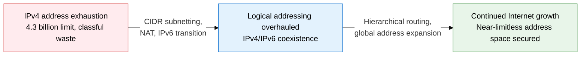
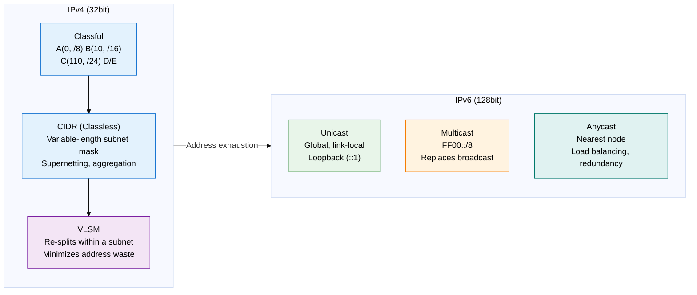
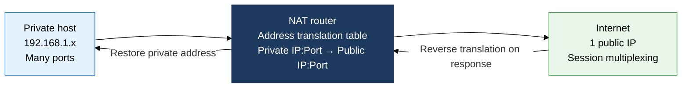

## 1. Logical Addressing and the Strategy to Overcome IPv4 Exhaustion — Overview of L3 IP Addressing

**Definition**: An Internet address management structure that identifies logical endpoints at the network layer and overcomes IPv4 exhaustion through CIDR subnetting, NAT, and IPv6 transition technology.
- IPv4 (32-bit) extends its lifespan with CIDR and NAT, while a phased transition to IPv6 (128-bit) is underway.
- VLSM-based subnetting minimizes wasted address space and improves routing table efficiency.
- NAT/PAT shares public addresses across a private address space, realistically easing IPv4 exhaustion.

**Characteristics**:
- **Hierarchical address design**: Splitting network/host bits enables hierarchical routing; VLSM allocates subnet sizes optimally
- **Address conservation mechanisms**: NAT/PAT connects thousands of private nodes through a single public IP, using RFC 1918 private addresses
- **Prepared for IPv6's future**: 128-bit address space (3.4×10^38 addresses), IPsec built in by default, enhanced mobility and auto-configuration

---

## 2. Core Structure of L3 IP Addressing

### A. The IPv4/IPv6 Addressing Scheme and Subnetting

**CIDR subnetting fundamentals**: network address = IP AND subnet mask. /26 = 255.255.255.192, host count = 2^6 - 2 = 62.

| Comparison item | IPv4 | IPv6 |
|---|---|---|
| **Address length** | 32 bits (4 octets, dotted decimal) | 128 bits (8 groups, colon-separated hex) |
| **Address space** | About 4.3 billion (2^32) | About 3.4×10^38 (2^128) |
| **Header size** | 20-60 bytes (variable, options included) | 40 bytes fixed (extension headers separate) |
| **Broadcast** | Supported (subnet broadcast) | Not supported → replaced by multicast/anycast |
| **Security** | IPsec optional | IPsec built in by default, AH/ESP supported |
| **Auto-configuration** | Requires DHCP | SLAAC (Stateless Address Auto-Configuration) supported by default |

> **RFC 1918 private addresses**: 10.0.0.0/8, 172.16.0.0/12, 192.168.0.0/16 — not routable on the Internet, NAT required.

---

### B. IPv4-to-IPv6 Transition Techniques and NAT/PAT

**History of the IPv4 exhaustion response**: IANA finished allocating its last /8 block to the RIRs in February 2011. IPv4 addresses ran out in the order APNIC, RIPE NCC, ARIN, LACNIC. IPv4 now survives on the secondhand address trading market and NAT/CGN (Carrier-Grade NAT).

**3 major IPv4-to-IPv6 transition techniques**

| Transition technique | How it works | Advantages | Limitations | When applied |
|---|---|---|---|---|
| **Dual stack** | A device gets both an IPv4 and an IPv6 address, choosing the protocol per peer | Fully compatible, allows a phased transition | Doubles device resource use | Early IPv6 adoption stage |
| **Tunneling** | Encapsulates IPv6 packets in an IPv4 header for transport (6in4, Teredo, ISATAP) | Reuses existing IPv4 infrastructure | Encapsulation overhead, MTU issues | Transitional period while IPv4 networks still dominate |
| **Translation (NAT64/DNS64)** | Translates address and protocol between an IPv6-only client and an IPv4 server | Gives IPv6-only environments access to IPv4 | Increased complexity from stateful translation | Final stage of an IPv6-led transition |

**NAT type comparison**

| NAT type | How it works | Translation target | Session count | Main use |
|---|---|---|---|---|
| **Static NAT** | Fixed 1:1 mapping of a private IP to a public IP | IP address only | Fixed 1:1 | Exposing internal servers externally (web, mail) |
| **Dynamic NAT** | Dynamically allocated from a public IP pool, returned when the session ends | IP address only | Within pool size | Multiple hosts accessing the Internet |
| **PAT (NAPT)** | Multiplexes many private hosts through 1 public IP plus port numbers | Both IP and port | Up to 65,535 ports | Home/enterprise Internet sharing (most common) |

> **NAT table operation**: Stores a mapping from the internal source IP:Port to the public IP:translated Port. On receiving a response, it reverses the translation and forwards internally. Entries are removed on session timeout (TCP 300 s, UDP 30 s).

**Key considerations for NAT ALG (Application Layer Gateway)**:
- FTP Active mode: the data-channel port negotiation is embedded in the payload → the ALG must also translate the IP:Port inside the payload
- SIP/VoIP: if NAT does not recognize and translate the media address/port inside the SDP (Session Description Protocol), voice fails to connect
- H.323: its complex port negotiation structure requires an ALG or STUN/TURN/ICE-based NAT traversal technique alongside it

**IPv6 address auto-configuration (SLAAC)**:
- The router advertises the /64 prefix via an RA (Router Advertisement) message
- The host completes its address using EUI-64 (interface ID = extended 48-bit MAC) or a temporary address (RFC 4941)
- DHCPv6 Stateful or Stateless (RDNSS option) can additionally distribute DNS information

---

## 3. Expected Benefits and Practical Applications of L3 IP Addressing

| Category | Key benefits | Practical applications |
|---|---|---|
| **Address efficiency** | CIDR/VLSM minimize wasted addresses, hierarchical summarization shrinks routing table size | Apply VLSM when designing subnets per department/function; use BGP summary advertisements to optimize ISP routing tables |
| **Extending IPv4's lifespan** | NAT/PAT lets a small number of public IPs support a large private network, cutting public IP cost | Enterprise DMZ uses Static NAT (exposing servers); internal networks use PAT; ALG handles FTP/SIP NAT traversal |
| **IPv6 transition** | The 128-bit address space absorbs the explosive growth of IoT and mobile; IPsec by default strengthens security | Transition in phases with dual stack; deploy DNS64/NAT64 to guarantee IPv6-only clients access to IPv4 services |
| **Security, visibility** | NAT hides the internal topology; RFC 1918 private addresses block direct external access | NAT-log-based session tracking and security audits; real-time asset management via an IP Address Management (IPAM) system |
