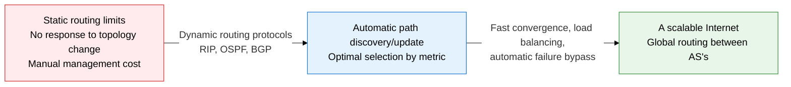
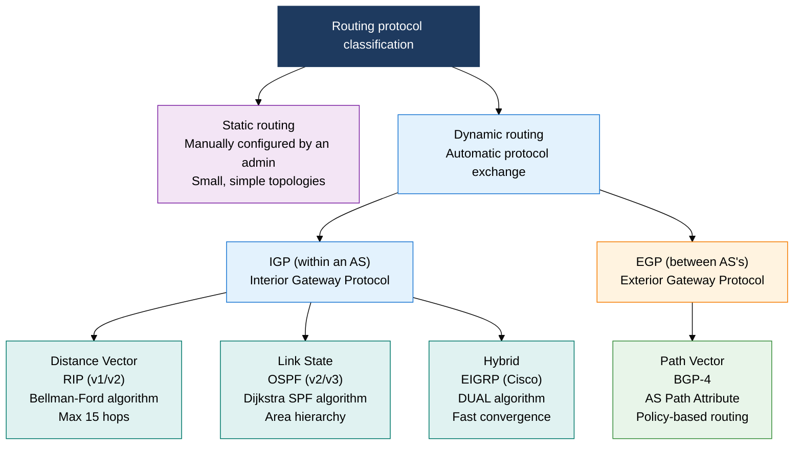

## 1. A Routing Structure That Dynamically Discovers and Updates the Optimal Path — Overview of L3 Routing Protocols

**Definition**: An L3 routing structure that exchanges network topology information with neighboring routers, computes and updates the optimal path using an algorithm, and uses the ARP, ICMP, and IGMP auxiliary protocols to support address resolution, diagnostics, and multicast group management.
- Dynamic routing automatically detects topology changes and converges on new paths, minimizing the operational burden compared with static routing.
- The IGP (Interior Gateway Protocol) handles the optimal path within a single AS; EGP/BGP handles policy-based routing between AS's.
- ARP, ICMP, and IGMP are essential auxiliary protocols that provide address resolution, error reporting, and group management for the IP layer.

**Characteristics**:
- **Algorithm diversity**: Distance Vector (Bellman-Ford), Link State (Dijkstra), Path Vector (BGP) — choose the algorithm to fit scale and purpose
- **Hierarchical design**: Separating IGP (RIP/OSPF) from EGP (BGP) manages internal and external AS routing policy independently, ensuring scalability
- **Fast convergence**: OSPF LSA flooding plus SPF recalculation applies an alternate path within seconds of a link failure

---

## 2. Core Structure of L3 Routing Protocols

### A. Routing Protocol Classification (RIP, OSPF, BGP)

**OSPF Area structure**: Backbone (Area 0) ↔ Regular Area (connected via ABR) / ASBR (redistributes external AS routes) / Stub Area (blocks external routes)

**RIP loop-prevention mechanisms**:
- **Split Horizon**: Prohibits re-advertising a route back out the interface it was learned on
- **Poison Reverse**: Re-advertises a learned route with metric 16 (infinity) to prevent loops
- **Holddown Timer**: Ignores updates for a set time after a route disappears, preventing loops

| Comparison item | RIP (v2) | OSPF (v2) | BGP-4 |
|---|---|---|---|
| **Algorithm** | Bellman-Ford (Distance Vector) | Dijkstra SPF (Link State) | Path Vector (AS Path) |
| **Scope** | IGP, within a small AS | IGP, within a mid-to-large enterprise/ISP AS | EGP, connecting AS's between ISPs on the Internet |
| **Metric** | Hop count (max 15 hops) | Cost (bandwidth-based, 10^8/BW) | AS Path length plus MED/Local Pref policy |
| **Convergence speed** | Slow (180 s timeout plus propagation delay) | Fast (LSA flooding plus immediate SPF recalculation) | Slow (policy takes priority, BGP attribute negotiation) |
| **Scale** | Small (15-hop limit) | Large (scales via Area hierarchy) | The entire Internet (hundreds of thousands of BGP routes) |

---

### B. Auxiliary Protocols (ARP, ICMP, IGMP)

```mermaid
%%{init: { 'theme': 'base', 'themeVariables': { 'edgeLabelBackground': '#fff' }}}%%
flowchart LR
    HOST["Host A<br/>Knows the destination IP<br/>Does not know the MAC address"]
    HOST --> REQ["ARP Request<br/>Sent as broadcast<br/>FF:FF:FF:FF:FF:FF"]
    REQ --> TARG["Destination host B<br/>Confirms IP match"]
    TARG --> REP["ARP Reply<br/>Unicast response<br/>Sends its own MAC"]
    REP --> CACHE["ARP cache stored<br/>Keeps the IP-MAC mapping<br/>Expires after a set time"]
    CACHE --> TX["Frame transmitted<br/>MAC inserted into the L2 header<br/>Delivered as unicast"]

    style HOST fill:#E3F2FD,stroke:#1976D2,color:#000
    style REQ fill:#FFF3E0,stroke:#F57C00,color:#000
    style TARG fill:#F3E5F5,stroke:#7B1FA2,color:#000
    style REP fill:#E8F5E9,stroke:#388E3C,color:#000
    style CACHE fill:#E0F2F1,stroke:#00796B,color:#000
    style TX fill:#1E3A5F,stroke:#1E3A5F,color:#fff
```

**Key ICMP messages and behavior**:
- **ping (Echo Request/Reply)**: Type 8 (request)/Type 0 (reply), measures round-trip time (RTT) and confirms host liveness
- **Traceroute**: Sends packets with TTL increasing from 1, tracing the path by receiving ICMP Time Exceeded (Type 11) from each hop router
- **Destination Unreachable (Type 3)**: Includes a reason code for unreachability (Net/Host/Port/Protocol Unreachable, etc.)
- **Redirect (Type 5)**: A router redirects the host's route to a better gateway

**IGMP multicast group management**:
- **IGMP v1/v2 Join**: A host requests to join a multicast group (224.x.x.x, Class D)
- **IGMP v2 Leave**: An explicit leave message drops out immediately, cutting off traffic sooner than v1
- **IGMP Querier election**: The router with the lowest IP becomes the Querier, periodically sending Membership Query
- **IGMP Snooping**: A switch monitors IGMP packets and forwards multicast frames only to the ports that need them

| Comparison item | ARP | ICMP | IGMP |
|---|---|---|---|
| **Purpose** | Translates an IP address to a MAC address (L3-to-L2 address mapping) | Delivers IP-layer error reporting, diagnostics, and control messages | Multicast group join, leave, and management |
| **Layer** | L2/L3 boundary (a separate protocol within the Ethernet frame) | L3 (encapsulated within an IP datagram) | L3 (IP protocol number 2) |
| **Key messages** | Request (broadcast) / Reply (unicast) / Gratuitous ARP | Echo Req/Reply, Time Exceeded, Dest Unreachable, Redirect | Membership Query, Report (Join), Leave |
| **Use** | Resolving gateway/host MAC addresses, ARP spoofing detection | ping/Traceroute network diagnostics, firewall ICMP policy configuration | IPTV/video conferencing multicast streaming, switch optimization via IGMP Snooping |

> **Gratuitous ARP**: Sending an ARP Request for one's own IP. Purpose: detecting IP conflicts, refreshing the ARP cache, and fast MAC updates during FHRP (HSRP/VRRP) failover.

---

## 3. Expected Benefits and Practical Applications of L3 Routing Protocols

| Category | Key benefits | Practical applications |
|---|---|---|
| **Availability** | OSPF/BGP dynamic convergence automatically switches to a bypass route within seconds of a link failure, minimizing service disruption | Redundant core routers plus OSPF BFD (Bidirectional Forwarding Detection) for failure detection/switchover at the 100 ms level |
| **Scalability** | OSPF Area hierarchy distributes routing tables across a large enterprise network; BGP route summarization ensures Internet scalability | Configure BGP multihoming (connecting 2 or more ISPs) for ISP connections; apply inbound/outbound traffic engineering policy |
| **Security, control** | BGP AS Path filters defend against route hijacking; ARP inspection and ICMP rate limiting counter L3 attacks | Block ARP spoofing with Dynamic ARP Inspection (DAI) and IP Source Guard; verify AS path authenticity with BGP RPKI |
| **Operational efficiency** | Dynamic routing automation removes the burden of manual static route management; IGMP Snooping optimally distributes multicast traffic | Manage OSPF/BGP configuration through a network automation platform (Ansible/NAPALM); unify route visibility via IPAM/NMS integration |
